# Control flow — three mechanisms, no overlap

This document explains how a user prompt becomes a workflow run in the
panther-ivy-plugin. The plugin uses three distinct control-flow mechanisms.
They are not redundant — each one owns a capability the others physically
cannot serve. Removing any of them would remove a real capability, not
duplicate code.

If you are a new contributor, read this file end to end before editing
`routing-rules.json`, any workflow `SKILL.md`, or `hooks/scripts/route-user-prompt.py`.

## The three mechanisms

| # | Mechanism | Fires | Owns | What the others cannot do |
|---|---|---|---|---|
| 1 | `routing-rules.json` + `hooks/scripts/route-user-prompt.py` (UserPromptSubmit hook) | Every user turn, before any skill loads | Free-text → workflow intent classification; emits `[ROUTING]` / `[ROUTING:CONTINUE]` / `[ROUTING:AVAILABLE]` / `[ROUTING:KNOWLEDGE]` `additionalContext` tags | Skill bodies cannot inspect raw user prose pre-load. `pending_dispatch` cannot classify free-text intent. |
| 2 | In-skill `Skill(skill="panther-ivy-plugin:<name>")` | Same turn, synchronous | (a) navigate's terminal dispatch (Phase 2 reflection-gate-confirmed; Phase 1 Step 2c `pending_dispatch` consumption); (b) `workflow-triage` preflight read-only probe; (c) progressive disclosure of `knowledge-*` and `cross-cutting-*` skills | `pending_dispatch` cannot return same-turn. Routing rules cannot load a knowledge skill. |
| 3 | `pending_dispatch` journal event (`workflow_state.append_pending_dispatch`) | Across turn boundary; consumed by navigate Phase 1 Step 2c on the next turn | Async workflow-to-workflow hand-off with full causal trace in the journal. Survives session restart subject to a 2-hour staleness window. | `Skill()` loses the journal record. Routing rules do not survive a turn. |

### Verbatim citations

The disjointness above is not theoretical — it is grounded in the workflow
skills themselves:

- `skills/workflow-build/SKILL.md` (`pending_dispatch` rationale, Phase 4
  hand-off): *"Hand control to the `verify` workflow via a `pending_dispatch`
  event — no in-place state mutation, no direct `Skill(...)` invocation."*
- `skills/workflow-navigate/SKILL.md` Phase 1 Step 2c: navigate is the
  *only* skill that may issue a same-turn cross-workflow `Skill()` call,
  and only after consuming a `pending_dispatch` journal entry.
- `skills/workflow-navigate/SKILL.md` Dispatch HARD-GATE: *"Direct
  `Skill(<workflow>)` without these gates is the bypass-the-discipline
  anti-pattern."*
- `skills/workflow-verify/SKILL.md` (triage preflight): triage runs Phase 1
  only and returns to verify's current turn — `active-workflow` stays on
  `(workflow=verify, phase=preflight)` throughout. The synchronous `Skill()`
  call is required because converting it to `pending_dispatch` would break
  the inline preflight semantics.

## Lifecycle

```dot
digraph plugin_runtime {
  rankdir=LR;
  node [shape=box, style=rounded];

  // SessionStart pipeline (cleanup + workspace detect + overview inject)
  start [label="SessionStart\n(cleanup-stale-pids.sh\n→ detect-ivy-workspace.sh\n→ inject-using-plugin.sh\n→ wait-for-indexing.sh)"];

  // UserPromptSubmit — mechanism 1
  prompt [label="UserPromptSubmit\nroute-user-prompt.py", shape=box, style="rounded,filled", fillcolor="#e3f2fd"];
  routing [label="[ROUTING] / [ROUTING:CONTINUE] /\n[ROUTING:AVAILABLE] / [ROUTING:KNOWLEDGE]"];

  // Workflow activation — mechanism 2 (Skill tool dispatch)
  navigate [label="workflow-navigate\n(Phase 1 Step 2c\nconsumes pending_dispatch)"];
  workflows [label="workflow-build\nworkflow-verify\nworkflow-review\nworkflow-triage", shape=box, style="rounded,filled", fillcolor="#fff3e0"];

  // Phase work
  body [label="phases:\nMCP tools (ivy_verify, ivy_compile, …)\nagent dispatch (spec-analyst, …)\nadversarial gates G0-G6"];

  // Hand-off — mechanism 3
  handoff [label="append_pending_dispatch(target,reason)\n+ clear active-workflow flag", shape=box, style="rounded,filled", fillcolor="#f3e5f5"];

  // Completion
  completion [label="cross-cutting-completion-gate\n(IDENTIFY → RUN → READ → VERIFY → THEN-claim)"];

  start -> prompt;
  prompt -> routing -> navigate;
  navigate -> workflows [label="Skill(workflow-X)"];
  workflows -> body;
  body -> handoff [label="phase done"];
  body -> completion [label="terminal phase"];
  handoff -> prompt [label="next turn"];
  completion -> handoff [label="optional next workflow"];
}
```

## When does each mechanism fire?

If you are deciding which mechanism to use, this table is authoritative:

| Goal | Use | Why |
|---|---|---|
| Same-turn progressive disclosure of a `knowledge-*` or `cross-cutting-*` skill (load reference content into the current turn's context) | In-skill `Skill()` (mechanism 2) | The skill body must be in context this turn. `pending_dispatch` cannot return same-turn. |
| Same-turn read-only health probe (e.g. verify Phase 1.5 calls `Skill(skill="panther-ivy-plugin:workflow-triage", args="preflight")` to check MCP/LSP/Serena health without taking over the workflow) | In-skill `Skill()` with `args="preflight"` (mechanism 2) | Triage in preflight mode does not write `active-workflow` and returns silently on healthy stack. Replacing this with `pending_dispatch` would surrender the current turn for a passing health check. |
| Cross-workflow hand-off after a phase completes (e.g. `build` Phase 4 → `verify`; `review` finds structural fix needed → `build`) | `pending_dispatch` (mechanism 3) | The journal record is load-bearing for `/nct-observability`, `agent-dispatch.md` recovery, `mcp-tool-reliability.md` recovery, and the navigate situation briefing. `Skill()` would lose the trace. |
| Free-text intent classification on every user prompt (mapping "verify this layer" → `workflow-verify`) | `routing-rules.json` (mechanism 1) | Workflow skills cannot inspect raw user prose before they load. Skill descriptions are matched by Claude's auto-discovery layer, but only `routing-rules.json` writes `active-workflow` and emits the `[ROUTING]` tag. |
| Direct cross-workflow dispatch in a non-navigate skill (e.g. `verify` decides to invoke `review` synchronously) | NEVER. Use `pending_dispatch` instead | This is the bypass-the-discipline anti-pattern called out in `workflow-navigate/SKILL.md` Dispatch HARD-GATE. The journal would lose the causal chain and downstream observability would break. |

## The routing hook ↔ pending_dispatch race (resolved)

Before the legibility pass, `route-user-prompt.py` read only
`active-workflow` plus user prose to score the next workflow. It did not
inspect the journal. When a workflow had just queued a `pending_dispatch`
(e.g. `build` handing off to `verify`) and the user's next prose still
matched build keywords, the hook could emit a misleading
`[ROUTING] workflow-build` line that contradicted navigate's actual
hand-off to `verify`. navigate Phase 1 Step 2c consumed the
`pending_dispatch` correctly — so this was never a correctness bug — but
the user saw a transient `[ROUTING]` line that disagreed with the
following turn's behavior.

The hook now reads the journal up front. If the newest journal entry of
type `pending_dispatch` is younger than 2 hours, the hook emits
`[ROUTING:CONTINUE]` for the queued `target_workflow` and returns; the
prose-score path is skipped. The 2-hour window matches the
`is_workflow_stale` default in `workflow_state.py` and the
`feedback_no_relocate_backup_files` retention norm.

The fix is in `hooks/scripts/route-user-prompt.py` near the top of `main`,
before the prose-score loop. The pytest fixture is in
`tests/test_routing.py`.

## routing-rules.json audit (entries are not redundant)

A common simplification suggestion is to drop `routing-rules.json`
entries whose keywords overlap with the matching skill's frontmatter
`description`. This is wrong. Every routing-rules entry produces side
effects that skill descriptions do not:

- writes `active-workflow` state via `route-user-prompt.py` (skill
  descriptions do not),
- emits `[ROUTING:CONTINUE]` / `[ROUTING:AVAILABLE]` / `[ROUTING:KNOWLEDGE]`
  tags that downstream skills depend on,
- gates `meta-plugin-self-mod` activation on `fileTriggers` globs that
  skill descriptions cannot express.

Confirmed at the 2026-04-27 legibility pass: zero entries are truly
redundant. Even where keywords overlap with descriptions, the routing
entry pulls weight via at least one of the side effects above. Do not
reopen this audit unless one of those side effects is removed.
