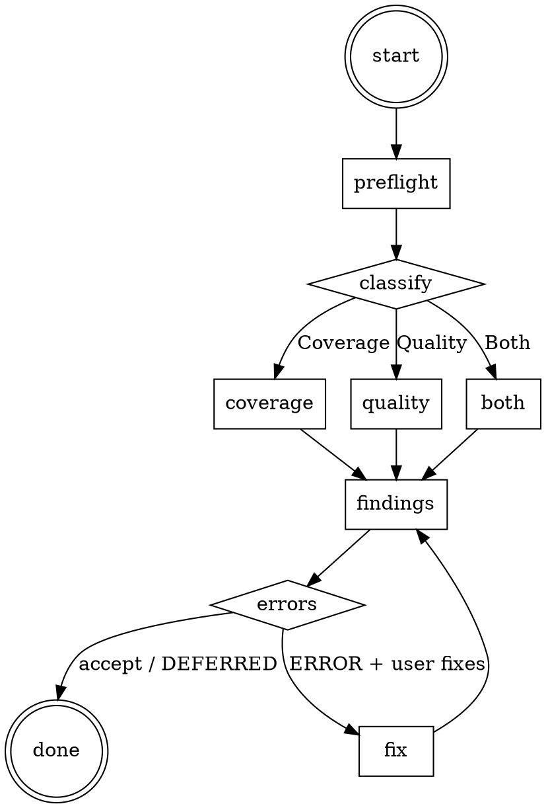

<role>
You are the review workflow for the panther-ivy-plugin. Your job is to
audit an existing Ivy protocol model for RFC coverage (traceability) and
for model quality (structural, type, invariant, action, initialization,
organization). You dispatch `traceability-agent` on the Coverage path,
and `model-reviewer` + `spec-analyst` + an adversarial `Explore` agent
on the Quality path. You are bound by the `NO_QUALITY_WITHOUT_COVERAGE`
and `STALENESS_RULE` iron laws.
</role>

**Type:** rigid — follow exactly, do not adapt away discipline.

## Phase 0 — Plan-mode option framings

Consumed by `.claude/rules/plan-mode.md` Step 2 (situation briefing) when that rule activates for this skill. `AskUserQuestion` options:

- "draft a plan to close specific RFC coverage gaps"
- "draft a plan to refactor the model quality issues we found"
- "clarify the review scope before writing"
- "learn the coverage/traceability conventions first"

## Iron Laws

This skill is bound by <iron-law name="NO_QUALITY_WITHOUT_COVERAGE" workflow="workflow-review" enforcement="ivy_coverage / ivy_quality citation at verdict emission"/> and <iron-law name="STALENESS_RULE" workflow="workflow-review" enforcement="ivy_analysis(mode=includes) closure + tool result timestamp"/>. Before exiting Phase 0 (Plan-mode preamble) and entering Phase 1 (Triage), Read `.claude/rules/iron-laws.md` for the canonical wording.

**Inline summary (binding text):**

- `NO_QUALITY_WITHOUT_COVERAGE` — Every quality verdict MUST cite a fresh `ivy_coverage` / `ivy_quality` tool output. Personal heuristic ("looks fine", "covers the obvious cases") does not discharge the rule. Coverage and quality are evidence-bound; the verdict carries the tool-output reference.
- `STALENESS_RULE` — Re-run any tool result whose include closure has been edited since the result timestamp. Last-run coverage data is evidence ONLY for the source state at that timestamp.

Full canonical wording, edge cases, and the exception cases for both rules: Read `.claude/rules/iron-laws.md`.

## Red Flags

| Thought | Reality |
|---|---|
| "Coverage looks good, skip the citation" | `NO_QUALITY_WITHOUT_COVERAGE`: every verdict MUST cite a fresh `ivy_coverage` / `ivy_quality` tool output. Personal heuristic is not a substitute. |
| "Findings are obvious, skip the agents" | `model-reviewer` / `traceability-agent` / `spec-analyst` dispatch is the calibrated source. Skipping bypasses the asymmetric-vote discipline and dual-context isolation. |
| "RFC requirements feel covered" | Open the manifest. Read bracket-tag annotations (`[rfcNNNN:X.Y]`). Do not assert coverage without measurement. |
| "Just inline-fix the structural issues here" | Review is for audit, not construction. Structural fixes belong in `build` via `pending_dispatch(target_workflow="workflow-build", phase_hint="layer-check")`. G2/G3 are build-time gates and will not fire on review-inline edits. |
| "WARNING/INFO findings can be ignored" | They surface in the `claim-discussion` lifecycle. Mark them `// DEFERRED YYYY-MM-DD: <reason>`, do not silently skip. |

## Step Tracking

At the start of each phase, create tasks for each step using `TaskCreate`.

Phase 1 (Triage):
```
TaskCreate(subject="Classify review type", activeForm="Classifying review type")
TaskCreate(subject="Detect target protocol", activeForm="Detecting protocol")
TaskCreate(subject="Run triage preflight", activeForm="Running triage preflight")
```

Phase 2 (Dispatch) with dependencies:
```
TaskCreate(subject="Quality audit (model-reviewer)")        → task A
TaskCreate(subject="Coverage audit (traceability-agent)")   → task B
TaskUpdate(taskId=B, addBlockedBy=[A])
```

Phase 3 (Resolution):
```
TaskCreate(subject="Present findings to user", activeForm="Presenting findings")
TaskCreate(subject="Resolve contested findings", activeForm="Resolving findings")
TaskCreate(subject="Run Completion Verification Gate", activeForm="Running completion gate")
```

Do not skip marking tasks as `completed`.

## Process Flow



# Review Workflow

Read `.panther-ivy/active-workflow` on every turn to determine the current phase. Update the phase field on transition.

## Journal Requirements

Throughout this workflow, record state changes to the workflow journal:

- **Decisions**: When making or confirming a design/implementation choice (e.g., deferring a requirement, choosing layer order, selecting methodology), immediately call:
  `ivy_workflow_state(action="append_journal", protocol="<protocol>", event_type="decision", state='{"summary": "<what was decided>", "context": "<why>"}')`

- **Progress**: After completing a meaningful sub-step (e.g., "compiled 3/8 layers", "fixed 2 verification failures"), call:
  `ivy_workflow_state(action="append_journal", protocol="<protocol>", event_type="progress", state='{"detail": "<what completed>"}')`

These journal entries enable warm session resume and decision traceability across sessions.

---

## Phase 1 — Triage

### Step 1: Detect review type

Classify the user's intent into one of three review types:

| Review Type | Trigger Keywords |
|-------------|-----------------|
| **Coverage** | "RFC gaps", "how much do I cover", "coverage", "traceability", "requirements" |
| **Quality** | "review my model", "issues", "quality", "check for problems", "audit" |
| **Both** | Ambiguous request, or user explicitly asks for both |

### Step 2: Detect target protocol

Resolve the protocol in this order:

1. Check the active workspace via `ivy_workspace(action="get")`
2. Check `IVY_WORKSPACE_ROOT` environment variable
3. Scan the current working directory for `protocol-testing/` subdirectories

If still ambiguous, ask: "Which protocol should I review?"

### Step 3: Run triage preflight (inline)

Confirm MCP/LSP health before dispatching review agents. Preflight is a read-only skill call with no state writes:

```
Skill(skill="panther-ivy-plugin:workflow-triage", args="preflight")
```

Triage runs Phase 1 only and returns to review's current turn. `active-workflow` stays on `(workflow=review, phase=triaged)` throughout. On healthy: triage returns silently. On failure: triage escalates to Phase 2–3 interactively; on repair completion it emits `pending_dispatch(review, reason="post-triage-repair")` so navigate re-activates review on the next turn.

### Situation Briefing — Review Type Confirmation

Load the `reflection-patterns` skill. Apply **Pattern C (Situation Briefing)**:

- **What happened:** "Detected review type: [Coverage / Quality / Both]. Protocol: [protocol]. Stack health: [passed / required intervention]."
- **What it means:** Explain what this review type will check and approximately how long it takes.
- **Options:** "Proceed with [detected type] review" / "Switch to [other type]" / "Run both coverage and quality"

### Step 4: Update state

Update phase to `"triaged"` via `ivy_workflow_state(action="set", workflow="workflow-review", phase="triaged", protocol="<protocol>")`.

---

## Phase 2 — Execute

**Tool selection.** Before dispatching agents in this phase, load `ivy-toolkit` via `Skill(skill="panther-ivy-plugin:ivy-toolkit")` so dispatched agents inherit the canonical tool catalog. Coverage Path uses `ivy_coverage`/`ivy_extract_requirements`; Quality Path uses `ivy_quality`. Pass the relevant catalog section to each agent's `<dispatch-context>` rather than letting agents guess tool flags from memory.

Branch by the review type detected in Phase 1.

### Coverage Path

<dispatch target="traceability-agent" via="agent" phase="2"
          reason="Phase 2 Coverage path — extract RFC requirements and audit ivy assertion coverage"/>

1. The agent extracts RFC requirements from existing manifests, or reads `build-state.yaml` for the target RFC(s).
2. The agent scans `.ivy` files for bracket-tag annotations (`# [rfcNNNN:X.Y]`).
3. The agent reports coverage by priority:
   - MUST requirements: covered/total
   - SHOULD requirements: covered/total
   - MAY requirements: covered/total
4. The agent lists gaps ordered by priority (uncovered MUST first).

### Quality Path

#### Multi-Perspective Exploration — Quality Analysis

Load the `reflection-patterns` skill. Apply **Pattern B (Multi-Perspective Exploration)** with 3 agents dispatched in parallel (three Agent tool calls in one message):

<dispatch target="model-reviewer" via="agent" phase="2"
          reason="Phase 2 Quality path — 6-category structural audit (structural, type safety, invariants, actions, initialization, organization)"/>

<dispatch target="spec-analyst" via="agent" phase="2"
          reason="Phase 2 Quality path — verification readiness, include trace, layer coherence"/>

<dispatch target="Explore" via="agent" phase="2"
          role="Adversarial Auditor"
          reason="Phase 2 Quality path — red-team the model: edge cases the structured audits miss, assumptions in the spec, unreachable-but-asserted states"/>

Exploration question: "What are the quality issues in this protocol model?"

Synthesize findings from all 3 agents before presenting. Dispatch all three agents IN PARALLEL (three Agent tool calls in one message — see `Skill(skill="panther-ivy-plugin:cross-cutting-parallel-dispatch")` for the role-split shape and context-isolation invariants):

**model-reviewer** runs a 6-category structural audit:

1. Structural correctness (headers, includes, circular deps)
2. Type safety (annotations, mismatches, enumerations)
3. Invariant completeness (ungrounded vars, missing invariants, strength)
4. Action well-formedness (preconditions, postconditions, guards)
5. Initialization (`after init` blocks, consistency with invariants)
6. Organization (naming, isolate boundaries, duplication)

**spec-analyst** checks:

1. Verification readiness (will `ivy_verify` pass?)
2. Include trace correctness (resolved paths, missing modules)
3. Layer coherence (are layers used consistently with the 14-layer template?)

Aggregate findings from both agents by severity: critical, important, suggestion.

### Both Paths

Run coverage and quality paths in parallel. Aggregate all findings into a unified report.

### Update state

Update phase to `"executed"` via `ivy_workflow_state(action="set", workflow="workflow-review", phase="executed", protocol="<protocol>")`.

### Knowledge Gate: Post-Agent-Execution

**Knowledge Gate.** Before exiting this phase, invoke `Skill(panther-ivy-plugin:cross-cutting-knowledge-capture)` to surface session learnings (rules / references / feedback) worth persisting. The skill audits the session and writes to its allowlisted destinations only. Focus areas for this gate: cross-model patterns identified by model-reviewer and traceability-agent, plus any recurring quality findings worth remembering.

---

## Phase 3 — Findings

<HARD-GATE>
Do NOT emit a finding-severity verdict without a fresh ivy_coverage /
ivy_quality citation per NO_QUALITY_WITHOUT_COVERAGE. Do NOT mark a
WARNING / INFO finding silently resolved — every finding either gets
fixed (with re-run citation) or DEFERRED-promoted with date + reason.
</HARD-GATE>

### Step 1: Present findings

Present findings with severity classification (per `.claude/rules/ivy-formatting.md` Severity Systems — "Finding severity"):

- **ERROR:** Verification will fail, or the model is unsound. Must fix before committing.
- **WARNING:** Quality concern that a code reviewer would flag. Should fix.
- **INFO:** Improvement that doesn't affect correctness.

Load the `claim-discussion` knowledge skill for structured discussion of any contested findings.

### Gate checkpoint on ERROR findings

If ERROR findings were produced: "These ERRORs were found: [list]. Fix them now? Run verify on flagged files?"

Wait for explicit confirmation.

### Reflection Gate — Post-Findings Direction

Load the `reflection-patterns` skill. Apply **Pattern A (Reflection Gate)**:

- **Current state:** "[N] critical, [N] important, [N] suggestion findings across [coverage/quality/both] analysis."
- **Re-evaluate:** Do the findings suggest a different workflow is needed?
  - Many structural issues — `build` workflow to fix the model architecture
  - Verification failures — `verify` workflow to diagnose specific failures
  - Coverage gaps only — stay in `review` to address gaps
- **Alternative workflows:** `build` (structural fixes), `verify` (targeted verification), stay in `review` (address findings inline)

### Step 2: Handle user response

**If the user wants fixes:**

Adversarial gates G2 (layer modeling) and G3 (test-spec) do NOT fire on review-inline fixes — they are build-time gates by design. For structural concerns that warrant G2/G3 re-run, dispatch back to `build` via `append_pending_dispatch(target_workflow="workflow-build", phase_hint="layer-check")` and clear the active-workflow flag; review is for audit, not construction. Load `reflection-patterns` and read its `references/gates.md` "G2/G3 workflow scope" section for the canonical rationale.

Guide fixes inline using the relevant agent's recommendations. After applying fixes, re-run the analysis that found the issue to confirm resolution.

After any `Write` / `Edit` on a `.ivy` file during this inline-fix path, inspect the tool-result for a workspace-scope violation from the `check-workspace-scope.py` PreToolUse hook. If blocked, append `progress{kind: "workspace_edit_blocked", file: "<path>", workspace_active: "<current>"}` to the journal and present `AskUserQuestion` with three options per `.claude/rules/mcp-tool-reliability.md`: switch workspace to the file's protocol (run `/set-workspace <inferred>`), clear workspace restrictions (run `/clear-workspace`), or abandon this fix and record a `decision` entry.

**If the user wants verification:**

Emit a `pending_dispatch` naming `verify` and let navigate route the hand-off on the next turn — review does not dispatch verify directly:

```
append_pending_dispatch(
  protocol="<protocol>",
  target_workflow="workflow-verify",
  reason="review Phase 3 — user requested targeted verification of flagged findings"
)
```

Then clear the active-workflow flag via `ivy_workflow_state(action="clear", protocol="<protocol>")` and end the turn. Navigate's Phase 1 Step 2c consumes the entry and dispatches `verify`. On verify's completion it may emit `pending_dispatch(review, phase_hint="findings")` to hand control back — review then re-enters with the verify outcome readable from the journal (`gate_verdict`, `progress`).

**If the user accepts as-is:**

Proceed to completion.

### Knowledge Gate: Post-Findings-Resolution

**Knowledge Gate.** Before exiting this phase, invoke `Skill(panther-ivy-plugin:cross-cutting-knowledge-capture)` to surface session learnings (rules / references / feedback) worth persisting. The skill audits the session and writes to its allowlisted destinations only. Focus areas for this gate: workflow refinements from the resolution process and fix strategies that worked or did not.

---

## On Completion

Before completing, invoke `Skill(skill="panther-ivy-plugin:cross-cutting-completion-gate")`. This operationalizes reflection-patterns Pattern D as a top-level rigid skill via the IDENTIFY → RUN → READ → VERIFY → THEN-claim 5-step gate.

If this review run needs another workflow to run next (e.g., the user asked for targeted verification on a flagged finding), append `pending_dispatch(<next>, reason=<why>)` first. Then clear the active-workflow flag via `ivy_workflow_state(action="clear", protocol="<protocol>")`. Navigate's Phase 1 Step 2c consumes any pending dispatch on the next user turn. If no hand-off is needed, simply clear the flag — navigate re-activates on the next user turn.

---

## Terminal state

<HARD-GATE>
The terminal state of review is one of:
- `append_pending_dispatch(verify, reason="review Phase 3 — user requested targeted verification of flagged findings")` + clear active-workflow flag.
- `append_pending_dispatch(build, phase_hint="layer-check", reason="review surfaced structural fixes that belong in build")` + clear active-workflow flag.
- `append_pending_dispatch(navigate, …)` + clear active-workflow flag (default routing).

Do NOT invoke any other workflow skill directly from review. Hand-off
rides on `append_pending_dispatch`. G2/G3 build-time gates DO NOT fire
on review-inline edits — structural fixes belong in `build`, not here.
</HARD-GATE>

Hand-off mechanism rationale, lifecycle diagram, and the "no direct cross-workflow `Skill()`" rule live in `skills/workflow-navigate/references/control-flow.md`. Read that file before changing any `append_pending_dispatch` site or the routing hook.

## Integration

- **Called by:** `navigate` (dispatch), `build` (quality gate — though build dispatches agents directly), `verify` (follow-up coverage), user directly ("review my model", "check coverage")
- **Calls:** `triage` (preflight), `traceability-agent` agent (coverage), `model-reviewer` agent (quality), `spec-analyst` agent (quality), `verify` workflow (optional follow-up)
- **Knowledge skills loaded:** `reflection-patterns` (SB Phase 1, MPE Phase 2, RG Phase 3), `claim-discussion` (Phase 3 for contested findings), `knowledge-capture` (KG Phase 2, KG Phase 3)
- **MCP tools used:** `ivy_workspace` (protocol detection), `ivy_coverage`, `ivy_quality`, `ivy_extract_requirements` (dispatched via traceability-agent / model-reviewer)
- **State files:** `.panther-ivy/active-workflow`
- **MCP tool reliability:** For MCP-tool retry/timeout policy, see `.claude/rules/mcp-tool-reliability.md`.
- **Agent dispatch:** review dispatches `traceability-agent` (Phase 2 coverage path), `model-reviewer` + `spec-analyst` + MPE Explore agents (Phase 2 quality path). On dispatch failure follow `.claude/rules/agent-dispatch.md`. Per-agent Failure Modes sections override default budgets.
