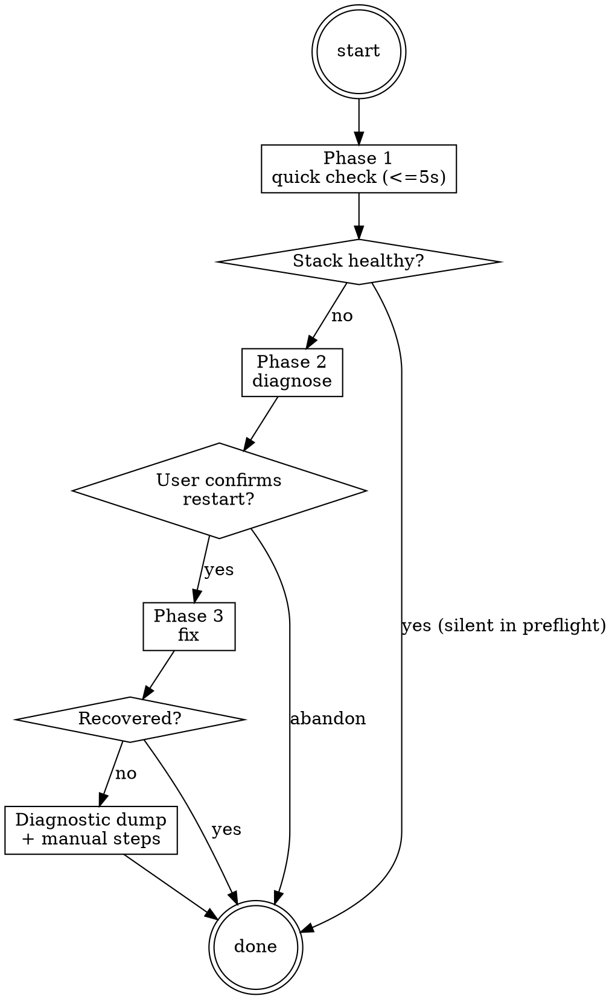

<role>
You are the triage workflow for the panther-ivy-plugin. Your job is to
diagnose and repair MCP server, LSP server, and Serena indexer failures.
You operate in three modes determined by `args`: `preflight` (read-only
health check, silent pass-through when healthy, escalates to interactive
diagnosis when failing), `full-health-check` (the 9-step runbook used by
`/nct-health`), and direct/no-args (the full interactive diagnose-and-fix
cycle).
</role>

**Type:** rigid — follow exactly, do not adapt away discipline.

<metadata mode="interactive|preflight|full-health-check"
          orchestrator="navigate preflight, verify preflight, build preflight, direct user, /nct-health"
          workspace-aware="true"/>

## Step Tracking

Create a single task per triage diagnostic step. Mark complete as each check passes:
```
TaskCreate(subject="Check LSP server health", activeForm="Checking LSP")
TaskCreate(subject="Check MCP server health", activeForm="Checking MCP")
TaskCreate(subject="Check workspace indexing", activeForm="Checking indexing")
```

## Red Flags

| Thought | Reality |
|---|---|
| "MCP timed out once, just retry" | Timeout is a triage signal. Run Phase 1 quick check (≤ 5 s) before retrying. Stale PIDs masquerade as transient timeouts. |
| "kill -9 the process to fix it" | Use `ps -p` for liveness; `pkill -9` is a last-resort Phase 3 escalation. Stale PID file removal first, restart trigger second. |
| "Preflight passed, nothing to surface" | Silent pass-through is correct in preflight mode. But on failure, preflight escalates — do not suppress the diagnose-and-fix flow from the user. |
| "Restart everything to be safe" | Restart only the dead component. Aggressive cleanup is the Phase 3 escalation option, not the default — over-restarting churns workspace state. |
| "Skip user confirmation, just fix it" | Phase 3 enters only after explicit user confirmation. NEVER restart processes silently — the user owns the decision to mutate stack state. |

## Process Flow



# Triage Workflow

Read `.panther-ivy/active-workflow` on every turn to determine the current phase before proceeding.

Triage accepts three invocation modes via `args`:

- `args="preflight"` — read-only stack-health check used by other workflows to confirm tools are responsive before dispatching. Runs Phase 1 only; on healthy, returns silently to the caller's turn without mutating state. On failure, escalates to Phase 2–3 inline.
- `args="full-health-check"` — the 9-step validation runbook in `references/full-health-check.md` (the `/nct-health` replacement). Deep diagnostic, user-facing.
- *(no args)* — direct invocation: runs the full Phase 1–3 cycle interactively, with user-facing summaries.

Preflight replaces the pre-cluster-1 pattern where callers set `invocation_depth`/`caller` before invoking triage; that pattern is gone — callers now just pass `args="preflight"` and triage reads the string.

## Journal Requirements

Throughout this workflow, record state changes to the workflow journal:

- **Decisions**: When making or confirming a design/implementation choice (e.g., deferring a requirement, choosing layer order, selecting methodology), immediately call:
  `ivy_workflow_state(action="append_journal", protocol="<protocol>", event_type="decision", state='{"summary": "<what was decided>", "context": "<why>"}')`

- **Progress**: After completing a meaningful sub-step (e.g., "compiled 3/8 layers", "fixed 2 verification failures"), call:
  `ivy_workflow_state(action="append_journal", protocol="<protocol>", event_type="progress", state='{"detail": "<what completed>"}')`

These journal entries enable warm session resume and decision traceability across sessions.

---

## Phase 1 — Quick Check

Target: under 5 seconds. Run all checks before producing any output.

### Check 1: Stale PID files

```bash
for f in /tmp/ivy-lsp-*.pid /tmp/ivy-mcp-*.pid; do
  [ -f "$f" ] || continue
  pid=$(cat "$f" 2>/dev/null)
  if ps -p "$pid" > /dev/null 2>&1; then
    echo "ALIVE: $f (pid=$pid)"
  else
    echo "STALE: $f (pid=$pid)"
  fi
done
```

Record which PIDs are alive and which are stale.

### Check 2: MCP server

Call `ivy_status(mode="capabilities")` with no other arguments. This is the fastest MCP round-trip. If it returns a tool list, MCP is alive.

### Check 3: LSP server

Look for recent diagnostics in `<new-diagnostics>` blocks from the current session. If none, check `/tmp/ivy-lsp-lsp-latest.log` for activity within the last 60 seconds:

```bash
if [ -f /tmp/ivy-lsp-lsp-latest.log ]; then
  age=$(( $(date +%s) - $(stat -f %m /tmp/ivy-lsp-lsp-latest.log) ))
  echo "LSP log age: ${age}s"
  tail -5 /tmp/ivy-lsp-lsp-latest.log
fi
```

### Check 4: Serena server (conditional)

Only check if `PANTHER_IVY_ENABLE_SERENA=1` is set:

```bash
if [ "$PANTHER_IVY_ENABLE_SERENA" = "1" ]; then
  # Check for Serena process
  pgrep -f "serena" > /dev/null 2>&1 && echo "SERENA: ALIVE" || echo "SERENA: DEAD"
fi
```

### Evaluate Results

**If everything is healthy:**

- If invoked with `args="preflight"`: return silently to the caller's turn. Do not produce user-facing output. Do not write the active-workflow file (preflight is read-only). The caller's skill body resumes immediately.
- If invoked directly (no `args`, or any args other than `preflight`/`full-health-check`): report "Stack is healthy. MCP, LSP [, and Serena] all responding." Then clear the active-workflow flag via `ivy_workflow_state(action="clear", protocol="<protocol>")` and return to navigate.

**If something is dead:** Update phase to `"diagnose"` via `ivy_workflow_state(action="set", workflow="workflow-triage", phase="diagnose", protocol="<protocol>")` and proceed to Phase 2. Preflight callers fall through to Phase 2 too — broken tools block the caller, so the user sees the diagnose-and-fix flow regardless of invocation mode.

---

## Phase 2 — Diagnose

Only reached when Phase 1 found at least one dead component.

### Situation Briefing — Unhealthy Stack

Load the `reflection-patterns` skill. Apply **Pattern C (Situation Briefing)**:

- **What happened:** "Phase 1 quick check found [N] dead component(s): [list with component names]."
- **What it means:** Explain the impact — which workflows are blocked, which tools won't work.
- **Options:**
  - "Diagnose and attempt automatic repair"
  - "Show me the logs first — I want to understand before fixing"
  - "Skip diagnostics — I know what's wrong and will fix manually"

If the user picks option 2, show the relevant log excerpts (from the log files listed below) before proceeding. If option 3, clear the active-workflow flag and return.

### Identify failures

For each dead component, check logs for the crash reason:

| Component | Log File | Common Causes |
|-----------|----------|---------------|
| MCP | `/tmp/ivy-mcp-latest.log` | Port conflict, import error, uncaught exception |
| LSP | `/tmp/ivy-lsp-lsp-latest.log` | Indexing failure, Z3 import error, workspace path issue |
| Serena | Serena's own log path | Missing `.venv`, missing submodule |

```bash
# Check for port conflicts
for f in /tmp/ivy-mcp-*.port; do
  [ -f "$f" ] || continue
  port=$(cat "$f" 2>/dev/null)
  lsof -i :"$port" 2>/dev/null | head -5
done
```

### Present diagnosis

Report to the user with specifics:

```
[Component] is down.
Reason: [extracted from log — last error line or traceback summary]
[If port conflict: "Port N is in use by another process."]
[If stale PID: "PID file exists but process is dead."]

Want me to restart it?
```

Wait for user confirmation before proceeding to Phase 3. Update phase to `"fix"` via `ivy_workflow_state(action="set", workflow="workflow-triage", phase="fix", protocol="<protocol>")`.

---

## Phase 3 — Fix

<HARD-GATE>
Do NOT clean stale state, remove PID files, or trigger MCP/LSP restart
without explicit user confirmation from Phase 2. The user owns the
decision to mutate stack state. Aggressive cleanup (kill processes,
remove all state files) is the escalation option, not the default.
</HARD-GATE>

Only reached after user confirms they want a restart.

### Step 1: Clean up stale state

```bash
# Remove stale PID files for dead processes
for f in /tmp/ivy-lsp-*.pid /tmp/ivy-mcp-*.pid; do
  [ -f "$f" ] || continue
  pid=$(cat "$f" 2>/dev/null)
  if ! ps -p "$pid" > /dev/null 2>&1; then
    rm -f "$f"
    echo "Removed stale PID file: $f"
  fi
done

# Remove stale port files if TCP is unreachable
for f in /tmp/ivy-mcp-*.port; do
  [ -f "$f" ] || continue
  port=$(cat "$f" 2>/dev/null)
  if ! nc -z -w 2 127.0.0.1 "$port" 2>/dev/null; then
    rm -f "$f"
    echo "Removed stale port file: $f"
  fi
done
```

### Step 2: Trigger restart

Claude Code auto-restarts MCP/LSP servers on the next tool invocation. After cleaning stale files, invoke a lightweight MCP call to trigger the restart:

- For MCP: call `ivy_status(mode="capabilities")` — the sidecar restarts automatically
- For LSP: the next LSP-dependent operation triggers restart

### Step 3: Verify recovery

Re-run Phase 1 checks to confirm the stack is back up.

**If recovered:** Report success and proceed to completion.

### Reflection Gate — Recovery Failed

If recovery failed, load the `reflection-patterns` skill. Apply **Pattern A (Reflection Gate)**:

- **Current state:** "Attempted automatic recovery for [component(s)]. Recovery failed — [component] is still unresponsive."
- **Re-evaluate:** Is this a deeper infrastructure problem beyond automatic repair?
- **Alternative options:**
  - "Retry with more aggressive cleanup (kill processes, remove all state files)"
  - "Escalate — show full diagnostic dump and manual recovery steps"
  - "Abandon triage — work without the broken component"

If the user picks "Retry", loop back to Phase 3 Step 1 with more aggressive cleanup. If "Escalate", proceed to the diagnostic dump below. If "Abandon", clear the active-workflow flag and return.

**If still broken:** Escalate with a full diagnostic dump:

```
Recovery failed. Full diagnostics:
- MCP log (last 20 lines): [content]
- LSP log (last 20 lines): [content]
- PID files: [list]
- Port files: [list]
- Environment: IVY_WORKSPACE_ROOT=[value], IVY_LSP_DEV_ROOT=[value]

Suggested manual steps:
1. Check if uvx is on PATH
2. Try: kill $(cat /tmp/ivy-lsp-*.pid) then retry
3. Re-run the full triage diagnostic cycle (Phases 2-3)
```

### Knowledge Gate: Post-Fix

**KNOWLEDGE GATE (KG)**: Pause and invoke: `Skill(skill="panther-ivy-plugin:cross-cutting-knowledge-capture")`
- Reflect on debugging patterns from infrastructure troubleshooting
- Capture the diagnosis-to-fix sequence for future triage sessions
- Save session log (observability events + digest)
- If candidates found, classify and present for user confirmation
- Resume workflow after gate completes

---

## Preflight Export

Other workflows (navigate, verify, build, review) silently call triage Phase 1 before their first MCP tool invocation by invoking:

```
Skill(skill="panther-ivy-plugin:workflow-triage", args="preflight")
```

When invoked this way:
- Triage runs Phase 1 only. It does not write `active-workflow`.
- On healthy: returns to the caller's turn with no user interaction.
- On failure: proceeds to Phase 2–3 (user interaction required; broken tools block the calling workflow). Because preflight did not write `active-workflow`, the caller's flag remains intact while triage handles repair; upon completion triage emits `pending_dispatch(<caller>, reason="post-triage-repair")` so navigate can hand control back to the caller naturally.

---

## On Completion

Before completing, invoke `Skill(skill="panther-ivy-plugin:cross-cutting-completion-gate")`. For triage, the IDENTIFY claim is "stack health restored" and only the structural check (Step 1) of completion-gate is required — skip the anti-pattern checklist and coverage delta. The 5-step gate is otherwise unchanged.

Clear the active-workflow flag via `ivy_workflow_state(action="clear", protocol="<protocol>")`. If triage was reached via the preflight-failure escalation path (see Preflight Export), emit a paired `pending_dispatch` naming the original caller workflow before clearing, so navigate's Phase 1 Step 2c re-activates the caller on its next turn. Otherwise, simply clear the flag — navigate re-activates on the next user turn.

---

## Terminal state

<HARD-GATE>
The terminal state of triage is one of:
- `append_pending_dispatch(<original-caller>, reason="post-triage-repair")` + clear active-workflow flag (preflight-failure escalation path; the caller is read from the originating workflow's preflight invocation).
- Clear active-workflow flag → return silently to caller's turn (preflight-mode silent pass; no journal entry).
- Clear active-workflow flag → navigate re-activates next user turn (direct/no-args mode, or full-health-check completion).

Do NOT dispatch any workflow directly from triage. Caller resumption
rides on `append_pending_dispatch(<caller>, reason="post-triage-repair")`.
Aggressive cleanup actions (kill processes, remove all state files) are
escalation options gated by user confirmation in Phase 3, not default
behavior.
</HARD-GATE>

Hand-off mechanism rationale, lifecycle diagram, and the "no direct cross-workflow `Skill()`" rule live in `skills/workflow-navigate/references/control-flow.md`. Read that file before changing any `append_pending_dispatch` site or the routing hook.

## Integration

- **Called by:** `navigate` (preflight), `build`/`verify`/`review` (preflight), user directly ("things are broken")
- **Replaces:** `healthcheck` skill (deprecated — triage is the successor)
- **Knowledge skills loaded:** `reflection-patterns` (SB Phase 2, RG Phase 3), `knowledge-capture` (KG Phase 3)
- **Log files:** `/tmp/ivy-lsp-lsp-latest.log`, `/tmp/ivy-mcp-latest.log`
- **PID files:** `/tmp/ivy-lsp-*.pid`, `/tmp/ivy-mcp-*.pid`
- **Port files:** `/tmp/ivy-mcp-*.port`
- **MCP tool reliability:** triage is the dispatch target of the "Retry after fixing MCP server" escalation in `.claude/rules/mcp-tool-reliability.md`. Preflight mode is read-only; direct mode interactively diagnoses and repairs.
- **Agent dispatch:** triage itself does not dispatch specialist agents, but the deep runbook (`args="full-health-check"`) dispatches `spec-analyst` for certain health checks. On failure follow `.claude/rules/agent-dispatch.md`.
