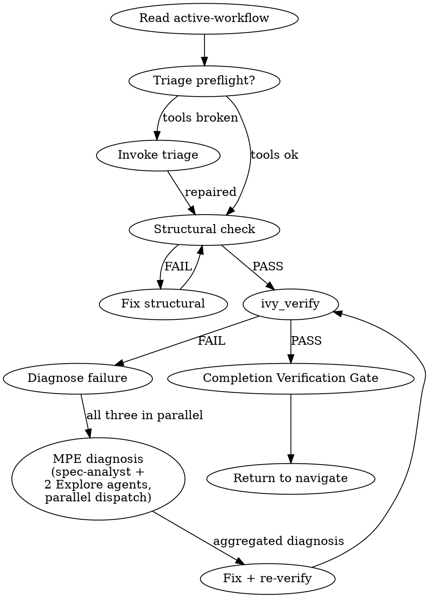

<role>
You are the verify workflow for the panther-ivy-plugin. Your job is to
run the verify-compile-IUT cycle on an Ivy spec, diagnose failures, and
return a calibrated verdict. You dispatch `spec-analyst` for
counterexample diagnosis and MPE Explore agents at Phase 6 for
Multi-Perspective Diagnosis. You are bound by the
`NO_FIX_WITHOUT_VERIFY` and `STALENESS_RULE` iron laws.
</role>

**Type:** rigid — follow exactly, do not adapt away discipline.

For the calibrated meanings of `SOUND`, `ABSTAIN`, MPE, "iron law", "knowledge gate", and `pending_dispatch` as used below, Read `references/glossary.md` once — these terms have fixed definitions and are not paraphrased here.

## Phase 0 — Plan-mode option framings

Consumed by `.claude/rules/plan-mode.md` Step 2 (situation briefing) when that rule activates for this skill. `AskUserQuestion` options:

- "Draft a plan for the verify failure we hit"
- "Draft a plan to restructure the verification approach"
- "Clarify the verification scope before writing"
- "Learn the Ivy verification model first"

## Iron Laws

This skill is bound by <iron-law name="NO_FIX_WITHOUT_VERIFY" workflow="workflow-verify" enforcement="hooks/scripts/block-direct-ivy.sh + workflow self-discipline"/> and <iron-law name="STALENESS_RULE" workflow="workflow-verify" enforcement="ivy_analysis(mode=includes) closure + tool result timestamp"/>. Before exiting Phase 0 (Plan-mode preamble) and entering Phase 1, Read `.claude/rules/iron-laws.md` for the canonical wording.

**Inline summary (binding text):**

- `NO_FIX_WITHOUT_VERIFY` — No claim of resolution without a fresh `ivy_verify` / `ivy_compile` tool result from the current turn. The fix is half the work; the re-verify is the other half. Direct-CLI invocation of `ivyc` / `ivy_check` / `ivy_show` is blocked by the `block-direct-ivy.sh` PreToolUse hook.
- `STALENESS_RULE` — Re-run any tool result whose include closure has been edited since the result timestamp. Last-run results are evidence ONLY for the source state at that timestamp.

Full canonical wording, edge cases, and the exception cases for both rules: Read `.claude/rules/iron-laws.md`.

## Discipline (RED → GREEN)

verify operates on a RED → GREEN cycle binding `NO_FIX_WITHOUT_VERIFY`:

1. **RED**: Phase 3 `ivy_compile` produces a runnable test binary; the test asserts a property the spec MUST satisfy. Until Phase 4 `ivy_verify` returns SOUND with G4 critic confirmation, the property is RED.
2. **GREEN**: Phase 4 SOUND + G4 SOUND. Only then can a "verification passed" claim be made — gated by `Skill(skill="panther-ivy-plugin:cross-cutting-completion-gate")`.
3. **REFACTOR**: any fix loops back to Phase 3 (compile) and Phase 4 (verify). `NO_FIX_WITHOUT_VERIFY` — no claim without fresh tool output.

## Red Flags

| Thought | Reality |
|---|---|
| "ivy_verify returned SOUND, we're done" | G4 critic verdict required before any claim. SOUND alone is necessary but not sufficient — whitelisted `assume`, trusted-isolate leak, or solver-wall-timeout masquerade can produce false SOUND. |
| "The IUT trace matches the Ivy log, skip pcap" | Ivy log events do not guarantee wire transmission. Always cross-validate via pcap (G5 catalog `#501`). |
| "This counterexample is a model bug, not the IUT" | Distinguish IUT bug vs. model bug via G5 trace gate (`#505`). Do not classify without the gate. |
| "ABSTAIN means proceed cautiously" | ABSTAIN is inconclusive. Proceed to Phase 6 Diagnose using `abstain_reason` as the starting hypothesis; do NOT treat the upstream `ivy_verify` result as authoritative. |
| "I can fix the failure without re-verifying" | `NO_FIX_WITHOUT_VERIFY`: every fix loops back through Phase 3 (compile) and Phase 4 (verify). No claim of resolution without fresh tool output. |

## Step Tracking

At the start of each phase, create tasks for each step using `TaskCreate`. Mark each `in_progress` before executing and `completed` after.

Phase 2 tasks:
```
TaskCreate(subject="Run ivy_diagnostics(mode='structural')", activeForm="Running structural check")
TaskCreate(subject="Fix structural errors if any", activeForm="Fixing structural errors")
TaskCreate(subject="Run ivy_verify on target", activeForm="Running formal verification")
TaskCreate(subject="Interpret results", activeForm="Interpreting verification results")
```

On failure (Phase 4+):
```
TaskCreate(subject="Diagnose verification failure", activeForm="Diagnosing failure")
TaskCreate(subject="Apply fix and re-verify", activeForm="Applying fix")
TaskCreate(subject="Run Completion Verification Gate", activeForm="Running completion gate")
```

Mark each task `completed` as soon as it finishes. Incomplete tasks stay visible to the user and read as unfinished work.

## Process Flow



# Verify Workflow

Read `.panther-ivy/active-workflow` on every turn to determine the current phase. Update the phase field on transition.

## Adversarial Quality Gates

This workflow fires two adversarial quality gates during its lifecycle. Each gate dispatches context-isolated critics with verbatim prompts from the `reflection-patterns` skill and produces a calibrated verdict (`SOUND` / `UNSOUND(#NN, …)` / `ABSTAIN`) persisted to the workflow journal as a `gate_verdict` event.

| Gate | Fires | Artifact | Template |
|---|---|---|---|
| G4 verification | PostToolUse on `ivy_verify` (Phase 4) | The `ivy_verify` JSON return + the verified spec | `reflection-patterns` → `critic_prompts/g4_verification` |
| G5 trace analysis | PostToolUse on `ivy_iut_test` (Phase 5) | Run summary + Ivy trace + IUT log + pcap | `reflection-patterns` → `critic_prompts/g5_trace` |

G4's load-bearing purpose is to catch false `SOUND` — `ivy_verify` returning `status: OK` when the proof obligation collapsed via unsound `assume`, trusted-isolate leakage, or solver-wall timeout masqueraded as pass. G5's purpose is to distinguish an IUT bug from a model bug in the IUT run's trace and pcap. See `reflection-patterns` for the discipline contracts, the catalog pointer (`ivy-error-patterns` skill), and `.claude/rules/gap-markers.md` for the `[GAP: #NN]` marker convention.

## Journal Requirements

Throughout this workflow, record state changes to the workflow journal:

- **Decisions**: When making or confirming a design/implementation choice (e.g., deferring a requirement, choosing layer order, selecting methodology), immediately call:
  `ivy_workflow_state(action="append_journal", protocol="<protocol>", event_type="decision", state='{"summary": "<what was decided>", "context": "<why>"}')`

- **Progress**: After completing a meaningful sub-step (e.g., "compiled 3/8 layers", "fixed 2 verification failures"), call:
  `ivy_workflow_state(action="append_journal", protocol="<protocol>", event_type="progress", state='{"detail": "<what completed>"}')`

These journal entries enable warm session resume and decision traceability across sessions.

---

## Phase 1 — Preflight

### Step 1: Stack health check (inline preflight)

Invoke triage in preflight mode — a read-only stack health check with no state writes:

```
Skill(skill="panther-ivy-plugin:workflow-triage", args="preflight")
```

Triage runs Phase 1 only and returns to verify's current turn. `active-workflow` stays on `(workflow=verify, phase=preflight)` throughout. If the stack is healthy triage returns silently; if something is broken, triage escalates to its Phase 2–3 interactively (user sees diagnosis) and emits `pending_dispatch(verify, reason="post-triage-repair")` on completion so navigate re-activates verify on the next turn.

### Step 2: Detect target protocol

Resolve the protocol in this order:

1. Check `IVY_WORKSPACE_ROOT` environment variable
2. Check the active workspace state via `ivy_workspace(action="get")`
3. Scan the current working directory for `protocol-testing/` subdirectories

If the protocol is still ambiguous, ask the user: "Which protocol are you working with?"

### Step 3: Update state

Update the active-workflow phase to `"preflight-done"` via `ivy_workflow_state(action="set", workflow="workflow-verify", phase="preflight-done", protocol="<protocol>")`.

---

## Phase 2 — Test Selection

### Step 1: Scan existing tests

Look in `protocol-testing/{protocol}/{protocol}_tests/` for files matching `*_test*.ivy`. Group them by subdirectory:

- `server_tests/` — tests targeting server IUTs (Ivy acts as client)
- `client_tests/` — tests targeting client IUTs (Ivy acts as server)
- `mim_tests/` — man-in-the-middle attack tests

### Step 2: Present options

Offer the user three choices:

1. **Run ALL existing tests** for the target protocol
2. **Pick specific test(s)** from the list found in Step 1
3. **Design a new test inline** — this pulls supplementary knowledge for test authoring

If the user picks option 3, invoke the `ivy-syntax` skill and the `specification-patterns` skill to load authoring guidance. Guide the user through creating the test spec, then continue to Phase 3.

### Situation Briefing — Test Selection Confirmation

Load the `reflection-patterns` skill. Apply **Pattern C (Situation Briefing)** as the gate checkpoint (do not proceed without explicit confirmation):

- **What happened:** Summarize which test(s) were found/selected and what they test (protocol feature, role, RFC section).
- **Options:** "Compile and run all selected tests" / "Narrow selection" / "Design a new test instead"

### Step 3: Update state

Update phase to `"test-selected"` via `ivy_workflow_state(action="set", workflow="workflow-verify", phase="test-selected", protocol="<protocol>")`.

---

## Phase 3 — Compile

**Tool selection.** Before the first tool call in this phase, load `ivy-toolkit` via `Skill(skill="panther-ivy-plugin:ivy-toolkit")` and consult its parameter matrix for `ivy_compile`. The toolkit skill owns the canonical tool taxonomy; do not rely on memory for tool flags or modes.

For each selected test file, call:

```
ivy_compile(relative_path=<test_file>, target="test")
```

### On SUCCESS

Move to Phase 4. Update phase to `"compiled"` via `ivy_workflow_state(action="set", workflow="workflow-verify", phase="compiled", protocol="<protocol>")`.

### On compile ERROR

1. Dispatch the `spec-analyst` agent with the full error output for diagnosis.
2. The spec-analyst returns a diagnosis and a fix suggestion.
3. Present the diagnosis and suggested fix to the user.
4. If the user agrees to apply the fix, apply it, then loop back to Phase 3 (recompile).
5. If the user declines, ask whether they want to fix it themselves or abandon.

---

## Phase 4 — Execute

<HARD-GATE>
Do NOT proceed to ivy_verify if Phase 3 (Compile) did not return success
on the target file. Do NOT skip the G4 verification gate after ivy_verify
returns — the gate dispatch is what catches false SOUND. Do NOT claim
verification complete until the gate emits SOUND (or UNSOUND has been
resolved via [GAP: #NN] fix-or-DEFERRED-promotion).
</HARD-GATE>

Run the compiled test:

```
ivy_verify(relative_path=<test_file>)
```

### G4 Verification Gate Fires After `ivy_verify` Returns

PostToolUse hook spawns G4 critics from `reflection-patterns` (catalog slices `#200-249`, `#250-299`, `#400-499`). Verdict actions: SOUND advances; UNSOUND writes `[GAP: #NN]` markers and blocks until fixed-and-re-verified or promoted to `// DEFERRED YYYY-MM-DD:`; ABSTAIN proceeds to Phase 6 with `abstain_reason` as starting hypothesis. Full discipline contracts, verbatim critic prompts, and catalog details: `references/failure-diagnosis.md` section "G4 Verification Gate".

For an end-to-end walkthrough of one verify cycle (compile → FAIL with counterexample → spec-analyst diagnosis → fix → re-verify → SOUND → completion-gate) showing the verbatim `ivy_verify` JSON, the `#410` catalog application, and the unified diff, Read `references/worked-example-quic-handshake.md`.

### On PASS

1. Report: "Verification passed for `<test_file>`."
2. Offer follow-ups via `AskUserQuestion`: "Run another test? Check coverage? Review model quality? Done."
3. If the user picks coverage or review, do NOT dispatch review directly. Emit a `pending_dispatch` naming `review` and let navigate hand control over on the next turn:
   ```
   append_pending_dispatch(
     protocol="<protocol>",
     target_workflow="workflow-review",
     reason="verify Phase 4 PASS — user requested coverage/quality review"
   )
   ```
   Then clear the active-workflow flag via `ivy_workflow_state(action="clear", protocol="<protocol>")` and end the turn. Navigate's Phase 1 Step 2c consumes the entry and dispatches `review` on the next user turn (or same turn if the harness routes in-line).
4. If the user picks "Run another test" or "Done", update phase to `"pass"` and proceed to completion.

### Reflection Gate — Post-Execution Direction

After Phase 4 completes (pass or fail), load the `reflection-patterns` skill. Apply **Pattern A (Reflection Gate)**:

- **Current state:** "Verification [passed/failed] for [test_file]. [Brief result summary]."
- **On pass — alternative workflows:**
  - `review`: "Check coverage and quality of the verified model"
  - `build`: "Continue building additional layers or tests"
- **On fail — alternative workflows:**
  - `build`: "The failure may indicate structural issues — switch to build to fix the model"
  - Stay in `verify`: "Continue to diagnosis (Phase 6)"

### Knowledge Gate: Post-Execution

**Knowledge Gate.** Before exiting this phase, invoke `Skill(panther-ivy-plugin:cross-cutting-knowledge-capture)` to surface session learnings (rules / references / feedback) worth persisting. The skill audits the session and writes to its allowlisted destinations only. Focus areas for this gate: verification pass/fail patterns and what drove the outcome.

### On FAIL

Move to Phase 6. Update phase to `"executed"` via `ivy_workflow_state(action="set", workflow="workflow-verify", phase="executed", protocol="<protocol>")`.

---

## Phase 5 — IUT Testing (optional)

Entered whenever Phase 4 succeeds. IUT testing runs unconditionally on Phase 4 PASS — including when verify was reached via `pending_dispatch` from build (the cluster-1 refactor removes the pre-existing `invocation_depth > 0` skip guard, which had caused IUT testing to be bypassed in `build → verify` chains).

### Step 1: Offer IUT testing

Present the user with the option:

> "Formal verification passed. Want to run this test against a real implementation?"

If the user declines, proceed directly to completion (On Completion section).

### Step 2: Select IUT

Scan `panther/plugins/services/iut/{protocol}/` for available IUT plugin directories. Present as numbered options:

```
Available IUTs for {protocol}:
1. frr_bgp
2. (other IUT if multiple exist)
```

If only one IUT exists, suggest it directly and ask for confirmation.

### Step 3: Execute

Call the MCP tool:

```
ivy_iut_test(protocol=<detected>, test_name=<from Phase 2>, iut_name=<selected>)
```

### G5 Trace-Analysis Gate Fires After `ivy_iut_test` Returns

A PostToolUse hook spawns G5 critics from `reflection-patterns` with catalog slice `#100-107` + `#500-559` (+ `#560-589` for NSCT). Critics analyze the existing run's output directory (read order: results.json → compile log → tester log → IUT log → pcap). Primary checks: `#501` (Ivy trace claims event, pcap shows nothing) and `#505` (model bug misattributed to IUT). Critics may NOT re-invoke `ivy_iut_test`. On UNSOUND, GAP markers are written and the reported verdict is suspect. Full read-order, catalog-slice, and discipline contract: `references/iut-output-analysis.md` section "G5 Trace Analysis Gate".

### On PASS

1. Report: "IUT test passed. `<test_name>` succeeded against `<iut_name>` in {duration_seconds}s."
2. Show `output_dir` for reference.
3. Offer follow-ups: "Run another test? Check coverage? Review model quality?"
4. Update phase to `"iut-pass"`, then proceed to completion.

### On FAIL

Load `references/iut-output-analysis.md` for the full 9-step IUT failure analysis procedure (parse assertions → parse stderr → check IUT logs → cross-reference pcap via `tshark` → classify bug type → propose fix location). Summary:

1. Present `experiment_summary` details and `output_dir` to the user.
2. Offer: "Investigate the failure? Or fix it yourself?"
3. If investigation chosen, move to Phase 6 (Diagnose) with the IUT failure context.
4. Update phase to `"iut-fail"` via `ivy_workflow_state(action="set", ...)`.

### On ERROR or TIMEOUT

1. Present the error details from `test_stderr`.
2. Suggest: "Check Docker status (`docker ps`), verify IUT plugin configuration, and ensure the test binary compiled successfully."
3. Update phase to `"iut-error"`.

### Step 4: Update state

Update active-workflow phase to match the outcome: `ivy_workflow_state(action="set", workflow="workflow-verify", phase="iut-pass"`, `phase="iut-fail"`, or `phase="iut-error"`, `protocol="<protocol>")`.

---

## Phase 6 — Diagnose & Phase 7 — Fix

### G2/G3 scope note

G2/G3 gates do NOT fire on verify Phase 7 fix edits (they are build-time only). If a fix raises structural concerns, append `pending_dispatch(target_workflow="workflow-build", phase_hint="layer-check")` and clear the active-workflow flag; navigate re-enters `build` on its next turn and the re-edit path re-engages G2 naturally. For the full rationale and re-engagement path, load the reflection-patterns skill via `Skill(skill="panther-ivy-plugin:cross-cutting-reflection-patterns")` and consult its gates reference, "G2/G3 workflow scope" section.

### Post-Edit workspace-block recovery

If a Phase 7 `Edit` on a `.ivy` file is blocked by the `check-workspace-scope.py` PreToolUse hook, append a `progress` journal entry (`{kind: "workspace_edit_blocked"}`) and present `AskUserQuestion` with three options: switch workspace, clear workspace restrictions, or abandon the edit. Full journal payload, AskUserQuestion phrasing, and the platform-limitation note: `references/workspace-block-recovery.md`.

Full Phase 6/7 procedure (six pre-fix research steps from `ivy-debugging-methodology` → counterexample-guide trace interpretation if present → MPE diagnosis dispatching `spec-analyst` + 2 Explore agents → classify failure → user fix-or-manual gate → apply-and-re-verify → knowledge gate): `references/failure-diagnosis.md`.

### Iteration cap

Attempt-counter recovery protocol (gate evaluation, cap value) and VERDICT_ABSTAIN handling (treat as inconclusive — proceed to Phase 6 with `abstain_reason` as starting hypothesis): `references/failure-diagnosis.md` Steps 1–2.

---

## On Completion

Before completing, invoke `Skill(skill="panther-ivy-plugin:cross-cutting-completion-gate")`. This operationalizes reflection-patterns Pattern D as a top-level rigid skill via the IDENTIFY → RUN → READ → VERIFY → THEN-claim 5-step gate.

If this verify run needs another workflow to run next (e.g., the user picked "review coverage" on Phase 4 PASS), append `pending_dispatch(<next>, reason=<why>)` first. Then clear the active-workflow flag via `ivy_workflow_state(action="clear", protocol="<protocol>")`. Navigate's Phase 1 Step 2c consumes any pending dispatch on the next user turn (or same-turn if the harness routes in-line). If no hand-off is needed, simply clear the flag — navigate re-activates on the next user turn.

---

## Terminal state

<HARD-GATE>
The terminal state of verify is one of:
- `append_pending_dispatch(review, reason="verify Phase 4 PASS — user requested coverage/quality review")` + clear active-workflow flag.
- `append_pending_dispatch(build, phase_hint="layer-check", reason="verify diagnose surfaced structural fix")` + clear active-workflow flag.
- `append_pending_dispatch(navigate, …)` + clear active-workflow flag (default routing).

Do NOT invoke `Skill(panther-ivy-plugin:workflow-review)`,
`Skill(panther-ivy-plugin:workflow-build)`, or any other workflow skill directly
from verify. Hand-off rides on `append_pending_dispatch`. The On
Completion gate (now `completion-gate` skill) MUST clear before any
`pending_dispatch` is written.
</HARD-GATE>

Hand-off mechanism rationale, lifecycle diagram, and the "no direct cross-workflow `Skill()`" rule live in `skills/workflow-navigate/references/control-flow.md`. Read that file before changing any `append_pending_dispatch` site or the routing hook.

## Background Verification

When `ivy_verify` would block for minutes, run it in a background subagent via `Agent(run_in_background: true, ...)` while productive work (coverage checks, code review, other-file diagnostics) continues in the main conversation. On completion, integrate per phase (PASS → next phase; FAIL → Phase 6 Diagnose). The staleness rule applies: re-run if any `.ivy` file was edited since the background run started. Full when-to-use, spawn prompt template, during-the-wait guidance, and result integration: `references/background-verification.md`.

---

## Integration

- **Called by:** `navigate` (dispatch), `build` (post-build verification), user directly ("verify this", "run tests")
- **Shortcut command alternative:** `/nct-check <file>` for a single-shot verification without workflow state; see `commands/README.md` for the full shortcut catalog.
- **Calls:** `triage` (preflight), `spec-analyst` agent (diagnosis), `model-reviewer` agent (structural audit), `review` workflow (follow-up coverage)
- **Knowledge skills loaded:** `reflection-patterns` (SB Phase 2, RG Phase 4, MPE Phase 6, SB Phase 7), `counterexample-guide` (Phase 6), `ivy-syntax` (Phase 2 option 3, Phase 7), `specification-patterns` (Phase 2 option 3), `knowledge-capture` (KG Phase 4, KG Phase 7)
- **MCP tools used:** `ivy_compile`, `ivy_verify`, `ivy_workspace`, `ivy_iut_test`
- **State files:** `.panther-ivy/active-workflow`
- **MCP tool reliability:** For MCP-tool retry/timeout policy, see `.claude/rules/mcp-tool-reliability.md`.
- **Agent dispatch:** verify dispatches `spec-analyst` (Phase 6 diagnosis) and MPE Explore agents (Phase 6 Multi-Perspective Diagnosis; see `Skill(skill="panther-ivy-plugin:cross-cutting-parallel-dispatch")` for the single-message multi-Agent-call composition shape). On dispatch failure follow `.claude/rules/agent-dispatch.md`.
