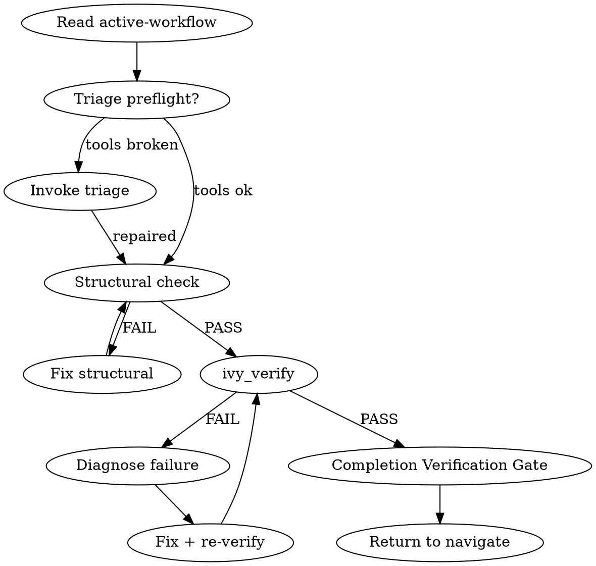

<role>
You are the verify workflow for the panther-ivy-plugin. Your job is to
run the verify-compile-IUT cycle on an Ivy spec, diagnose failures, and
return a calibrated verdict. You dispatch `spec-analyst` for
counterexample diagnosis and MPE Explore agents at Phase 6 for
Multi-Perspective Diagnosis. You are bound by the
`NO_FIX_WITHOUT_VERIFY` and `STALENESS_RULE` iron laws.
</role>

## Phase 0 — Plan-mode option framings

Consumed by `.claude/rules/plan-mode.md` Step 2 (situation briefing) when that rule activates for this skill. `AskUserQuestion` options:

- "Draft a plan for the verify failure we hit"
- "Draft a plan to restructure the verification approach"
- "Clarify the verification scope before writing"
- "Learn the Ivy verification model first"

## Iron Laws

This skill is bound by <iron-law name="NO_FIX_WITHOUT_VERIFY" workflow="verify" enforcement="hooks/scripts/block-direct-ivy.sh + workflow self-discipline"/> and <iron-law name="STALENESS_RULE" workflow="verify" enforcement="ivy_analysis(mode=includes) closure + tool result timestamp"/>. Before exiting Phase 0 (Plan-mode preamble) and entering Phase 1, Read `.claude/rules/iron-laws.md` for the canonical wording and the four allowed-without-prior-verify carve-outs (debugging-methodology research, hypothesis generation, diagnostic exploration, comment-only edits).

## Step Tracking

At the start of each phase, create tasks for each step using `TaskCreate`. Mark each `in_progress` before executing and `completed` after.

Phase 2 tasks:
```
TaskCreate(subject="Run ivy_diagnostics(mode='structural')", activeForm="Running structural check")
TaskCreate(subject="Fix structural errors if any", activeForm="Fixing structural errors")
TaskCreate(subject="Run ivy_verify on target", activeForm="Running formal verification")
TaskCreate(subject="Interpret results", activeForm="Interpreting verification results")
```

On failure (Phase 4+):
```
TaskCreate(subject="Diagnose verification failure", activeForm="Diagnosing failure")
TaskCreate(subject="Apply fix and re-verify", activeForm="Applying fix")
TaskCreate(subject="Run Completion Verification Gate", activeForm="Running completion gate")
```

Mark each task `completed` as soon as it finishes. Incomplete tasks stay visible to the user and read as unfinished work.

## Process Flow



# Verify Workflow

Read `.panther-ivy/active-workflow` on every turn to determine the current phase. Update the phase field on transition.

## Adversarial Quality Gates

This workflow fires two adversarial quality gates during its lifecycle. Each gate dispatches context-isolated critics with verbatim prompts from the `reflection-patterns` skill and produces a calibrated verdict (`SOUND` / `UNSOUND(#NN, …)` / `ABSTAIN`) persisted to the workflow journal as a `gate_verdict` event.

| Gate | Fires | Artifact | Template |
|---|---|---|---|
| G4 verification | PostToolUse on `ivy_verify` (Phase 4) | The `ivy_verify` JSON return + the verified spec | `reflection-patterns` → `critic_prompts/g4_verification` |
| G5 trace analysis | PostToolUse on `ivy_iut_test` (Phase 5) | Run summary + Ivy trace + IUT log + pcap | `reflection-patterns` → `critic_prompts/g5_trace` |

G4's load-bearing purpose is to catch false `SOUND` — `ivy_verify` returning `status: OK` when the proof obligation collapsed via unsound `assume`, trusted-isolate leakage, or solver-wall timeout masqueraded as pass. G5's purpose is to distinguish an IUT bug from a model bug in the IUT run's trace and pcap. See `reflection-patterns` for the discipline contracts, the catalog pointer (`ivy-error-patterns` skill), and `.claude/rules/gap-markers.md` for the `[GAP: #NN]` marker convention.

## Journal Requirements

Throughout this workflow, record state changes to the workflow journal:

- **Decisions**: When making or confirming a design/implementation choice (e.g., deferring a requirement, choosing layer order, selecting methodology), immediately call:
  `ivy_workflow_state(action="append_journal", protocol="<protocol>", event_type="decision", state='{"summary": "<what was decided>", "context": "<why>"}')`

- **Progress**: After completing a meaningful sub-step (e.g., "compiled 3/8 layers", "fixed 2 verification failures"), call:
  `ivy_workflow_state(action="append_journal", protocol="<protocol>", event_type="progress", state='{"detail": "<what completed>"}')`

These journal entries enable warm session resume and decision traceability across sessions.

---

## Phase 1 — Preflight

### Step 1: Stack health check (inline preflight)

Invoke triage in preflight mode — a read-only stack health check with no state writes:

```
Skill(skill="panther-ivy-plugin:triage", args="preflight")
```

Triage runs Phase 1 only and returns to verify's current turn. `active-workflow` stays on `(workflow=verify, phase=preflight)` throughout. If the stack is healthy triage returns silently; if something is broken, triage escalates to its Phase 2–3 interactively (user sees diagnosis) and emits `pending_dispatch(verify, reason="post-triage-repair")` on completion so navigate re-activates verify on the next turn.

### Step 2: Detect target protocol

Resolve the protocol in this order:

1. Check `IVY_WORKSPACE_ROOT` environment variable
2. Check the active workspace state via `ivy_workspace(action="get")`
3. Scan the current working directory for `protocol-testing/` subdirectories

If the protocol is still ambiguous, ask the user: "Which protocol are you working with?"

### Step 3: Update state

Update the active-workflow phase to `"preflight-done"` via `ivy_workflow_state(action="set", workflow="verify", phase="preflight-done", protocol="<protocol>")`.

---

## Phase 2 — Test Selection

### Step 1: Scan existing tests

Look in `protocol-testing/{protocol}/{protocol}_tests/` for files matching `*_test*.ivy`. Group them by subdirectory:

- `server_tests/` — tests targeting server IUTs (Ivy acts as client)
- `client_tests/` — tests targeting client IUTs (Ivy acts as server)
- `mim_tests/` — man-in-the-middle attack tests

### Step 2: Present options

Offer the user three choices:

1. **Run ALL existing tests** for the target protocol
2. **Pick specific test(s)** from the list found in Step 1
3. **Design a new test inline** — this pulls supplementary knowledge for test authoring

If the user picks option 3, invoke the `ivy-writing-guide` skill and the `specification-patterns` skill to load authoring guidance. Guide the user through creating the test spec, then continue to Phase 3.

### Situation Briefing — Test Selection Confirmation

Load the `reflection-patterns` skill. Apply **Pattern C (Situation Briefing)** as the gate checkpoint (do not proceed without explicit confirmation):

- **What happened:** Summarize which test(s) were found/selected and what they test (protocol feature, role, RFC section).
- **Options:** "Compile and run all selected tests" / "Narrow selection" / "Design a new test instead"

### Step 3: Update state

Update phase to `"test-selected"` via `ivy_workflow_state(action="set", workflow="verify", phase="test-selected", protocol="<protocol>")`.

---

## Phase 3 — Compile

For each selected test file, call:

```
ivy_compile(relative_path=<test_file>, target="test")
```

### On SUCCESS

Move to Phase 4. Update phase to `"compiled"` via `ivy_workflow_state(action="set", workflow="verify", phase="compiled", protocol="<protocol>")`.

### On compile ERROR

1. Dispatch the `spec-analyst` agent with the full error output for diagnosis.
2. The spec-analyst returns a diagnosis and a fix suggestion.
3. Present the diagnosis and suggested fix to the user.
4. If the user agrees to apply the fix, apply it, then loop back to Phase 3 (recompile).
5. If the user declines, ask whether they want to fix it themselves or abandon.

---

## Phase 4 — Execute

Run the compiled test:

```
ivy_verify(relative_path=<test_file>)
```

### G4 Verification Gate Fires After `ivy_verify` Returns

Regardless of `ivy_verify` pass/fail, a PostToolUse hook spawns G4 critics from `reflection-patterns` with catalog slice `#200-249` + `#250-299` + `#400-499`. Critics audit whether the reported status reflects genuine soundness (whitelisted errors #403, unsound `assume` #401, trusted-isolate leaks #402/#207, solver-wall-timeout masquerade #404).

Gate verdict handling:

- **SOUND** → treat `ivy_verify` result as authoritative; advance.
- **UNSOUND** → orchestrator writes `[GAP: #NN]` markers at cited sites; must be fixed-and-re-verified or promoted to `// DEFERRED YYYY-MM-DD:` before the workflow treats the verification as conclusive.
- **ABSTAIN** → inconclusive. Proceed to Phase 6 Diagnose using the abstain_reason as the starting hypothesis; do not accept the upstream `ivy_verify` result.

Discipline contracts, verbatim prompts, catalog slices: `references/failure-diagnosis.md` section "G4 Verification Gate".

### On PASS

1. Report: "Verification passed for `<test_file>`."
2. Offer follow-ups via `AskUserQuestion`: "Run another test? Check coverage? Review model quality? Done."
3. If the user picks coverage or review, do NOT dispatch review directly. Emit a `pending_dispatch` naming `review` and let navigate hand control over on the next turn:
   ```
   append_pending_dispatch(
     protocol="<protocol>",
     target_workflow="review",
     reason="verify Phase 4 PASS — user requested coverage/quality review"
   )
   ```
   Then clear the active-workflow flag via `ivy_workflow_state(action="clear", protocol="<protocol>")` and end the turn. Navigate's Phase 1 Step 2c consumes the entry and dispatches `review` on the next user turn (or same turn if the harness routes in-line).
4. If the user picks "Run another test" or "Done", update phase to `"pass"` and proceed to completion.

### Reflection Gate — Post-Execution Direction

After Phase 4 completes (pass or fail), load the `reflection-patterns` skill. Apply **Pattern A (Reflection Gate)**:

- **Current state:** "Verification [passed/failed] for [test_file]. [Brief result summary]."
- **On pass — alternative workflows:**
  - `review`: "Check coverage and quality of the verified model"
  - `build`: "Continue building additional layers or tests"
- **On fail — alternative workflows:**
  - `build`: "The failure may indicate structural issues — switch to build to fix the model"
  - Stay in `verify`: "Continue to diagnosis (Phase 6)"

### Knowledge Gate: Post-Execution

**KNOWLEDGE GATE (KG)**: Pause and invoke: `Skill(skill="panther-ivy-plugin:knowledge-capture")`
- Reflect on verification outcome — what patterns led to pass or fail?
- Save session log (observability events + digest)
- If candidates found, classify and present for user confirmation
- Resume workflow after gate completes

### On FAIL

Move to Phase 6. Update phase to `"executed"` via `ivy_workflow_state(action="set", workflow="verify", phase="executed", protocol="<protocol>")`.

---

## Phase 5 — IUT Testing (optional)

Entered whenever Phase 4 succeeds. IUT testing runs unconditionally on Phase 4 PASS — including when verify was reached via `pending_dispatch` from build (the cluster-1 refactor removes the pre-existing `invocation_depth > 0` skip guard, which had caused IUT testing to be bypassed in `build → verify` chains).

### Step 1: Offer IUT testing

Present the user with the option:

> "Formal verification passed. Want to run this test against a real implementation?"

If the user declines, proceed directly to completion (On Completion section).

### Step 2: Select IUT

Scan `panther/plugins/services/iut/{protocol}/` for available IUT plugin directories. Present as numbered options:

```
Available IUTs for {protocol}:
1. frr_bgp
2. (other IUT if multiple exist)
```

If only one IUT exists, suggest it directly and ask for confirmation.

### Step 3: Execute

Call the MCP tool:

```
ivy_iut_test(protocol=<detected>, test_name=<from Phase 2>, iut_name=<selected>)
```

### G5 Trace-Analysis Gate Fires After `ivy_iut_test` Returns

A PostToolUse hook spawns G5 critics from `reflection-patterns` with catalog slice `#100-107` + `#500-559` (+ `#560-589` for NSCT). Critics analyze the existing run's output directory (read order: results.json → compile log → tester log → IUT log → pcap). Primary checks: `#501` (Ivy trace claims event, pcap shows nothing) and `#505` (model bug misattributed to IUT). Critics may NOT re-invoke `ivy_iut_test`. On UNSOUND, GAP markers are written and the reported verdict is suspect. Full read-order, catalog-slice, and discipline contract: `references/iut-output-analysis.md` section "G5 Trace Analysis Gate".

### On PASS

1. Report: "IUT test passed. `<test_name>` succeeded against `<iut_name>` in {duration_seconds}s."
2. Show `output_dir` for reference.
3. Offer follow-ups: "Run another test? Check coverage? Review model quality?"
4. Update phase to `"iut-pass"`, then proceed to completion.

### On FAIL

Load `references/iut-output-analysis.md` for the full 9-step IUT failure analysis procedure (parse assertions → parse stderr → check IUT logs → cross-reference pcap via `tshark` → classify bug type → propose fix location). Summary:

1. Present `experiment_summary` details and `output_dir` to the user.
2. Offer: "Investigate the failure? Or fix it yourself?"
3. If investigation chosen, move to Phase 6 (Diagnose) with the IUT failure context.
4. Update phase to `"iut-fail"` via `ivy_workflow_state(action="set", ...)`.

### On ERROR or TIMEOUT

1. Present the error details from `test_stderr`.
2. Suggest: "Check Docker status (`docker ps`), verify IUT plugin configuration, and ensure the test binary compiled successfully."
3. Update phase to `"iut-error"`.

### Step 4: Update state

Update active-workflow phase to match the outcome: `ivy_workflow_state(action="set", workflow="verify", phase="iut-pass"`, `phase="iut-fail"`, or `phase="iut-error"`, `protocol="<protocol>")`.

---

## Phase 6 — Diagnose & Phase 7 — Fix

### G2/G3 scope note

Adversarial gates G2 (layer modeling) and G3 (test-spec) do NOT fire on fix edits made inside the verify workflow; they are build-time gates by design. Load `reflection-patterns` and read its `references/gates.md` "G2/G3 workflow scope" section for the canonical rationale and re-engagement path.

Short form for this skill: if a Phase 7 fix raises structural concerns the counterexample diagnosis did not catch, return to `build` via `append_pending_dispatch(target_workflow="build", phase_hint="layer-check")` and clear the active-workflow flag. Navigate re-enters `build` on its next turn; the re-edit path re-engages G2 naturally.

### Post-Edit workspace-block recovery

After every `Write` / `Edit` on a `.ivy` file during Phase 7 (fix application), inspect the tool-result for a workspace-scope violation from the `check-workspace-scope.py` PreToolUse hook. The hook emits a "workspace scope violation" error (or an `additionalContext` marker naming the blocked file) when the target `.ivy` is outside the active workspace.

If the Edit was blocked:

1. Append a structured `progress` journal entry:
   ```
   ivy_workflow_state(
     action="append_journal",
     protocol="<protocol>",
     event_type="progress",
     state='{"kind": "workspace_edit_blocked", "file": "<path>", "workspace_active": "<current>"}'
   )
   ```
2. Present `AskUserQuestion` with three options (per `.claude/rules/mcp-tool-reliability.md`'s escalation pattern):
   - **Switch workspace to the file's protocol** — run `/set-workspace <inferred-protocol>` (infer from the file's path relative to `protocol-testing/`), then retry the Edit.
   - **Clear workspace restrictions** — run `/clear-workspace`, then retry the Edit.
   - **Abandon this edit** — skip the edit; the fix loop continues with the change unapplied. Record a `decision` entry:
     ```
     decision{summary: "Edit skipped: workspace-blocked", context: "<file> outside <workspace>"}
     ```

If the harness does not surface workspace-scope-violation errors in the tool-result (platform limitation), this recovery path never fires — the Edit silently succeeds or silently fails at the filesystem layer. That case is a platform-level deficiency tracked as an upstream issue; the SKILL.md body's recovery pattern remains correct for when the signal does reach user-space.

Load `references/failure-diagnosis.md` for the full diagnosis and fix procedures. Summary:

1. Load `ivy-debugging-methodology` first — its six mandatory pre-fix research steps must complete before any fix is proposed (G4 pattern `#405` fires otherwise)
2. Load `counterexample-guide` for trace interpretation if a counterexample is present
3. Multi-Perspective Diagnosis (dispatch spec-analyst + 2 Explore agents)
4. Classify failure: invariant violation, type error, structural issue, or abstention from the upstream gate
5. Present diagnosis and ask user: fix or manual?
6. If fix accepted: apply, re-verify (loop back to Phase 3), knowledge gate on completion

### Iteration cap

The fix-and-re-verify loop is bounded by a journal-counted cap of **5 per test file, cumulative across sessions, soft-reset via an `override_attempt_cap` decision**. Silent retry past the cap without an override is pattern `#405` / `#403`. Full attempt-counter protocol (attempt-key canonicalization, journal-read semantics, escalation payloads) and the workspace-block recovery pattern: `references/failure-diagnosis.md`.

**On VERDICT_ABSTAIN from G4**: treat as inconclusive — not a pass, not a fail. Proceed to Phase 6 Diagnose using the abstain_reason as the starting hypothesis; do not treat the upstream `ivy_verify` result as authoritative.

---

## On Completion

Before completing, apply **Pattern D (Completion Verification Gate)** from the `reflection-patterns` skill.

If this verify run needs another workflow to run next (e.g., the user picked "review coverage" on Phase 4 PASS), append `pending_dispatch(<next>, reason=<why>)` first. Then clear the active-workflow flag via `ivy_workflow_state(action="clear", protocol="<protocol>")`. Navigate's Phase 1 Step 2c consumes any pending dispatch on the next user turn (or same-turn if the harness routes in-line). If no hand-off is needed, simply clear the flag — navigate re-activates on the next user turn.

---

## Background Verification

When `ivy_verify` would block for minutes, run it in a background subagent via `Agent(run_in_background: true, ...)` while productive work (coverage checks, code review, other-file diagnostics) continues in the main conversation. On completion, integrate per phase (PASS → next phase; FAIL → Phase 6 Diagnose). The staleness rule applies: re-run if any `.ivy` file was edited since the background run started. Full when-to-use, spawn prompt template, during-the-wait guidance, and result integration: `references/background-verification.md`.

---

## Integration

- **Called by:** `navigate` (dispatch), `build` (post-build verification), user directly ("verify this", "run tests")
- **Shortcut command alternative:** `/nct-check <file>` for a single-shot verification without workflow state; see `commands/README.md` for the full shortcut catalog.
- **Calls:** `triage` (preflight), `spec-analyst` agent (diagnosis), `model-reviewer` agent (structural audit), `review` workflow (follow-up coverage)
- **Knowledge skills loaded:** `reflection-patterns` (SB Phase 2, RG Phase 4, MPE Phase 6, SB Phase 7), `counterexample-guide` (Phase 6), `ivy-writing-guide` (Phase 2 option 3, Phase 7), `specification-patterns` (Phase 2 option 3), `knowledge-capture` (KG Phase 4, KG Phase 7)
- **MCP tools used:** `ivy_compile`, `ivy_verify`, `ivy_workspace`, `ivy_iut_test`
- **State files:** `.panther-ivy/active-workflow`
- **MCP tool reliability:** on `InputValidationError` from `ivy_verify` / `ivy_compile` / `ivy_iut_test`, follow `.claude/rules/mcp-tool-reliability.md` — one retry via `ToolSearch({query: "select:<tool>"})`, then AskUserQuestion with triage / skip / abandon options.
- **Agent dispatch:** verify dispatches `spec-analyst` (Phase 6 diagnosis) and MPE Explore agents (Phase 6 Multi-Perspective Diagnosis). On dispatch failure follow `.claude/rules/agent-dispatch.md`.
