# Journaling Contract

This is the canonical contract for how every routable surface in the panther-ivy-plugin maintains the workflow journal at `.panther-ivy/workflow-journal.yaml` and the active-workflow YAML at `.panther-ivy/active-workflow`. The contract is load-bearing: ops-skills, the orchestrator, hook scripts, and the cleanup script all converge on the rules below. Agents are read-only on these files indirectly (they invoke ops-skills which write).

The contract is delivered to two surfaces:

- **Main thread** — this file has no `paths:` frontmatter, so the harness auto-loads it on the first Read of any file in the plugin tree.
- **Subagent thread** — `hooks/scripts/journaling/contract-inject.py` (registered on the SubagentStart event, or on PreToolUse(matcher="Agent") if SubagentStart cannot deliver `additionalContext`) reads this file and injects it into a dispatched plugin specialist's context. Critic agents receive only a 5-line read-only stub; non-plugin agents receive nothing.

If the contract file is missing or unreadable, the injection hook exits with code 2 and blocks the dispatch — the contract is a hard requirement, not advisory.

## 1. Surface taxonomy

| Surface | Writes journal? | Writes active-workflow YAML? |
|---|---|---|
| `skills/ivy/SKILL.md` (orchestrator) | YES — `workflow_resumed`, `gate_verdict` (after critic aggregation), `context_switch`, `plan_approved` (delegated to plan-mode rule), `knowledge_captured` (after G6 SOUND) | YES — `set` on dispatch; the matching ops-skill clears at terminal |
| `skills/{scaffold,refine,experiment,review,triage,meta-self-mod}-ops/SKILL.md` | YES — `phase_transition`, `decision`, `progress`, `gate_verdict` (for hook-internal G4/G5), `error`, `pending_dispatch` | The orchestrator wrote `set` before dispatch; ops-skill clears at terminal |
| `skills/{methodology,ivy-syntax,ivy-toolkit,specification-patterns,propagation-patterns,apt-attack-patterns,verification-failures}/SKILL.md` | NO (knowledge skills are read-only references) | NO |
| `agents/ivy-{refiner,experimenter,builder,reviewer,triage,meta}-agent.md` | NO directly — invokes its preloaded ops-skill which writes | NO directly |
| `agents/g-{plan,fidelity,knowledge}-critic.md` | NO — returns `VERDICT_*` (or `KEEP/DROP/DEFER` for `g-knowledge-critic`); the orchestrator writes `gate_verdict` after aggregation | NO |
| `commands/{nct-health,nct-iut-test}.md` | YES via the underlying ops-skill (triage / experiment) | YES via the underlying ops-skill |
| Hook scripts | YES — `session_start` (`cleanup/stale-workflow.py`, only on actual resume or stale-clear), `gate_dispatched` (`posttooluse/gates/run-gate.py --id g0b\|g2\|g3\|g5` via `posttooluse/gates/gate_handlers.py`, `record/workflow-error.py` for G4), `error` (`record/workflow-error.py`), `progress{kind: mcp_retry}` (`mcp/retry.py`) | `cleanup/stale-workflow.py` clears stale; no other hook writes |

`progress{kind: fix_attempt}` is written by `refine-ops/SKILL.md` Phase 7 (the fix-attempt counter loop), not by a hook. Attribution matters when grepping the journal for diagnostic context.

Several Stop-hook readers (`record/session-end.py`, `render/summary/main.py`, `render.summary.audit_journal`) gate their output on a **per-session activity flag** (see §11). When the flag is absent, those hooks emit the one-line confirmation `[ivy-session] no ivy activity this session — skipping summary` and return without journal writes or lint output. The activity flag is **not** a journal event; it is a side-channel state file documented in §11.

## 2. Per-turn lifecycle (decision tree)

```dot
digraph journaling_lifecycle {
  rankdir=LR;
  user_turn      [shape=doublecircle, label="user turn arrives"];
  plan_mode      [shape=diamond, label="plan-mode\nactive?"];
  plan_branch    [shape=box, label="plan-authoring branch\n(per plan-mode.md);\nPhase 1.5 SKIPPED"];
  orch_phase1    [shape=box, label="orchestrator Phase 1\nread active-workflow YAML\nread journal last_n=20"];
  pending_check  [shape=diamond, label="fresh\npending_dispatch\n(<2h)?"];
  warm_resume    [shape=box, label="WARM RESUME\n1. append workflow_resumed\n2. set_active_workflow(target, init)\n3. dispatch matching agent"];
  cold_start     [shape=box, label="COLD START\n1. classify intent from prompt\n2. set_active_workflow(target, init)\n3. dispatch matching agent"];
  agent_run      [shape=box, label="subagent runs ops-skill\n(SubagentStart hook injects\nthis contract,\ngated by subagent_type)"];
  ops_writes     [shape=box, label="ops-skill writes:\nphase_transition / decision /\nprogress / gate_verdict / error"];
  terminal_check [shape=diamond, label="phase done?"];
  terminal       [shape=box, label="ops-skill terminal HARD-GATE\n1. append_pending_dispatch(next)\n   (optional)\n2. clear_active_workflow\n3. emit terminal-state msg"];
  return         [shape=box, label="orchestrator returns to user;\nturn ends"];

  user_turn -> plan_mode;
  plan_mode -> plan_branch [label="yes"];
  plan_mode -> orch_phase1 [label="no"];
  plan_branch -> return;
  orch_phase1 -> pending_check;
  pending_check -> warm_resume [label="yes"];
  pending_check -> cold_start  [label="no"];
  warm_resume -> agent_run;
  cold_start  -> agent_run;
  agent_run -> ops_writes;
  ops_writes -> terminal_check;
  terminal_check -> terminal [label="yes"];
  terminal_check -> ops_writes [label="no, continue phase"];
  terminal -> return;
}
```



## 3. Event payload schemas

The list below is closed. Adding a new event type requires editing `_VALID_EVENT_TYPES` in `hooks/scripts/workflow_state.py` AND `ivy_lsp/mcp/tools/workflow_state.py` AND this table in the same change. Runtime rejection of an unknown event type is silent (`append_journal_event` returns False) — drift is caught by review, not by the validator.

| Event type | Required fields | Optional fields | Writer |
|---|---|---|---|
| `session_start` | `resumed_from` (str or null) | `stale_cleared` (bool) | `cleanup/stale-workflow.py` — written **only** on actual resume (non-stale active workflow present) or stale-clear; **not** on idle session start (no active workflow). |
| `session_end` | `reason` (str) | — | `record/session-end.py` |
| `phase_transition` | `from` (str), `to` (str) | — | ops-skill at phase boundary |
| `decision` | `summary` (str), `context` (str) | — | ops-skill on user-driven choice |
| `progress` | `detail` (str) OR `kind` (str) + kind-specific fields | varies by `kind` | ops-skill |
| `progress{kind: fix_attempt}` | `kind: "fix_attempt"`, `key` (file path), `attempt` (int) | — | `refine-ops/SKILL.md` Phase 7 |
| `progress{kind: mcp_retry}` | `kind: "mcp_retry"`, `tool` (str), `outcome` (str) | — | `hooks/scripts/mcp/retry.py` |
| `progress{kind: agent_dispatch_*}` | `kind`, `agent`, `workflow`, `phase` | `reason` (failure mode) | per `.claude/rules/agent-dispatch.md` |
| `progress{kind: skill_invoked}` | `kind: "skill_invoked"`, `skill` (str: full plugin-prefixed name), `workflow` (str), `phase` (str) | — | `hooks/scripts/record/skill-invocation.py` (only fires when an ops-skill — `scaffold-ops`, `refine-ops`, `experiment-ops`, `review-ops`, `triage-ops`, `meta-self-mod-ops` — is invoked inside an active workflow). The orchestrator reads this on its next turn for warm-resume routing. |
| `progress{kind: question_answered}` | `kind: "question_answered"`, `record_id` (str: 12-char id matching the JSONL line), `question_count` (int), `answer_count` (int) | — | `hooks/scripts/record/askuserquestion.py` (PostToolUse:AskUserQuestion). The full question/answer text lives in the JSONL log at `.panther-ivy/askuserquestion-log.jsonl`; the journal entry is the compact pointer so the YAML stays small. |
| `error` | `pattern` (str), `file` (str), `line` (int) | `tool_name`, `tool_result_excerpt` | `record/workflow-error.py`; ops-skill on caught exception |
| `context_switch` | `detection` (str), `mode` (str) | — | orchestrator on plan-mode entry / exit |
| `gate_dispatched` | `gate` (str: `g0`/`g0b`/`g2`/`g3`/`g4`/`g5`/`g6`), `trigger` (str), `artifact` (str) | `layer`, `methodology`, `tool_name`, `plan_approved_ts` (g0b only) | `posttooluse/gates/run-gate.py --id g0b\|g2\|g3\|g5` (logic in `posttooluse/gates/gate_handlers.py`), `record/workflow-error.py` (G4) |
| `gate_verdict` | `gate` (str), `verdict` (str: `sound`/`unsound`/`abstain`), `vote` (str: e.g. `2-of-3`) | `patterns` (list of `#NN`), `cycle` (int), `tier` (str), `duration_s` (number), `abstain_reason` (str if `verdict=abstain`) | orchestrator after critic fan-out aggregation |
| `plan_approved` | `workflow` (str: caller), `phase_before_plan` (str), `plan_file` (str: abs path) | `supersedes` (list of str) | plan-mode procedure (per `plan-mode.md` Step 4) |
| `workflow_resumed` | `workflow` (str: caller being resumed), `phase_after_resume` (str), `source_pending_dispatch_index` (int) | `g0_cycle` (int) if traced from G0 SOUND | orchestrator on `pending_dispatch` consumption (Phase 1.5) |
| `knowledge_captured` | `rule_file` (str: dest path under `~/.claude/projects/<project>/memory/feedback_<topic>.md`), `summary` (str) | `g6_cycle` (int), `kept_count` (int), `dropped_count` (int) | orchestrator after G6 `g-knowledge-critic` SOUND verdict |
| `pending_dispatch` | `target_workflow` (str), `reason` (str) | `phase_hint` (str), `source_workflow` (str), `source_phase` (str) | ops-skill terminal HARD-GATE via `append_pending_dispatch` helper |

## 4. Idempotency, plan-mode, and concurrency

The pair `pending_dispatch` (producer) + `workflow_resumed` (consumer) implements turn-boundary-safe hand-off. The orchestrator MUST write `workflow_resumed` BEFORE `set_active_workflow` and BEFORE the actual dispatch. Order matters: if the orchestrator crashes between consume and dispatch, the next-turn read sees `workflow_resumed` already paired with the `pending_dispatch` index, so the same `pending_dispatch` is not consumed twice.

### 4.1 Plan-mode skip clause

When plan-mode is active (detected per `plan-mode.md` § Detection signals), the orchestrator's Phase 1.5 is skipped entirely. The `pending_dispatch` is NOT consumed; no `workflow_resumed` is written. The orchestrator drops to the plan-authoring branch.

Reason: `workflow_resumed` is the consume-marker. Writing it without an actual dispatch would break the pair semantics — the next-turn post-`ExitPlanMode` orchestrator would see the pair complete and skip re-consumption, losing the hand-off entirely.

Acknowledged risk: a plan-authoring session that exceeds 2 h causes the unconsumed `pending_dispatch` to go stale (per `is_workflow_stale` in `workflow_state.py`) and be silently dropped. The user re-invokes the workflow manually post-`ExitPlanMode` if needed. A contributor reading the journal after a long plan-mode session sees a `pending_dispatch` with no paired `workflow_resumed` — that is expected behaviour, not a bug.

### 4.2 Sequential-write assumption

The current architecture assumes only one writer (the active ops-skill or the orchestrator) writes the journal at any given time. `append_journal_event` (`hooks/scripts/workflow_state.py:461-509`) is read-modify-write with no file locking.

Today the architecture ensures sequencing:

- PostToolUse hooks fire in `hooks.json` order (per `postuse-hook-ordering.md`).
- Ops-skills run sequentially via `pending_dispatch` hand-off across turn boundaries.
- Critics dispatched in parallel (G0 / G0b / G6 each fire 3 critics) do NOT write the journal — they return verdicts, the orchestrator writes a single `gate_verdict` after aggregation.

Forward-looking note: a future change introducing parallel ops-skill dispatch (e.g. simultaneous scaffold + review) would require adding `fcntl` locking to `append_journal_event` or moving to an append-only journal format. The contract assumes sequential discipline; do not violate it without addressing the locking gap.

### 4.3 Journal rotation

`rotate_journal` (`hooks/scripts/workflow_state.py:581-625`) archives the oldest half of journal entries when the file exceeds 200 entries; archived entries land in `.panther-ivy/journal-archive/YYYY-MM-DD.yaml`.

The orchestrator's Phase 1 read of `last_n=20` is unaffected by rotation. A `pending_dispatch` from a much earlier session that escaped consumption may live in the archive, but the 2-hour staleness check happens before any archive lookup is needed, so this is benign in normal operation. A contributor investigating a missing `workflow_resumed` across a session boundary should grep the archive directory.

## 5. Terminal-state HARD-GATE (every ops-skill)

Before ending its turn, every ops-skill MUST do exactly this in this order:

1. (optional) `ivy_workflow_state(action="append_journal", event_type="pending_dispatch", state='{"target_workflow":"<next>", "reason":"<why>", "phase_hint":"<optional>"}')` — equivalently, call `append_pending_dispatch` directly.
2. `ivy_workflow_state(action="clear", protocol="<protocol>")`.
3. Emit the user-facing terminal-state message in the format `[ivy-{workflow}] {phase} {verdict}. {next_action_phrase}`.
4. END TURN — do not `Skill()` into another ops-skill, do not `Agent()` dispatch.

`pending_dispatch` is optional (no hand-off needed → just clear). Direct `Skill()` or `Agent()` calls between ops-skills are forbidden — the orchestrator owns dispatch.

Per `.claude/rules/skill-conventions.md` and the project's `feedback_autoload_rule_no_pointer_stub`, ops-skill bodies (scaffold-ops, refine-ops, experiment-ops, review-ops, triage-ops, meta-self-mod-ops) retain only their per-workflow Terminal sections with concrete `pending_dispatch` examples and per-workflow next-step phrasing. The abstract HARD-GATE rule above lives only in this contract document; it is not duplicated in the ops-skill bodies.

## 6. Subagent return shapes (canonical)

Two existing shapes are canonical for plugin subagents. New plugin agents MUST match one of them.

### 6.1 Specialist agents

`agents/ivy-{refiner,experimenter,builder,reviewer,triage,meta}-agent.md` all return:

```
Return ≤ 800 words total. JSON shape:
{
  "claim": "1-3 sentence verdict — what was attempted, outcome, gate state (≤ 60 words)",
  "evidence_paths": ["protocol-testing/<file>:<line>", "..."],   // ≤ 6 entries
  "gate_status": "SOUND | UNSOUND | ABSTAIN | NOT_APPLICABLE",
  "next_dispatch_hint": "≤ 30 words; null if work is complete",
  "tool_invocations": 0   // integer count, no transcript
}
```

The orchestrator reads `claim` and `next_dispatch_hint` to drive its next dispatch; `evidence_paths` and `tool_invocations` are surfaced to the user; `gate_status` reflects the most recent gate verdict relevant to the agent's run.

The orchestrator does NOT use the return shape to learn which journal events the agent's ops-skill wrote — it reads the journal directly. The journal is the single source of truth; the return shape is a verdict summary, not a write log.

### 6.2 Critic agents

`agents/g-{plan,fidelity,knowledge}-critic.md` all return:

```
VERDICT_<value>(#0X, "<reason>", "<scope>")

Reasoning:
- <evidence 1>
- <evidence 2>

Recommendation (only on UNSOUND):
- <specific fix>
```

`g-knowledge-critic` additionally emits a per-candidate `KEEP / DROP / DEFER` list before the per-batch VERDICT.

The orchestrator aggregates 3 verdicts via 2-of-3 vote per `references/parallel-dispatch.md`, then writes a single `gate_verdict` event with the aggregated outcome.

## 7. Hook output prefixes

Hook scripts emit twin-key output via `hook_utils.emit_hook_output` (per `output-style.md`). The full prefix table lives in `output-style.md`; the journaling-relevant additions are:

| Prefix / Marker | Event | Meaning |
|---|---|---|
| `[ivy-journal]` | SubagentStart (or PreToolUse(matcher="Agent") fallback) | The journaling-contract injection hook fired for a dispatched specialist. Critics receive the marker plus the read-only stub; non-plugin agents receive nothing. |
| `[ivy-resume]` | orchestrator user-visible message | The orchestrator consumed a fresh `pending_dispatch` and is warm-resuming a workflow. Format: `[ivy-resume] resuming <workflow> (<phase>) from <source_workflow>'s pending_dispatch`. |

Hooks that *write* journal events (or any other persistent state) compose their `systemMessage` from one of the three canonical templates documented in `output-style.md` § "State-persistence message templates (T1 / T2 / T3)". `T2 (journal)` is the relevant template for journal writes — example: `[ivy-gate] G2 modeling-gate dispatched appended to journal at .panther-ivy/workflow-journal.yaml (entry=#42)`. The discipline is enforced by `tests/test_observability_write_discipline.py`.

## 8. User-facing terminal-state message format

Every ops-skill MUST emit a one-liner before its `clear_active_workflow` call:

```
[ivy-{workflow}] {phase} {verdict}. {next_action_phrase}
```

Examples:

- `[ivy-refine] Phase 4 PASS (G4 SOUND, 2-of-3). Dispatching review for coverage follow-up.`
- `[ivy-scaffold] Phase 4 PASS. Handing off to refine (post-modeling verification).`
- `[ivy-review] Phase 3 PASS (G5 SOUND). Workflow complete; no further dispatch.`
- `[ivy-triage] Repair complete. Resuming refine (caller of preflight).`

Verdicts use the appropriate severity system per `ivy-formatting.md`: tool-outcome (`PASS / FAIL / WARN`) for mechanical results; gate-verdict (`SOUND / UNSOUND(#NN) / ABSTAIN`) for adversarial-vote outcomes.

## 9. Failure modes

The contract is load-bearing. Failure modes documented:

- **Contract file unreadable** — the SubagentStart injection hook exits 2 and blocks the dispatch. The user sees a hook-error message and fixes the file before retrying.
- **Unknown plugin agent name** — the injection hook logs `unknown panther-ivy-plugin agent: <name>` to stderr and emits the 5-line read-only stub as a fail-safe default. Dispatch proceeds. Adding a new agent to the plugin requires updating the gating switch in the hook script.
- **Journal write race** — does not happen under the sequential-write assumption (§4.2). If a future change violates the assumption, `append_journal_event` will silently drop one of the racing writes (the later one wins). Add `fcntl` locking before introducing parallelism.
- **Legacy active-workflow names** — `_KNOWN_WORKFLOWS` in `workflow_state.py` is the unprefixed set (`navigate`, `scaffold`, `refine`, `experiment`, `review`, `triage`, `meta`). Legacy prefixed names (`workflow-verify`, `workflow-build`, etc.) are migrated by the user-invoked one-shot `scripts/migrate_legacy_workflow.py`, NOT by `cleanup/stale-workflow.py` (per `feedback_no_backward_compat_shims`).

## 10. PROJECT.md as a derived view

`protocol-testing/<protocol>/PROJECT.md` is a per-protocol rolled-up status view of the workflow journal. It is a *derived* artifact: never hand-edited. The journal at `.panther-ivy/workflow-journal.yaml` is the single source of truth; PROJECT.md is the convenient snapshot the orchestrator reads at session entry to drive warm-resume.

Why this exists: the journal is append-only and grows linearly; the orchestrator needs a constant-time read of "current mode, current phase, last verify status, open counterexamples." Walking the full journal on every session entry would scale poorly. PROJECT.md is the rolled-up view, regenerated only when the workflow state changes.

### 10.1 Schema

The schema is owned by `hooks/scripts/project_md_state.py:PROJECT_MD_KEYS` (10 keys). Frontmatter shape:

```yaml
---
protocol: <name>           # bgp, quic, apt, minip, coap
version: <RFC version>     # e.g., rfc4271; 'unknown' if not yet inferred
mode: scaffold | refine | experiment | idle
phase: 0..10               # 0 = idle; 1..10 = canonical NCT phases
journal_pointer: .panther-ivy/workflow-journal.yaml#<event_id-or-null>
last_verify:
  status: SAT | UNSAT | NOT_RUN
  timestamp: <iso-or-null>
  isolate: <name-or-null>
rfc_sections_covered: [<payload>...]
open_counterexamples: [{phase, isolate, last_observed}, ...]
last_iut_run: null | {iut, verdict, timestamp}   # verdict ∈ NO_VIOLATION_FOUND / NON_COMPLIANT / TESTER_CRASH / IUT_CRASH
deferred_layers: [<payload>...]
---
```

### 10.2 Regeneration trigger

A PostToolUse hook on `mcp__.*ivy_workflow_state` (registered as `render/project-md.py`) fires for `action="set"|"clear"` and invokes `scripts/render-project-md.py` against the active workspace's `protocol-testing/<workspace>/` directory. `get`/`list`/other actions skip silently.

The render script reads:
- `.panther-ivy/workflow-journal.yaml` — for the rolled-up state.

The render script writes:
- `<protocol-dir>/PROJECT.md` — frontmatter only (no body).

Regeneration is idempotent: re-running on identical state produces an identical file. The hook's user-facing systemMessage uses the `[ivy-project-md]` marker.

### 10.3 Cross-reference with the journal

`journal_pointer` in PROJECT.md frontmatter points at the `event_id` of the journal event that produced the current view (or `null` if the journal is empty). If they disagree (orchestrator edits PROJECT.md without journal append), the journal is authoritative — re-run `scripts/render-project-md.py` to bring PROJECT.md back in sync.

### 10.4 Bootstrap

`scripts/migrate-bootstrap-project-md.py` is the one-shot bootstrap that seeds an idle PROJECT.md (mode=idle, phase=0, NOT_RUN, empty arrays) for every known protocol directory. Skips dirs that already have a PROJECT.md. Deletable after the first sweep per `feedback_no_backward_compat_shims`.

### 10.5 Failure modes

- **PROJECT.md absent or unreadable** — orchestrator's warm-resume path treats this as `mode=idle` and falls through to cold-start. Recoverable by re-running the bootstrap script.
- **Schema validation failure** — `load_project_md` raises `ProjectMdSchemaError`; the orchestrator falls back to cold-start. Recoverable by re-running `render-project-md.py` (which writes a fresh validated frontmatter).
- **Concurrent regen** — same sequential-write assumption as §4.2. Two workflow_state writes racing would race the regeneration hook, but the journal is the source of truth so the eventual roll-up converges.

## 11. Session-activity flag

The session-activity flag is a side-channel state file that answers the question "did the user actually touch Ivy in this session?" without reading the journal or inspecting git history. It is separate from the journal and from the active-workflow YAML.

### 11.1 Location and format

```
${TMPDIR}/claude-ivy/session-activity-<resolved_session_id>.flag
```

- The session ID is resolved via `resolve_session_id()` from `lib.hook_utils` (same helper used by `render/summary/main.py` and `gather_tool_metrics()`).
- The file is empty. Existence is the signal; content is not read.
- When `resolve_session_id()` returns `"unknown"`, `is_session_active()` returns **False** (fail-closed). Writers still touch a `session-activity-unknown.flag` path for back-to-back coherence within a broken-session-id condition, but readers in Stop hooks treat that path as absent.
- Lifetime: created on first signal; deleted by OS `${TMPDIR}` cleanup (no manual GC). Sessions spanning a `${TMPDIR}` cleanup boundary lose the flag mid-session and will see the one-line confirmation at Stop — a known, accepted limitation (sessions rarely span days).

### 11.2 Writers (4 sites)

| Hook | Signal | When |
|---|---|---|
| `record/skill-invocation.py` | `skill:<full-prefixed-name>` | Any `panther-ivy-plugin:*` skill invoked (knowledge skills included) |
| `posttooluse/lint/ivy.py` | `file:<path>` | Any `.ivy` file written or edited |
| `mcp/activity.py` | `mcp:<tool_name>` | Any `mcp__plugin_panther-ivy-plugin_*` tool call (broad matcher covers workspace, workflow_state, status, and all testing tools) |
| `render/workflow-aware-annotation.py` | `agent:<subagent_type>` | Specialist-agent dispatch (`ivy-{refiner,experimenter,builder,reviewer,triage,meta}-agent`); critic agents (`g-*-critic`) do **not** flip the flag |

All writes are idempotent: `Path.touch(exist_ok=True)` is atomic on POSIX, safe under parallel-firing PostToolUse hooks.

### 11.3 Readers (Stop hooks)

| Hook | Behavior when flag absent | Behavior when flag present |
|---|---|---|
| `record/session-end.py` | Emits `[ivy-noop] no ivy activity this session — skipping summary` and returns; no journal write. | Three-way dispatch on `WorkflowContext.current()`: (a) non-None → appends `session_end` + rotates journal + emits T2 message; (b) None → emits `[ivy-noop] activity recorded; no orchestrator workflow — skipping journal append`. |
| `render/summary/main.py` | Emits `[ivy-noop] no ivy activity this session` and returns. | Proceeds to `find_modified_ivy_files()` (path-scoped); if no files, another noop; else builds and emits the session summary. |
| `render.summary.audit_journal` | Returns `[]` immediately (no "no journal entries" warning). | Proceeds with the existing journal-gap checks. |

### 11.4 Relationship to the journal

The activity flag is **not** a journal event. It lives in `${TMPDIR}`, not in `.panther-ivy/`. It is not read by the orchestrator, not included in `journal_pointer` computations, and not archived by `rotate_journal`. It is purely a Stop-hook gate to prevent false-positive output in non-Ivy sessions.

Debuggers looking for "why did no summary appear at Stop?" should check: (a) `ls ${TMPDIR}/claude-ivy/` for the expected flag file, and (b) that the session ID resolved correctly (non-`unknown`).

### 11.5 Optional diagnostic log

When `IVY_SESSION_ACTIVITY_LOG=1` is set, `mark_session_activity()` appends a JSONL line to a sibling `signals-<session_id>.log` file recording `{"ts": "<iso>", "signal": "<signal>"}`. This file is not read by any gate logic; it exists only for debugging signal provenance.

## 12. Per-session statusline overlay

The per-session statusline overlay is the second side-channel state file the plugin maintains. It holds session-private statusline state — the per-session ``test_file`` segment, badge metadata, and last-invoked specialist agent — so two Claude Code windows in the same workspace+protocol see their own transient view rather than overwriting each other's segments.

Like the session-activity flag (§11) the overlay is **not** a journal event. It lives under the panther-ivy-plugin cache directory rather than in `.panther-ivy/`. The orchestrator does not read it, `rotate_journal` does not touch it, and `journal_pointer` computations ignore it. It exists only so the bash renderer can compose per-session segments alongside the workspace-shared ones.

### 12.1 Location and format

```
~/.claude/panther-ivy-plugin/cache/<sha1(workspace_root)[:12]>/<active_group>/sessions/<session_id>/overlay.json
```

- `workspace_root` is the panther_ivy/ directory (mirrors the shared cache key).
- `active_group` is the value at `<workspace_root>/.ivy-workspace-state.json::active_group`, written by `ivy_workspace(action="set", target=...)`. Falls back to the literal string `default` when no selection is set, when the state file is missing, or when the value fails the `[A-Za-z0-9_-]+` safety regex.
- `session_id` is the stable Claude Code session UUID from the hook's stdin payload (always present per the harness; see https://code.claude.com/docs/en/hooks "Common input fields"). Same `[A-Za-z0-9_-]+` safety regex.
- File schema: section-merge JSON identical to the shared cache. Sections currently used: `test_file`, `active_skill`, `session`. Top-level `version` field for future schema evolution; readers drop the file silently on version mismatch.

### 12.2 Writers

| Hook | Section | When |
|---|---|---|
| `render/workflow-aware-annotation.py` | `test_file` | Any `Write`/`Edit` of a `.ivy` file when `session_id` is present on stdin. Falls back to the shared cache write when `session_id` is absent (offline / smoke-test invocations). |

Future hooks that need session-private rather than workspace-shared statusline state should call `statusline_cache.update_overlay_from_hook(session_id, sections)` rather than `update_from_hook`.

### 12.3 Readers

The bash renderer (`scripts/statusline/main.sh` plus `scripts/statusline/cache.sh::statusline_overlay_load`) reads the overlay once per render and populates `STC_SESSION_*` variables for the segment scripts. Each session-private segment prefers the overlay value with fallback to the shared cache value, so a session whose overlay is missing (no session_id, fresh session, reaper just ran) still sees the workspace-shared content.

### 12.4 Migration from pre-partitioning installs

Pre-partitioning caches at `<wsHash>/statusline.json` are moved under `<wsHash>/default/statusline.json` on the first `SessionStart` after Phase 4 lands, via `statusline_cache.migrate_legacy_cache(workspace_root)` invoked from `statusline/sync.py`. Idempotent — once the legacy file is gone the migration is a no-op. Concurrent SessionStart hooks are safe: the move is fcntl-locked, and a sibling session that races the migration finds the new file already present and deletes the legacy file rather than overwriting.

Per `feedback_no_backward_compat_shims` the migration code is one-shot. A follow-up commit removes `migrate_legacy_cache` and its call site once enough time has passed that no live install still has a legacy file. The function and its test (`tests/test_statusline_cache_migration.py`) are tagged for that follow-up cleanup.

### 12.5 Failure modes

- **Overlay file unreadable** — the renderer's `statusline_overlay_load` returns no-op and segments fall through to the shared cache. Same graceful-degradation pattern as the shared `statusline_cache_load`.
- **Unsafe `session_id`** — the writer (`update_overlay`) and reader (`read_overlay`) both validate against `[A-Za-z0-9_-]+`; a malformed payload silently no-ops rather than escaping the cache directory.
- **Concurrent writers in the same session** — fcntl-locked on a sibling `overlay.lock` file, identical pattern to the shared cache.
- **Reaping** — overlays accumulate over time as session UUIDs cycle. A future reaper (not yet implemented) will sweep `cache/<wsHash>/<active_group>/sessions/` for entries older than 7 days on `SessionStart`. Until that lands, the directory grows unbounded but with negligible disk impact (each overlay is ~200 B).
