# Skills

## Overview

Skills provide reference material and domain knowledge for Ivy protocol testing within the PANTHER framework. The 18 skills use the **flat-with-prefix layout** — each skill lives at `skills/<category>-<name>/SKILL.md` with `name: <category>-<leaf>` matching the leaf directory. Categories are encoded as the prefix:

- **workflow-*** (5) — User-facing entry points; activated by routing or explicit invocation.
- **knowledge-*** (7) — Reference material loaded by workflows and agents on demand.
- **cross-cutting-*** (4) — Patterns and gates invoked by multiple workflows.
- **meta-*** (2) — Plugin-internal; not user-invocable directly.

## Runtime composition (at a glance)

A user prompt becomes a workflow run via three coexisting control-flow mechanisms (intentionally disjoint — see `workflow-navigate/references/control-flow.md` for the full contract):

```dot
digraph plugin_runtime {
  rankdir=LR;
  node [shape=box, style=rounded, fontsize=10];

  start    [label="SessionStart\n(detect-ivy-workspace.sh\n+ inject-using-plugin.sh)"];
  prompt   [label="UserPromptSubmit\nroute-user-prompt.py", style="rounded,filled", fillcolor="#e3f2fd"];
  routing  [label="[ROUTING] /\n[ROUTING:CONTINUE] /\n[ROUTING:AVAILABLE]"];
  navigate [label="workflow-navigate\n(Phase 1 Step 2c\nconsumes pending_dispatch)"];
  workflows[label="workflow-build\nworkflow-verify\nworkflow-review\nworkflow-triage", style="rounded,filled", fillcolor="#fff3e0"];
  agents   [label="agents:\nspec-analyst, model-reviewer,\ntraceability-agent, MPE Explore"];
  gates    [label="adversarial gates\nG0-G5 (PostToolUse)"];
  handoff  [label="append_pending_dispatch(target)\n+ clear active-workflow", style="rounded,filled", fillcolor="#f3e5f5"];
  gate     [label="cross-cutting-\ncompletion-gate"];

  start    -> prompt;
  prompt   -> routing -> navigate;
  navigate -> workflows [label="Skill(workflow-X)"];
  workflows-> agents   [style=dashed];
  workflows-> gates    [style=dotted];
  workflows-> handoff  [label="phase done"];
  gates    -> gate;
  gate     -> handoff  [label="claim cleared"];
  handoff  -> prompt   [label="next turn"];
}
```

The three mechanisms each own a unique capability: routing-rules.json (intent classification), in-skill `Skill()` (same-turn progressive disclosure + triage preflight), and `pending_dispatch` (turn-boundary-surviving async hand-off with full causal journal). For the rule that workflows never invoke each other directly, see each workflow's Terminal state HARD-GATE block.

## Reading order for new contributors

1. **`meta-using-panther-ivy-plugin/SKILL.md`** — the 1% rule, methodology routing (NCT/NACT/NSCT), iron-law primer.
2. **`workflow-navigate/SKILL.md`** — the routing hub; every other workflow returns here via `pending_dispatch`.
3. **`routing-rules.json`** at the plugin root — the authoritative keyword/intent/file-trigger table consumed by `route-user-prompt.py`.
4. **`.claude/rules/iron-laws.md`** — the four laws cited by every rigid workflow skill.
5. One workflow that interests you (`verify | build | review | triage`), then the knowledge skills it loads (named in its Phase headers).

## Workflow Skills (5)

| Skill | Type | Iron laws bound | Dispatches agents | Purpose |
|-------|------|-----------------|-------------------|---------|
| [workflow-navigate](workflow-navigate/) | rigid | (none — routing hub) | MPE Explore (Phase 2) | Session entry point — detect intent, resume context, route via `pending_dispatch` consumption |
| [workflow-verify](workflow-verify/) | rigid | NO_FIX_WITHOUT_VERIFY, STALENESS_RULE | spec-analyst, MPE Explore | Verify, compile, diagnose failures in Ivy specifications |
| [workflow-build](workflow-build/) | rigid | NO_LAYER_WITHOUT_SCAFFOLD, STALENESS_RULE | spec-analyst, model-reviewer, traceability-agent, MPE Explore | Create models, add layers, propagate type changes |
| [workflow-review](workflow-review/) | rigid | NO_QUALITY_WITHOUT_COVERAGE, STALENESS_RULE | model-reviewer, traceability-agent, spec-analyst, MPE Explore | Audit quality, check RFC coverage, run multi-agent review |
| [workflow-triage](workflow-triage/) | rigid | (none — diagnostic) | (none — direct tool calls) | Diagnose toolchain issues, health check LSP + MCP stack |

## Knowledge Skills (7)

| Skill | Type | Loaded by | Purpose |
|-------|------|-----------|---------|
| [knowledge-apt-attack-patterns](knowledge-apt-attack-patterns/) | flexible | `workflow-build` (NACT methodology Phase 2) | APT-layer pattern library for NACT |
| [knowledge-ivy-toolkit](knowledge-ivy-toolkit/) | flexible | `workflow-build`, `workflow-verify`, learning_injection | MCP tool documentation and tool selection guidance |
| [knowledge-ivy-writing-guide](knowledge-ivy-writing-guide/) | flexible | `workflow-build` (Phase 3), learning_injection | Ivy 1.7 syntax reference and RFC annotation conventions |
| [knowledge-methodology-reference](knowledge-methodology-reference/) | flexible | `workflow-build` (Phase 1), `workflow-navigate`, learning_injection | NCT, NACT, NSCT methodology reference + 14-layer template |
| [knowledge-propagation-patterns](knowledge-propagation-patterns/) | flexible | `workflow-build` (Phase 3 on type change) | Patterns for propagating type changes across spec layers |
| [knowledge-specification-patterns](knowledge-specification-patterns/) | flexible | `workflow-build` (Phase 2) | 14-layer structural template and formal model patterns |
| [knowledge-verification-failures](knowledge-verification-failures/) | flexible | `workflow-verify` (Phase 6 Diagnose), `workflow-build` (Phase 3 on compile error), `workflow-review` (Phase 3 contested findings); G4 / G5 critics | Error-pattern catalog, debugging methodology, counterexample interpretation, and claim-discussion gate (consolidates four prior skills) |

## Cross-cutting Skills (4)

| Skill | Trigger | Purpose |
|-------|---------|---------|
| [cross-cutting-completion-gate](cross-cutting-completion-gate/) | Before any workflow-completion claim ('passed', 'sound', 'done') | 5-step IDENTIFY → RUN → READ → VERIFY → THEN-claim gate |
| [cross-cutting-reflection-patterns](cross-cutting-reflection-patterns/) | At phase transitions; when dispatching gate critics | Reflection Gate, MPE, Situation Briefing, G0–G6 patterns |
| [cross-cutting-parallel-dispatch](cross-cutting-parallel-dispatch/) | When facing 2+ independent agent dispatches | Multi-Agent dispatch composition pattern |
| [cross-cutting-knowledge-capture](cross-cutting-knowledge-capture/) | Knowledge gates at workflow phase boundaries; `/nct-learn`; end-of-session retros | Session learnings extraction at workflow phase boundaries |

## Meta Skills (2)

Plugin-internal: not user-invocable.

| Skill | Purpose |
|-------|---------|
| [meta-plugin-self-mod](meta-plugin-self-mod/) | 3-agent loop for plugin source modifications |

Plus 1 SessionStart-injected meta-skill: see [meta-using-panther-ivy-plugin/SKILL.md](meta-using-panther-ivy-plugin/SKILL.md). Not indexed as a peer because it is auto-injected at SessionStart by `hooks/scripts/inject-using-plugin.sh`, not user-invocable.

## Naming convention

The flat-with-prefix layout (`skills/<category>-<name>/`) was chosen after the 2026-04-27 migration confirmed empirically that nested layouts with slash-named skills (`skills/<category>/<name>/` with `name: <category>/<name>`) are not registered by the Claude Code harness. See `.claude/rules/skill-conventions.md` for the canonical rule and `docs/skill-audit-2026-04-27.md` for the original audit findings.
