# Skills

## Overview

Skills provide reference material and operating procedures for Ivy protocol testing within the PANTHER framework. Post-Phase-F.1 (CHANGELOG 0.11.0), the plugin uses an **orchestrator + specialist-agent** layout. The 13 skills under this directory split into three roles:

- **Orchestrator (1)** — `ivy/` is the single user-invocable entry point. It routes user intent to a specialist agent or answers knowledge questions inline by reading a knowledge skill on demand.
- **Ops skills (5)** — `verify-ops/`, `scaffold-ops/`, `review-ops/`, `triage-ops/`, `meta-self-mod-ops/` carry the operating procedures previously held by the deprecated `workflow-*` skills. They are preloaded into their owning specialist agent via the agent's `skills:` frontmatter chain at spawn time and are not user-invocable directly.
- **Knowledge skills (7)** — `apt-attack-patterns/`, `ivy-toolkit/`, `ivy-syntax/`, `methodology/`, `propagation-patterns/`, `specification-patterns/`, `verification-failures/` carry on-demand reference material loaded by the orchestrator and by specialist agents.

Specialist execution happens in five sibling agent files under `agents/` (`ivy-verifier-agent`, `ivy-builder-agent`, `ivy-reviewer-agent`, `ivy-triage-agent`, `ivy-meta-agent`). Three gate-critic agents (`g-plan-critic`, `g-fidelity-critic`, `g-knowledge-critic`) live alongside them. Agents are documented in `agents/README.md`; this file indexes the skills only.

## Runtime composition (at a glance)

A user prompt becomes a workflow run via three layered control-flow steps. The full dispatch contract lives in `ivy/SKILL.md` (the orchestrator's "Dispatch" sections); the diagram below summarises it.

```dot
digraph plugin_runtime {
  rankdir=LR;
  node [shape=box, style=rounded, fontsize=10];

  start    [label="SessionStart\n(detect-ivy-workspace.py\n+ inject-using-plugin.py)"];
  prompt   [label="UserPromptSubmit", style="rounded,filled", fillcolor="#e3f2fd"];
  ivy      [label="ivy orchestrator\n(intent routing, knowledge\nQ&A, active-workflow YAML)"];
  agents   [label="specialist agents\n(verifier, builder, reviewer,\ntriage, meta)\n+ preloaded *-ops skills",
            style="rounded,filled", fillcolor="#fff3e0"];
  critics  [label="gate critics\n(g-plan-critic,\ng-fidelity-critic,\ng-knowledge-critic)"];
  hooks    [label="PostToolUse adversarial gates\nG2/G3/G4/G5 (assess-*.py)"];
  handoff  [label="append_pending_dispatch(target)\n+ clear active-workflow",
            style="rounded,filled", fillcolor="#f3e5f5"];

  start    -> prompt;
  prompt   -> ivy;
  ivy      -> agents  [label="Agent(subagent_type=...)"];
  ivy      -> critics [label="Agent(critic) ×3 parallel"];
  agents   -> hooks   [style=dotted, label="tool result"];
  hooks    -> critics [style=dashed];
  agents   -> handoff [label="phase done"];
  handoff  -> prompt  [label="next turn"];
}
```

The three layers each own a unique capability: the ivy orchestrator (intent classification + same-turn routing), `Agent(subagent_type=...)` dispatch (forked-context specialist execution, agent owns its `*-ops` operating procedure), and `pending_dispatch` (turn-boundary-surviving async hand-off recorded in the workflow journal). For the rule that specialist agents never invoke each other directly — they always return to the orchestrator first — see each agent file's `<role>` and the orchestrator's `## Dispatch` section.

## Reading order for new contributors

1. **`ivy/SKILL.md`** — the orchestrator. Iron-law primer, methodology routing (NCT/NACT/NSCT), workspace control, dispatch tables for specialist agents and gate critics, post-dispatch sample-verify gate, and the knowledge-question routing table. Read this first; everything else is reached through it.
2. **`.claude/rules/iron-laws.md`** — the four laws (`NO_FIX_WITHOUT_VERIFY`, `NO_LAYER_WITHOUT_SCAFFOLD`, `NO_QUALITY_WITHOUT_COVERAGE`, `STALENESS_RULE`) cited by every ops skill.
3. **One ops skill that interests you** (`verify-ops`, `scaffold-ops`, `review-ops`, `triage-ops`, or `meta-self-mod-ops`) plus its owning agent file under `../agents/` — read them as a pair, since the agent file owns the capability contract and the ops skill owns the procedure.
4. **The knowledge skills cited by that ops skill's phase headers** (e.g. `verify-ops` cites `verification-failures` and `ivy-toolkit`).

## Orchestrator (1)

| Skill | Type | Iron laws bound | Dispatches | Purpose |
|-------|------|-----------------|------------|---------|
| [ivy](ivy/) | rigid | all four (delegates enforcement to specialist agents) | `ivy-{verifier,builder,reviewer,triage,meta}-agent`; `g-{plan,fidelity,knowledge}-critic` | Single session entry point — detect intent, run the iron-law primer, set the active-workflow YAML, dispatch the matching specialist agent or read a knowledge skill inline. Owns the post-dispatch sample-verify gate. |

## Ops Skills (5)

Operating procedures preloaded into a specialist agent via the agent's `skills:` frontmatter. Each `*-ops` skill is the procedure body that used to live in the deprecated `workflow-*` skill of the same role; the agent file under `../agents/` owns the capability contract (tools, model tier, `<dispatch-context>` schema, output schema). Not user-invocable.

| Skill | Type | Iron laws bound | Preloaded into | Purpose |
|-------|------|-----------------|----------------|---------|
| [verify-ops](verify-ops/) | rigid | `NO_FIX_WITHOUT_VERIFY`, `STALENESS_RULE` | `ivy-verifier-agent` | Verify, compile, run IUT tests, and diagnose counterexamples in Ivy specifications. |
| [scaffold-ops](scaffold-ops/) | rigid | `NO_LAYER_WITHOUT_SCAFFOLD`, `STALENESS_RULE` | `ivy-builder-agent` | Scaffold and extend protocol models (NCT 14-layer template, NACT 6-stage attack template, NSCT simulation), propagate field/variant changes across layers. |
| [review-ops](review-ops/) | rigid | `NO_QUALITY_WITHOUT_COVERAGE`, `STALENESS_RULE` | `ivy-reviewer-agent` | Audit RFC coverage, extract requirement manifests, score model quality, analyse IUT traces. |
| [triage-ops](triage-ops/) | rigid | (none — diagnostic) | `ivy-triage-agent` | 9-step MCP / LSP / Serena health-check runbook and repair flow. |
| [meta-self-mod-ops](meta-self-mod-ops/) | rigid | (none — editorial) | `ivy-meta-agent` | Plugin source modification flow (skills, agents, hooks, `.claude/rules/`, commands, output-styles) with self-audit against plugin conventions. |

## Knowledge Skills (7)

On-demand reference material. Loaded by the orchestrator (for "explain X" prompts) or by a specialist agent through its `skills:` frontmatter chain. Flexible (not rigid) — they answer questions, they do not run procedures.

| Skill | Type | Loaded by | Purpose |
|-------|------|-----------|---------|
| [apt-attack-patterns](apt-attack-patterns/) | flexible | `ivy-reviewer-agent`; `ivy-builder-agent` (NACT methodology); `ivy` orchestrator (knowledge questions) | APT 6-stage attack lifecycle, attacker entities, around-block monitor patterns. |
| [ivy-toolkit](ivy-toolkit/) | flexible | `ivy-{verifier,builder,reviewer,triage}-agent`; `ivy` orchestrator (knowledge questions) | MCP tool catalogue (18 ivy-tools tools + Serena), parameter matrix, mode map, selection guide. |
| [ivy-syntax](ivy-syntax/) | flexible | `ivy-verifier-agent`; `ivy-builder-agent`; `ivy` orchestrator (knowledge questions) | Ivy 1.7 syntax reference, module system, RFC annotation conventions, test-spec patterns. |
| [methodology](methodology/) | flexible | `ivy` orchestrator (NCT/NACT/NSCT selection and knowledge questions) | NCT (compliance) / NACT (security) / NSCT (simulation) selection and workflow guidance, 14-layer template overview. |
| [propagation-patterns](propagation-patterns/) | flexible | `ivy-builder-agent` (on type change in scaffold-ops); `ivy` orchestrator (knowledge questions) | Field/variant propagation patterns across stack/entities/shims/utils with Ivy-to-C++ encoding tables. |
| [specification-patterns](specification-patterns/) | flexible | `ivy-builder-agent` (layer scaffolding in scaffold-ops); `ivy` orchestrator (knowledge questions) | 14-layer structural template reference and formal-model pattern scaffolding. |
| [verification-failures](verification-failures/) | flexible | `ivy-verifier-agent` (diagnose phase in verify-ops); `ivy-reviewer-agent` (contested findings); G4 / G5 gate critics; `ivy` orchestrator (knowledge questions) | Numbered verifier-pattern catalogue (#100–#599), counterexample interpretation, claim-resolution gate. |

## Cross-cutting content (no longer discrete skills)

The four `cross-cutting-*` skills that existed pre-F.1 were graduated into the surfaces that needed them, so there is no separate "cross-cutting" tier in the new layout:

- **Completion gate** (5-step IDENTIFY → RUN → READ → VERIFY → THEN-claim) — split between `.claude/rules/iron-laws.md` (binding statements) and each agent file's `## Completion gate` section (per-role enforcement). The orchestrator also keeps the gate as `ivy/references/completion-gate.md` for inline reference at claim time.
- **Knowledge capture** — graduated into the `g-knowledge-critic` agent (G6 adversarial gate), dispatched by the orchestrator at session end via the Knowledge Gate.
- **Parallel dispatch** — graduated into `.claude/rules/agent-dispatch.md` and into the orchestrator's `references/parallel-dispatch.md`.
- **Reflection patterns** — inlined into agent bodies; there is no replacement skill.

## Naming convention

Skills use the **flat-with-prefix layout** — each skill lives at `skills/<name>/SKILL.md` with `name: <name>` matching the leaf directory. The 2026-04-27 audit confirmed empirically that nested layouts with slash-named skills (`skills/<category>/<name>/` with `name: <category>/<name>`) are not registered by the Claude Code harness, so the plugin encodes the orchestrator/ops/knowledge taxonomy by directory name suffix (`-ops`) and by description rather than by nesting. See `.claude/rules/skill-conventions.md` for the canonical rule.
