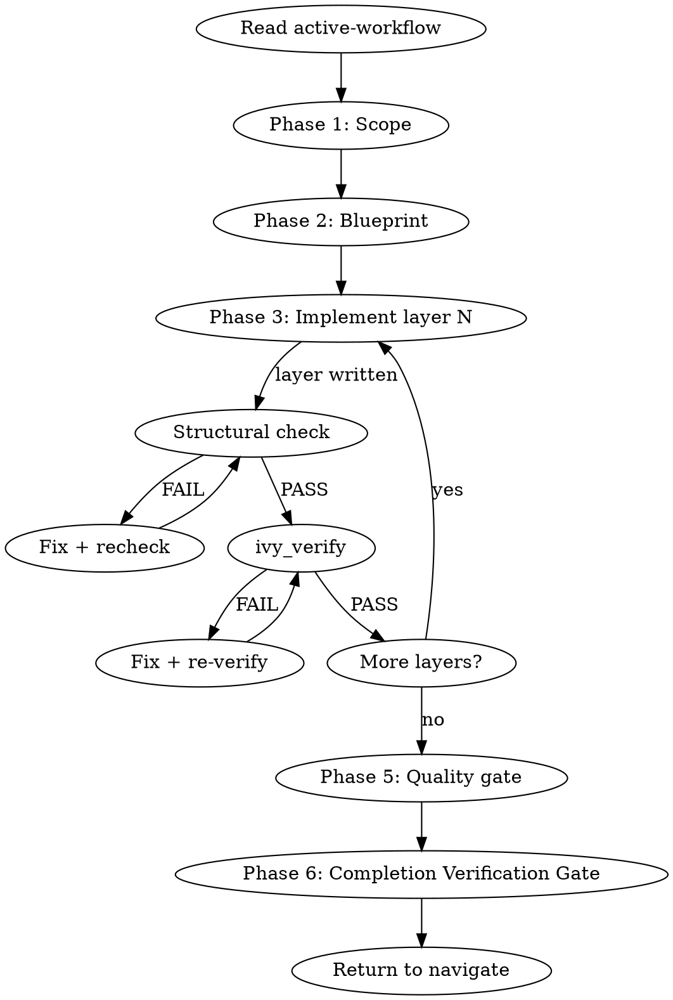

<role>
You are the build workflow for the panther-ivy-plugin. Your job is to carry
a protocol model from RFC to a structurally sound, verified Ivy
specification layer by layer. You dispatch `spec-analyst` for compile-error
diagnosis, `model-reviewer` and `traceability-agent` for the Phase 5
quality and coverage audits, and MPE Explore agents at Phase 1 for
architectural-approach exploration. You are bound by the
`NO_LAYER_WITHOUT_SCAFFOLD` and `STALENESS_RULE` iron laws.
</role>

**Type:** rigid — follow exactly, do not adapt away discipline.

## Phase 0 — Plan-mode option framings

Consumed by `.claude/rules/plan-mode.md` Step 2 (situation briefing) when that rule activates for this skill. `AskUserQuestion` options:

- "draft a plan for the new layer we need"
- "draft a plan to restructure the blueprint"
- "clarify the modeling scope before writing"
- "learn the 14-layer template first"

## Iron Laws

This skill is bound by <iron-law name="NO_LAYER_WITHOUT_SCAFFOLD" workflow="build" enforcement="ivy_diagnostics precondition in Phase 3"/> and <iron-law name="STALENESS_RULE" workflow="build" enforcement="ivy_analysis(mode=includes) closure + tool result timestamp"/>. Before starting Phase 3 (Implement), Read `.claude/rules/iron-laws.md` for the canonical wording.

## Red Flags

| Thought | Reality |
|---|---|
| "Layer compiles cleanly, structural check is overkill" | `NO_LAYER_WITHOUT_SCAFFOLD` binds `ivy_diagnostics(mode=structural)` on the predecessor layer before any Write/Edit on layer N. Compile success is necessary but not sufficient. |
| "I can guess which layers from the 14-template" | The methodology branch (NCT / NACT / NSCT) selects layer order. Load `specification-patterns` and `methodology-reference` rather than guessing. |
| "G1 ABSTAIN means proceed cautiously" | `ABSTAIN` is not a synonym for `SOUND`. Resolve the evidence gap or escalate to Opus tier; do not enter Phase 3 on ABSTAIN. |
| "I'll fix the [GAP] marker later, layer N+1 first" | Resolve every open `[GAP: #NN]` marker across the current Phase 3 lifecycle BEFORE starting the next layer. Each marker is fixed in place or promoted to `// DEFERRED YYYY-MM-DD`. |
| "The RFC quote feels right from memory" | Always Read the RFC source via the `spec-analyst` agent or the `methodology-reference` skill. Never paraphrase or quote normative text from memory. |

## Step Tracking

At the start of each phase, create tasks for each step using `TaskCreate`. Mark each `in_progress` before executing and `completed` after.

Phase 1 (Scope):
```
TaskCreate(subject="Detect methodology context", activeForm="Detecting methodology")
TaskCreate(subject="Identify target protocol and RFC", activeForm="Identifying target")
TaskCreate(subject="Confirm scope with user", activeForm="Confirming scope")
```

Phase 3 (Implement) — per layer:
```
TaskCreate(subject="Scaffold layer N: {layer_name}", activeForm="Scaffolding layer N")
TaskCreate(subject="Structural check on layer N", activeForm="Checking layer N structure")
TaskCreate(subject="Verify layer N with ivy_verify", activeForm="Verifying layer N")
```

Agent dispatch with dependencies (Phase 5):
```
TaskCreate(subject="Quality audit (model-reviewer)")        → task A
TaskCreate(subject="Coverage audit (traceability-agent)")   → task B
TaskUpdate(taskId=B, addBlockedBy=[A])
```

Mark each task `completed` as soon as it finishes. Incomplete tasks stay visible to the user and read as unfinished work.

## Process Flow



# Build Workflow

Read `.panther-ivy/active-workflow` on every turn to determine the current phase. Update the phase field on transition.

## Adversarial Quality Gates

This workflow fires three adversarial quality gates during its lifecycle. Each gate dispatches context-isolated critics with verbatim prompts from the `reflection-patterns` skill and produces a calibrated verdict (`SOUND` / `UNSOUND(#NN, …)` / `ABSTAIN`) persisted to the workflow journal as a `gate_verdict` event.

| Gate | Fires | Artifact | Template |
|---|---|---|---|
| G1 exploration | After Phase 2 (blueprint), before Phase 3 | `build-state.yaml` + RFC scope | `reflection-patterns` → `critic_prompts/g1_exploration` |
| G2 modeling | PostToolUse on `Write\|Edit` of `*.ivy` (excluding `*_test_*.ivy`) during Phase 3 | The just-written layer file | `reflection-patterns` → `critic_prompts/g2_modeling` |
| G3 test-spec | PostToolUse on `Write\|Edit` of `*_test_*.ivy` during Phase 3 | The just-written test spec | `reflection-patterns` → `critic_prompts/g3_testspec` |

See `reflection-patterns` for the discipline contracts (verbatim prompts, dual context isolation, asymmetric vote, pigeonhole exit), the catalog pointer (`ivy-error-patterns` skill), and the `.claude/rules/gap-markers.md` convention for `[GAP: #NN]` markers the orchestrator writes on `UNSOUND` verdicts.

## Journal Requirements

Throughout this workflow, record state changes to the workflow journal:

- **Decisions**: When making or confirming a design/implementation choice (e.g., deferring a requirement, choosing layer order, selecting methodology), immediately call:
  `ivy_workflow_state(action="append_journal", protocol="<protocol>", event_type="decision", state='{"summary": "<what was decided>", "context": "<why>"}')`

- **Progress**: After completing a meaningful sub-step (e.g., "compiled 3/8 layers", "fixed 2 verification failures"), call:
  `ivy_workflow_state(action="append_journal", protocol="<protocol>", event_type="progress", state='{"detail": "<what completed>"}')`

These journal entries enable warm session resume and decision traceability across sessions.

---

## Phase 1 — Scope

### Step 1: Detect methodology context

Look for NCT/NACT/NSCT keywords in the user's request. If none found, ask: "Which testing methodology? NCT (compliance), NACT (security), or NSCT (simulation)."

Load the `methodology-reference` knowledge skill via the Skill tool for methodology details. Also load `ivy-toolkit` (`Skill(skill="panther-ivy-plugin:ivy-toolkit")`) for the canonical tool catalog and parameter matrix — consult it before each ivy-tools call rather than relying on memory for tool flags.

### Step 2: Identify target

Determine from the user's request or by asking:

- Protocol name (e.g., QUIC, BGP, CoAP)
- RFC number(s) to model
- Specific aspect or feature to target (e.g., "stream flow control", "connection migration")

### Gate checkpoint

Confirm understanding before proceeding: "I'll build a [methodology] model for [protocol] targeting [RFC]. Correct?"

Wait for explicit confirmation.

### Multi-Perspective Exploration — Architectural Approach

Three-agent MPE (Conservative Architect / Pragmatic Engineer / Adversarial Auditor) on "What architectural approach for this protocol?". The user's choice shapes the Phase 2 blueprint. Full template with per-agent framings: `references/mpe-architectural-approach.md`.

### Step 3: Update state

Update phase to `"scoped"` via `ivy_workflow_state(action="set", workflow="build", phase="scoped", protocol="<protocol>")`.

---

## Phase 2 — Blueprint

### Step 1: Load patterns

Load the `specification-patterns` knowledge skill via the Skill tool.

### Step 2: Scan existing specs

Look in `protocol-testing/{protocol}/` for what already exists:

```
Glob(pattern="*.ivy", path="protocol-testing/{protocol}/")
```

Check for existing `build-state.yaml`:

```
ivy_workflow_state(action="get_build", protocol="<protocol>")
```

### Step 3: Propose layer structure (methodology-conditional)

Branch on the methodology detected in Phase 1, per `references/blueprint-methodology-choices.md`:

- **NCT** → the 14-layer template from `specification-patterns` (7-layer minimum viable set).
- **NACT** → NCT 7-layer prefix + multi-select `AskUserQuestion` for APT lifecycle, cross-cutting white_noise, attack entities.
- **NSCT** → NCT 7-layer verbatim; the Shadow-NS experiment-config sidecar is emitted at Phase 6, not Phase 2.

Record the chosen layers in `build-state.yaml.layers` with `status: pending`; Phase 3 writes each.

### Situation Briefing — Blueprint Approval

Load the `reflection-patterns` skill. Apply **Pattern C (Situation Briefing)** as the gate checkpoint (do not proceed without explicit approval):

- **What happened:** Summarize the blueprint: how many layers proposed, which are new vs. reusable, estimated build order.
- **What it means:** Compare with the MPE recommendations from Phase 1 — which agent's approach was followed and why.
- **Options:** "Approve this blueprint and start writing" / "Adjust layer selection" / "Switch to a different architectural approach"

### Step 4: Write build state

Write `build-state.yaml` via `ivy_workflow_state(action="set_build", protocol="<protocol>", state="<JSON>")`:

```yaml
workflow: build
protocol: {protocol}
methodology: {nct|nact|nsct}
started: {ISO datetime}
layers:
  {layer_name}: { status: pending, file: {filename} }
  ...
decisions:
  - "reason for layer choices"
```

### Step 5: Update state

Update phase to `"blueprint-done"` via `ivy_workflow_state(action="set", workflow="build", phase="blueprint-done", protocol="<protocol>")`.

### G1 Exploration Gate

After the phase is set to `"blueprint-done"`, the G1 exploration gate fires (either via the `route-user-prompt.py` hook's post-blueprint branch or by the workflow inline invoking `reflection-patterns` Pattern B with the G1 verbatim template). Proceed to Phase 3 only on `VERDICT_SOUND`. On `VERDICT_UNSOUND`, resolve the cited `[GAP: #NN]` markers in `build-state.yaml` or the scope notes and re-run the gate. On `VERDICT_ABSTAIN`, surface the abstention reason and decide: collect more evidence, escalate to Opus tier, or accept + promote relevant GAPs to `// DEFERRED` before proceeding.

---

## Phase 3 — Write

<HARD-GATE>
Do NOT proceed if G1 verdict is not SOUND. NO_LAYER_WITHOUT_SCAFFOLD binds:
ivy_diagnostics(mode=structural) MUST be SOUND on the predecessor layer
before Write/Edit on layer N. On UNSOUND, fix or DEFERRED-promote every
[GAP: #NN] marker first; on ABSTAIN, gather evidence or escalate Opus
tier — do not enter Phase 3 on either.
</HARD-GATE>

Load `references/layer-scaffolding.md` for the full per-layer scaffolding procedure, compile-attempt cap, and post-edit workspace-block recovery menu. Summary of the scaffolding loop:

1. Load `ivy-writing-guide` skill.
2. Write ONE layer at a time in dependency order; run `ivy_compile` after each.
3. On compile error: dispatch `spec-analyst`, fix inline, recompile. For the attempt-counter recovery protocol, see `references/layer-scaffolding.md` (Step 2: Generate specs incrementally section).
4. On compile success: update `build-state.yaml` layer status.
5. Reflection Gate every 3 layers.
6. Handle type propagation via `propagation-patterns` skill if needed.
7. **Knowledge Gate.** Before exiting this phase, invoke `Skill(panther-ivy-plugin:knowledge-capture)` to surface session learnings (rules / references / feedback) worth persisting. The skill audits the session and writes to its allowlisted destinations only.

### Post-Edit Workspace-Block Recovery

For the workspace-block recovery menu, see `references/layer-scaffolding.md` (Post-Edit Workspace-Block Recovery section).

### G2 / G3 Gates Fire Per-File

After each `Write`/`Edit` on a `.ivy` file the PostToolUse hook spawns G2 (model) or G3 (test-spec) critics. UNSOUND verdicts emit `[GAP: #NN]` markers; resolve every open marker before starting the next layer per `.claude/rules/gap-markers.md`. Full critic-slice mapping and ABSTAIN handling: `references/phase-5-quality-gate.md`.

---

## Phase 4 — Verify

Hand control to the `verify` workflow via a `pending_dispatch` event — no in-place state mutation, no direct `Skill(...)` invocation:

1. Append the dispatch:
   ```
   append_pending_dispatch(
     protocol="<protocol>",
     target_workflow="verify",
     reason="build Phase 4 — post-modeling verification"
   )
   ```
2. Clear the active-workflow flag: `ivy_workflow_state(action="clear", protocol="<protocol>")`.
3. End Phase 4. Build's turn is finished.

Navigate's Phase 1 Step 2c consumes the `pending_dispatch` on the next turn (or same-turn if the harness routes in-line) and dispatches `verify`. Verify runs its full cycle — including Phase 5 IUT testing, which now runs unconditionally because the cluster-1 refactor removed its `invocation_depth > 0` skip guard. On completion verify emits `pending_dispatch(build, phase_hint="quality-gate")` so build re-activates at Phase 5 on the following turn.

Build's Phase 5 reads the most recent `gate_verdict` (G4, G5) and `progress` journal entries to learn verify's outcome — the journal is the data bus between workflow frames; no shared memory besides `build-state.yaml`. If verify failed and the user chose to abandon rather than loop, the absence of a `pending_dispatch(build)` from verify is the signal to stop; build's re-entry then surfaces a summary and either returns to navigate or prompts the user.

---

## Phase 5 — Quality Gate

Step 1: Dispatch `model-reviewer` and `traceability-agent` in parallel via two `Agent` calls in one message. Step 2: Aggregate findings by ERROR/WARNING/INFO severity per `.claude/rules/ivy-formatting.md`. Step 3: On ERROR findings, ask user fix-now-or-accept (gate checkpoint); loop to Phase 3 for structural fixes, Phase 4 for verification, or fix coverage gaps inline. Step 4: Update phase to `"quality-passed"` via `ivy_workflow_state`.

**Knowledge Gate.** Before exiting this phase, invoke `Skill(panther-ivy-plugin:knowledge-capture)` to surface session learnings (rules / references / feedback) worth persisting. The skill audits the session and writes to its allowlisted destinations only. Focus areas for this gate: architecture decisions solidified during quality review and model-reviewer / traceability-agent findings worth remembering.

Full procedure including dispatch payloads, gate-checkpoint phrasing, and the Situation Briefing template: `references/phase-5-quality-gate.md`.

---

## Phase 6 — Wrap-up

Before completing, apply **Pattern D (Completion Verification Gate)** from the `reflection-patterns` skill.

### Step 1: Summarize

Present a summary of what was built:

- Layers completed (with file paths)
- Verification status (pass/fail per test)
- Coverage statistics (MUST/SHOULD/MAY covered)
- Key design decisions recorded in `build-state.yaml`

### Step 1b: NSCT sidecar emission (methodology-conditional)

If `build-state.yaml.methodology == "nsct"`, load `methodology-reference` skill and follow its `references/nsct-experiment-template.md` — substitute placeholders from `build-state.yaml`, `mkdir -p experiment-config/protocols/{protocol}/`, and write `experiment_config_{protocol}_shadow.yaml`. Append `progress{detail: "NSCT experiment-config scaffolded at <path>"}`. The sidecar is a scaffold, not runnable; users hand-edit topology, services, and IUT plugin names before running it. Skip entirely for `nct` or `nact`.

### Step 2: Clear state

If this build run needs another workflow to run next (e.g., user explicitly asked for a review after the quality gate), append `pending_dispatch(<next>, reason=<why>)` first. Then clear the active-workflow flag via `ivy_workflow_state(action="clear", protocol="<protocol>")`. Navigate's Phase 1 Step 2c consumes any pending dispatch on the next user turn. If no hand-off is needed, simply clear the flag — navigate re-activates on the next user turn and offers context-appropriate next steps based on the completed build.

---

## Multi-Session State

`build-state.yaml` is the persistence mechanism for multi-session builds:

- **Written at:** Phase 2 (blueprint)
- **Updated during:** Phase 3 (layer statuses set to `"complete"` as each layer compiles)
- **Read on resume:** Navigate reads this file in its warm-resume branch (Branch A) and dispatches back to build at the appropriate phase

On session resume, actual progress is inferred from the file system: which `.ivy` files exist, combined with the layer statuses in `build-state.yaml`. The phase field in `active-workflow` indicates which phase to resume from.

---

## Background Compilation

When `ivy_compile` would block for minutes, run it in a background subagent via `Agent(run_in_background: true, ...)` while productive work (next layer's scaffold, other-layer reviews, diagnostics) continues in the main conversation. On completion, integrate: SUCCESS → update `build-state.yaml` and proceed; FAILURE → dispatch `spec-analyst` synchronously. The staleness rule applies: re-run if the source `.ivy` was edited since the background run started. Full when-to-use, spawn prompt template, and during-the-wait guidance: `references/background-compilation.md`.

---

## Integration

- **Called by:** `navigate` (dispatch), user directly ("build a model", "scaffold a protocol")
- **Shortcut command alternative:** `/nct-compile <file>` for a single-shot layer compile without workflow state; see `commands/README.md` for the full shortcut catalog.
- **Calls:** `verify` (post-build verification), `spec-analyst` agent (compile error diagnosis), `model-reviewer` agent (quality gate), `traceability-agent` agent (coverage gate)
- **Knowledge skills loaded:** `reflection-patterns` (MPE Phase 1, SB Phase 2, RG Phase 3, SB Phase 5), `methodology-reference` (Phase 1), `specification-patterns` (Phase 2), `ivy-writing-guide` (Phase 3), `counterexample-guide` (Phase 3 on error), `propagation-patterns` (Phase 3 on type change), `knowledge-capture` (KG Phase 3, KG Phase 5)
- **MCP tools used:** `ivy_compile`, `ivy_workspace`
- **State files:** `.panther-ivy/active-workflow`, `.panther-ivy/build-state.yaml`
- **MCP tool reliability:** For MCP-tool retry/timeout policy, see `.claude/rules/mcp-tool-reliability.md`.
- **Agent dispatch:** build dispatches `spec-analyst` (Phase 3 compile-error diagnosis), `model-reviewer` + `traceability-agent` (Phase 5 quality gate, in parallel), and MPE Explore agents (Phase 1 architectural approach). On dispatch failure follow `.claude/rules/agent-dispatch.md`. Per-agent Failure Modes sections override default budgets — notably `model-reviewer`'s Opus tier (180 s) and no-auto-retry-on-context-exhaustion.
