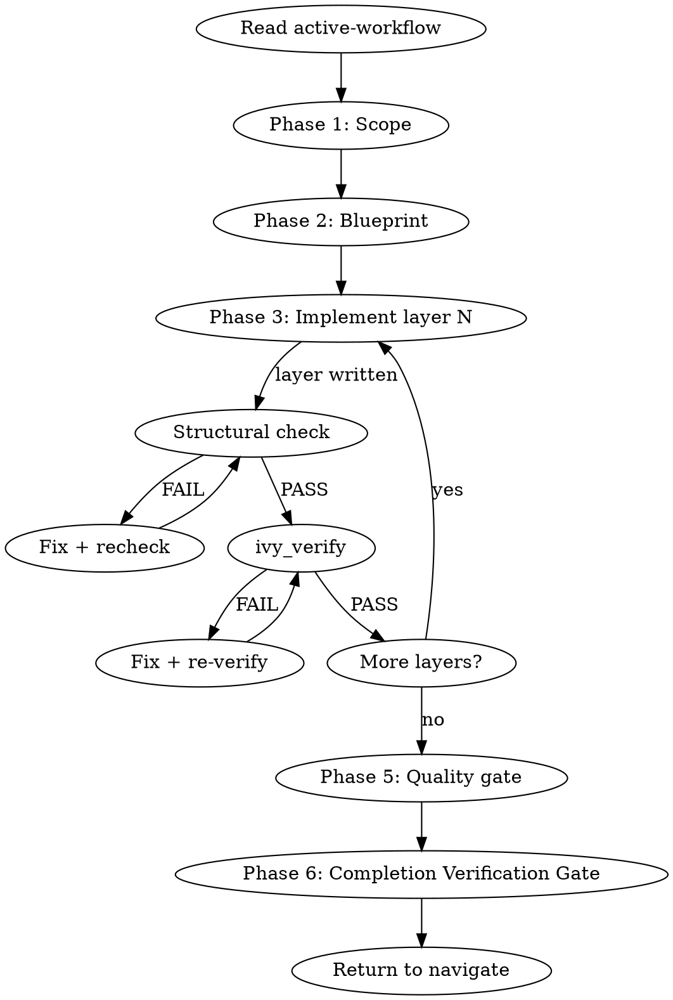

## Output Style

This workflow's output formatting is managed by the style system.
Follow the style directives injected via `additionalContext` -- they contain
the active workflow overlay and phase modifier. Do not invent
formatting for tool results that arrive pre-formatted in `hookSpecificOutput`.

## Phase 0 — Plan-mode preamble

Before running any build-phase logic, inspect the session context for plan-mode indicators. Plan mode blocks `ivy_compile`, `Write`/`Edit` on `.ivy` files, and any tool that mutates state, so the normal build cycle cannot proceed.

Detection signals (any one is sufficient):

1. The literal phrase `Plan mode is active` in a system-reminder.
2. The edit-restriction phrase `You MUST NOT make any edits`.
3. A plan file path of the form `/Users/*/plans/*.md` named in a plan-mode system-reminder.

If any indicator is present, switch to plan authoring instead of build dispatch:

1. Run read-only context gathering only: check the workflow journal for recent `error`, `gate_verdict`, and `decision` entries; inspect `build-state.yaml` if present; skip any step that would mutate state or scaffold new `.ivy` files.
2. Present a situation briefing via `AskUserQuestion` framed for plan-mode options — "draft a plan for the new layer we need", "draft a plan to restructure the blueprint", "clarify the modeling scope before writing", "learn the 14-layer template first".
3. Help the user draft the plan at the path named in the plan-mode system-reminder. If the plan covers a non-trivial implementation, invoke `Skill(skill="superpowers:writing-plans")`.
4. Before `ExitPlanMode`, append a `plan_approved` journal entry with `workflow: "build"`, `phase_before_plan: <whatever phase the user was in>`, `plan_file`, and `supersedes` (extracted from the plan's `## Supersedes` block if present).
5. Call `ExitPlanMode`.

Do NOT attempt to dispatch `ivy_compile`, `ivy_verify`, `Write`, `Edit`, or any state-mutating tool during plan mode — the call will be rejected and the session ends in an ambiguous state. Navigate's Phase 1.5 handles the re-entry on the next invocation after `ExitPlanMode`.

## Iron Laws

This skill is bound by `NO_LAYER_WITHOUT_SCAFFOLD` and the `STALENESS RULE`. Before starting Phase 3 (Implement), Read `.claude/rules/iron-laws.md` for the canonical wording, the explicit "Out of scope" carve-outs (patches to existing layers, files outside `{prot}_stack/`, drafts outside discovery path), and the plan-mode exemption clause. Summary for this skill: ground each net-new layer file in a passing `ivy_diagnostics(mode="structural")` for the prior layer; treat any tool result older than the most recent edit to a file in the include closure as stale.

## Step Tracking

At the start of each phase, create tasks for each step using `TaskCreate`. Mark each `in_progress` before executing and `completed` after.

Phase 1 (Scope):
```
TaskCreate(subject="Detect methodology context", activeForm="Detecting methodology")
TaskCreate(subject="Identify target protocol and RFC", activeForm="Identifying target")
TaskCreate(subject="Confirm scope with user", activeForm="Confirming scope")
```

Phase 3 (Implement) — per layer:
```
TaskCreate(subject="Scaffold layer N: {layer_name}", activeForm="Scaffolding layer N")
TaskCreate(subject="Structural check on layer N", activeForm="Checking layer N structure")
TaskCreate(subject="Verify layer N with ivy_verify", activeForm="Verifying layer N")
```

Agent dispatch with dependencies (Phase 5):
```
TaskCreate(subject="Quality audit (model-reviewer)")        → task A
TaskCreate(subject="Coverage audit (traceability-agent)")   → task B
TaskUpdate(taskId=B, addBlockedBy=[A])
```

Do not skip marking tasks as `completed` — incomplete tasks are visible to the user and signal unfinished work.

## Process Flow



# Build Workflow

Read `.panther-ivy/active-workflow` on every turn to determine the current phase. Update the phase field on transition.

## Adversarial Quality Gates

This workflow fires three adversarial quality gates during its lifecycle. Each gate dispatches context-isolated critics with verbatim prompts from the `reflection-patterns` skill and produces a calibrated verdict (`SOUND` / `UNSOUND(#NN, …)` / `ABSTAIN`) persisted to the workflow journal as a `gate_verdict` event.

| Gate | Fires | Artifact | Template |
|---|---|---|---|
| G1 exploration | After Phase 2 (blueprint), before Phase 3 | `build-state.yaml` + RFC scope | `reflection-patterns` → `critic_prompts/g1_exploration` |
| G2 modeling | PostToolUse on `Write\|Edit` of `*.ivy` (excluding `*_test_*.ivy`) during Phase 3 | The just-written layer file | `reflection-patterns` → `critic_prompts/g2_modeling` |
| G3 test-spec | PostToolUse on `Write\|Edit` of `*_test_*.ivy` during Phase 3 | The just-written test spec | `reflection-patterns` → `critic_prompts/g3_testspec` |

See `reflection-patterns` for the discipline contracts (verbatim prompts, dual context isolation, asymmetric vote, pigeonhole exit), the catalog pointer (`ivy-error-patterns` skill), and the `.claude/rules/gap-markers.md` convention for `[GAP: #NN]` markers the orchestrator writes on `UNSOUND` verdicts.

## Journal Requirements

Throughout this workflow, record state changes to the workflow journal:

- **Decisions**: When making or confirming a design/implementation choice (e.g., deferring a requirement, choosing layer order, selecting methodology), immediately call:
  `ivy_workflow_state(action="append_journal", protocol="<protocol>", event_type="decision", state='{"summary": "<what was decided>", "context": "<why>"}')`

- **Progress**: After completing a meaningful sub-step (e.g., "compiled 3/8 layers", "fixed 2 verification failures"), call:
  `ivy_workflow_state(action="append_journal", protocol="<protocol>", event_type="progress", state='{"detail": "<what completed>"}')`

These journal entries enable warm session resume and decision traceability across sessions.

---

## Phase 1 — Scope

### Step 1: Detect methodology context

Look for NCT/NACT/NSCT keywords in the user's request. If none found, ask: "Which testing methodology? NCT (compliance), NACT (security), or NSCT (simulation)."

Load the `methodology-reference` knowledge skill via the Skill tool for methodology details.

### Step 2: Identify target

Determine from the user's request or by asking:

- Protocol name (e.g., QUIC, BGP, CoAP)
- RFC number(s) to model
- Specific aspect or feature to target (e.g., "stream flow control", "connection migration")

### Gate checkpoint

Confirm understanding before proceeding: "I'll build a [methodology] model for [protocol] targeting [RFC]. Correct?"

Wait for explicit confirmation.

### Multi-Perspective Exploration — Architectural Approach

After the user confirms the scope, load the `reflection-patterns` skill. Apply **Pattern B (Multi-Perspective Exploration)**:

- **Exploration question:** "What architectural approach should we use for this [protocol] model?"
- **Agents:**
  - **Conservative Architect** (Explore): Propose a comprehensive model covering all RFC MUST requirements with full invariant coverage. Prioritize correctness over speed.
  - **Pragmatic Engineer** (Explore): Propose a minimal viable model — only the layers needed for the first end-to-end test. Build incrementally.
  - **Adversarial Auditor** (Explore): Propose a security-focused model prioritizing attack surface coverage (NACT-relevant layers, edge cases, error paths).

The user's choice shapes the blueprint in Phase 2.

### Step 3: Update state

Update phase to `"scoped"` via `ivy_workflow_state(action="set", workflow="build", phase="scoped", protocol="<protocol>")`.

---

## Phase 2 — Blueprint

### Step 1: Load patterns

Load the `specification-patterns` knowledge skill via the Skill tool.

### Step 2: Scan existing specs

Look in `protocol-testing/{protocol}/` for what already exists:

```
Glob(pattern="*.ivy", path="protocol-testing/{protocol}/")
```

Check for existing `build-state.yaml`:

```
ivy_workflow_state(action="get_build", protocol="<protocol>")
```

### Step 3: Propose layer structure

Using the 14-layer template from the `specification-patterns` skill, propose which layers apply to the target protocol and aspect:

- Which of the 14 layers are needed
- Dependency order for construction
- Minimum viable set (typically 7 layers: Types, Frame, Packet, Connection, Entity Defs, Entity Behavior, Shims)
- Which layers already exist and can be reused

### Situation Briefing — Blueprint Approval

Load the `reflection-patterns` skill. Apply **Pattern C (Situation Briefing)** as the gate checkpoint (do not proceed without explicit approval):

- **What happened:** Summarize the blueprint: how many layers proposed, which are new vs. reusable, estimated build order.
- **What it means:** Compare with the MPE recommendations from Phase 1 — which agent's approach was followed and why.
- **Options:** "Approve this blueprint and start writing" / "Adjust layer selection" / "Switch to a different architectural approach"

### Step 4: Write build state

Write `build-state.yaml` via `ivy_workflow_state(action="set_build", protocol="<protocol>", state="<JSON>")`:

```yaml
workflow: build
protocol: {protocol}
methodology: {nct|nact|nsct}
started: {ISO datetime}
layers:
  {layer_name}: { status: pending, file: {filename} }
  ...
decisions:
  - "reason for layer choices"
```

### Step 5: Update state

Update phase to `"blueprint-done"` via `ivy_workflow_state(action="set", workflow="build", phase="blueprint-done", protocol="<protocol>")`.

### G1 Exploration Gate

After the phase is set to `"blueprint-done"`, the G1 exploration gate fires (either via the `route-user-prompt.py` hook's post-blueprint branch or by the workflow inline invoking `reflection-patterns` Pattern B with the G1 verbatim template). Proceed to Phase 3 only on `VERDICT_SOUND`. On `VERDICT_UNSOUND`, resolve the cited `[GAP: #NN]` markers in `build-state.yaml` or the scope notes and re-run the gate. On `VERDICT_ABSTAIN`, surface the abstention reason and decide: collect more evidence, escalate to Opus tier, or accept + promote relevant GAPs to `// DEFERRED` before proceeding.

---

## Phase 3 — Write

Load `references/layer-scaffolding.md` for the full per-layer scaffolding procedure. Summary:

1. Load `ivy-writing-guide` skill
2. Write ONE layer at a time in dependency order; run `ivy_compile` after each
3. On compile error: dispatch `spec-analyst`, fix inline, recompile. The fix loop is bounded by a **journal-counted attempt cap of 5 per layer (cumulative across sessions, soft-reset via an `override_attempt_cap` decision)**. Before each compile attempt, compute the attempt key as the layer's canonical name from `build-state.yaml.layers` (e.g., `bgp_open`, not a file path). Read `ivy_workflow_state(action="get_journal", last_n=200)`, find the most recent `decision{kind: "override_attempt_cap", key: <same>}` (or `-1`), and count `progress{kind: "compile_attempt", key: <same>}` entries after that index. If the count is `>= 5`, escalate via `AskUserQuestion` with: **Continue anyway** (append `decision{kind: "override_attempt_cap", key}` and reset the cap), **Abandon this layer** (mark `build-state.yaml`'s layer status as `abandoned`, record a `decision`, move to the next layer in dependency order), or **Switch workflow** (emit `pending_dispatch(<next>, reason="Compile loop capped on <layer>")` and clear the active-workflow flag). Otherwise append `progress{kind: "compile_attempt", key: "<layer>", protocol: "<protocol>"}` and run `ivy_compile`. Silent retry past the cap without an override decision is the exact pattern `#403` (error whitelisting; see the `ivy-error-patterns` catalog) exists to discourage. `/nct-observability` surfaces per-layer attempt counts and overrides across sessions.
4. On compile success: update `build-state.yaml` layer status
5. Reflection Gate every 3 layers
6. Handle type propagation via `propagation-patterns` skill if needed
7. Knowledge Gate on completion of all layers

### Post-Edit workspace-block recovery

After every `Write` / `Edit` on a `.ivy` file during Phase 3 (layer writes), inspect the tool-result for a workspace-scope violation from the `check-workspace-scope.py` PreToolUse hook. If the hook emits a "workspace scope violation" error (or an `additionalContext` marker naming the blocked file), the layer was not written to disk:

1. Append `progress{kind: "workspace_edit_blocked", file: "<path>", workspace_active: "<current>"}` to the journal.
2. Present `AskUserQuestion` with three options (per `.claude/rules/mcp-tool-reliability.md`):
   - **Switch workspace to the file's protocol** — run `/set-workspace <inferred-protocol>`, then retry the Edit. Also update `build-state.yaml`'s `decisions` block if the workspace shift reflects a scope change.
   - **Clear workspace restrictions** — run `/clear-workspace`, then retry the Edit. Appropriate for multi-protocol builds where the layer spans protocols.
   - **Abandon this layer** — skip the Edit, mark the layer's `build-state.yaml` status as `abandoned`, record a `decision` entry, and move to the next layer in dependency order.

Platform note: if the harness does not propagate PreToolUse-hook block signals into the tool-result, this path does not fire. File a platform-level issue if observed; the SKILL.md recovery pattern still applies whenever the signal reaches user-space.

### G2 / G3 Gates Fire Per-File

After each `Write`/`Edit` on a `.ivy` file, a PostToolUse hook spawns critics from the `reflection-patterns` skill:
- `*.ivy` (non-test): G2 modeling critics (catalog slice `#200-249` + `#250-299` + NSCT `#260-289`).
- `*_test_*.ivy`: G3 test-spec critics (catalog slice `#200-208` + `#256-259` + `#300-399`).

On `VERDICT_UNSOUND`, the orchestrator writes `[GAP: #NN <reason>]` markers inline at the cited locations. Do not proceed to the next layer until each `[GAP:]` is either fixed or deliberately promoted to `// DEFERRED YYYY-MM-DD: …` per the `.claude/rules/gap-markers.md` convention. On `VERDICT_ABSTAIN`, the verdict lands silently in the workflow journal; read it at the next Reflection Gate.

---

## Phase 4 — Verify

Hand control to the `verify` workflow via a `pending_dispatch` event — no in-place state mutation, no direct `Skill(...)` invocation:

1. Append the dispatch:
   ```
   append_pending_dispatch(
     protocol="<protocol>",
     target_workflow="verify",
     reason="build Phase 4 — post-modeling verification"
   )
   ```
2. Clear the active-workflow flag: `ivy_workflow_state(action="clear", protocol="<protocol>")`.
3. End Phase 4. Build's turn is finished.

Navigate's Phase 1 Step 2c consumes the `pending_dispatch` on the next turn (or same-turn if the harness routes in-line) and dispatches `verify`. Verify runs its full cycle — including Phase 5 IUT testing, which now runs unconditionally because the cluster-1 refactor removed its `invocation_depth > 0` skip guard. On completion verify emits `pending_dispatch(build, phase_hint="quality-gate")` so build re-activates at Phase 5 on the following turn.

Build's Phase 5 reads the most recent `gate_verdict` (G4, G5) and `progress` journal entries to learn verify's outcome — the journal is the data bus between workflow frames; no shared memory besides `build-state.yaml`. If verify failed and the user chose to abandon rather than loop, the absence of a `pending_dispatch(build)` from verify is the signal to stop; build's re-entry then surfaces a summary and either returns to navigate or prompts the user.

---

## Phase 5 — Quality Gate

### Step 1: Dispatch review agents in parallel

Dispatch both agents in a single message using two Agent tool calls:

1. **`model-reviewer`** agent: structural correctness, type safety, invariant completeness, action well-formedness, initialization, organization
2. **`traceability-agent`** agent: RFC coverage check against the blueprint's target RFC(s)

### Step 2: Aggregate findings

Collect findings from both agents. Classify by severity per `.claude/rules/ivy-formatting.md` Severity Systems ("Finding severity"): ERROR, WARNING, INFO.

### Gate checkpoint on ERROR findings

If ERROR findings are produced, present them to the user: "These ERRORs were found: [list]. Fix them now? Or accept and move on?"

Wait for explicit confirmation.

### Step 3: Handle fixes

If the user wants fixes:

- For structural issues (type safety, invariants, initialization): loop back to Phase 3 to fix the affected layers.
- For verification issues (failed properties, counterexamples): loop back to Phase 4 to re-verify.
- For coverage gaps: add missing monitors inline, then re-run the traceability check.

### Situation Briefing — Quality Gate Results

Load the `reflection-patterns` skill. Apply **Pattern C (Situation Briefing)**:

- **What happened:** Summarize the quality gate results: how many findings by severity (critical/important/suggestion), which agents found what, overall model health.
- **What it means:** Are ERROR-severity findings blocking? Is coverage sufficient for the target methodology?
- **Options:**
  - "Fix ERROR findings now" (if any exist)
  - "Proceed to wrap-up — accept current quality level"
  - "Run full verification before wrapping up"
  - "Review coverage gaps in detail"

### Step 4: Update state

Update phase to `"quality-passed"` via `ivy_workflow_state(action="set", workflow="build", phase="quality-passed", protocol="<protocol>")`.

### Knowledge Gate: Post-Quality-Gate

**KNOWLEDGE GATE (KG)**: Pause and invoke: `Skill(skill="panther-ivy-plugin:knowledge-capture")`
- Reflect on architecture decisions solidified during quality review
- Capture model-reviewer and traceability-agent findings worth remembering
- Save session log (observability events + digest)
- If candidates found, classify and present for user confirmation
- Resume workflow after gate completes

---

## Phase 6 — Wrap-up

Before completing, apply **Pattern D (Completion Verification Gate)** from the `reflection-patterns` skill.

### Step 1: Summarize

Present a summary of what was built:

- Layers completed (with file paths)
- Verification status (pass/fail per test)
- Coverage statistics (MUST/SHOULD/MAY covered)
- Key design decisions recorded in `build-state.yaml`

### Step 2: Clear state

If this build run needs another workflow to run next (e.g., user explicitly asked for a review after the quality gate), append `pending_dispatch(<next>, reason=<why>)` first. Then clear the active-workflow flag via `ivy_workflow_state(action="clear", protocol="<protocol>")`. Navigate's Phase 1 Step 2c consumes any pending dispatch on the next user turn. If no hand-off is needed, simply clear the flag — navigate re-activates on the next user turn and offers context-appropriate next steps based on the completed build.

---

## Multi-Session State

`build-state.yaml` is the persistence mechanism for multi-session builds:

- **Written at:** Phase 2 (blueprint)
- **Updated during:** Phase 3 (layer statuses set to `"complete"` as each layer compiles)
- **Read on resume:** Navigate reads this file in its warm-resume branch (Branch A) and dispatches back to build at the appropriate phase

On session resume, actual progress is inferred from the file system: which `.ivy` files exist, combined with the layer statuses in `build-state.yaml`. The phase field in `active-workflow` indicates which phase to resume from.

---

## Background Compilation

When `ivy_compile` would block for minutes, run it in a background subagent while productive work continues in the main conversation.

### When to Use

- The model is large and compilation historically takes >60s
- There are independent tasks remaining (writing the next layer's scaffold, reviewing existing layers, running diagnostics on other files)
- The current layer's implementation is complete and the compile confirmation is pending

Do NOT background when: the next step requires the compile result (e.g., diagnosing a compile error inline), or when writing a single small layer where the compile is fast.

### How to Background

Spawn a background subagent with a self-contained prompt:

```
Agent(
  description: "Background ivy_compile",
  run_in_background: true,
  prompt: "Call the ivy_compile MCP tool with relative_path='<path>' and target='test' in workspace '<protocol>'.
           Report the full result: success/failure, any error messages with line numbers, duration.
           If the tool errors or times out, report that too."
)
```

The subagent loads MCP servers independently and calls `ivy_compile`. A notification arrives when it completes.

### During the Wait

Continue with work that does not depend on the compilation result:

- Scaffolding the next layer (if dependency order allows)
- Reviewing or editing other existing layers
- Running `ivy_diagnostics` or `ivy_coverage` on previously compiled files
- Reading RFC sections for upcoming layers

Avoid calling `ivy_verify` or `ivy_compile` in the main conversation while a background compilation runs — the MCP semaphore limits concurrent tool execution.

### Picking Up the Result

When the background agent completes, read its result and integrate into the current workflow phase:

- **SUCCESS**: Update `build-state.yaml` layer status, proceed to next layer or Phase 4
- **FAILURE**: Dispatch `spec-analyst` with the error output, fix inline, recompile (synchronously, since the feedback loop is needed)
- **ERROR/TIMEOUT**: Report to user, offer to retry synchronously

The staleness rule still applies: if the `.ivy` file was edited after the background compilation started, the result is stale and must be re-run.

---

## Integration

- **Called by:** `navigate` (dispatch), user directly ("build a model", "scaffold a protocol")
- **Shortcut command alternative:** `/nct-compile <file>` for a single-shot layer compile without workflow state; see `commands/README.md` for the full shortcut catalog.
- **Calls:** `verify` (post-build verification), `spec-analyst` agent (compile error diagnosis), `model-reviewer` agent (quality gate), `traceability-agent` agent (coverage gate)
- **Knowledge skills loaded:** `reflection-patterns` (MPE Phase 1, SB Phase 2, RG Phase 3, SB Phase 5), `methodology-reference` (Phase 1), `specification-patterns` (Phase 2), `ivy-writing-guide` (Phase 3), `counterexample-guide` (Phase 3 on error), `propagation-patterns` (Phase 3 on type change), `knowledge-capture` (KG Phase 3, KG Phase 5)
- **MCP tools used:** `ivy_compile`, `ivy_workspace`
- **State files:** `.panther-ivy/active-workflow`, `.panther-ivy/build-state.yaml`
- **MCP tool reliability:** on `InputValidationError` from `ivy_compile` / `ivy_workspace`, follow `.claude/rules/mcp-tool-reliability.md` — one retry via `ToolSearch({query: "select:<tool>"})`, then AskUserQuestion with triage / skip / abandon options.
- **Agent dispatch:** build dispatches `spec-analyst` (Phase 3 compile-error diagnosis), `model-reviewer` + `traceability-agent` (Phase 5 quality gate, in parallel), and MPE Explore agents (Phase 1 architectural approach). On dispatch failure follow `.claude/rules/agent-dispatch.md`. Per-agent Failure Modes sections override default budgets — notably `model-reviewer`'s Opus tier (180 s) and no-auto-retry-on-context-exhaustion.
