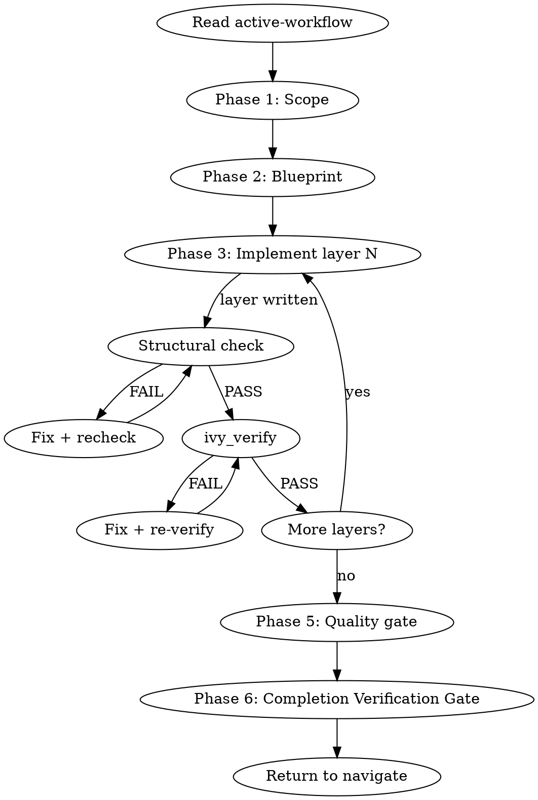

## Output Style

This workflow's output formatting is managed by the style system.
Follow the style directives injected via `additionalContext` -- they contain
your active workflow overlay and phase modifier. Do not invent your own
formatting for tool results that arrive pre-formatted in `hookSpecificOutput`.

## Iron Law

```
NO LAYER IMPLEMENTATION WITHOUT COMPLETING SCAFFOLD + STRUCTURAL CHECK FIRST.
If ivy_diagnostics(mode="structural") has not passed, do not write the next layer.
```

## Staleness Rule

Any `ivy_verify` or `ivy_compile` result older than the most recent `.ivy` file edit is STALE. Do not cite stale results as evidence of correctness. Re-run before claiming PASS or transitioning phases.

## Step Tracking

At the start of each phase, create tasks for each step using `TaskCreate`. Mark each `in_progress` before executing and `completed` after.

Phase 1 (Scope):
```
TaskCreate(subject="Detect methodology context", activeForm="Detecting methodology")
TaskCreate(subject="Identify target protocol and RFC", activeForm="Identifying target")
TaskCreate(subject="Confirm scope with user", activeForm="Confirming scope")
```

Phase 3 (Implement) — per layer:
```
TaskCreate(subject="Scaffold layer N: {layer_name}", activeForm="Scaffolding layer N")
TaskCreate(subject="Structural check on layer N", activeForm="Checking layer N structure")
TaskCreate(subject="Verify layer N with ivy_verify", activeForm="Verifying layer N")
```

Agent dispatch with dependencies (Phase 5):
```
TaskCreate(subject="Quality audit (model-reviewer)")        → task A
TaskCreate(subject="Coverage audit (traceability-agent)")   → task B
TaskUpdate(taskId=B, addBlockedBy=[A])
```

Do not skip marking tasks as `completed` — incomplete tasks are visible to the user and signal unfinished work.

## Process Flow



# Build Workflow

Read `.panther-ivy/active-workflow` on every turn to determine your current phase. Update the phase field as you transition.

---

## Phase 1 — Scope

### Step 1: Detect methodology context

Look for NCT/NACT/NSCT keywords in the user's request. If none found, ask: "Which testing methodology? NCT (compliance), NACT (security), or NSCT (simulation)."

Load the `methodology-reference` knowledge skill via the Skill tool for methodology details.

### Step 2: Identify target

Determine from the user's request or by asking:

- Protocol name (e.g., QUIC, BGP, CoAP)
- RFC number(s) to model
- Specific aspect or feature to target (e.g., "stream flow control", "connection migration")

### Gate checkpoint

Confirm understanding before proceeding: "I'll build a [methodology] model for [protocol] targeting [RFC]. Correct?"

Wait for explicit confirmation.

### Multi-Perspective Exploration — Architectural Approach

After the user confirms the scope, load the `reflection-patterns` skill. Apply **Pattern B (Multi-Perspective Exploration)**:

- **Exploration question:** "What architectural approach should we use for this [protocol] model?"
- **Agents:**
  - **Conservative Architect** (Explore): Propose a comprehensive model covering all RFC MUST requirements with full invariant coverage. Prioritize correctness over speed.
  - **Pragmatic Engineer** (Explore): Propose a minimal viable model — only the layers needed for the first end-to-end test. Build incrementally.
  - **Adversarial Auditor** (Explore): Propose a security-focused model prioritizing attack surface coverage (NACT-relevant layers, edge cases, error paths).

The user's choice shapes the blueprint in Phase 2.

### Step 3: Update state

Update phase to `"scoped"` via `update_workflow_phase()`.

---

## Phase 2 — Blueprint

### Step 1: Load patterns

Load the `specification-patterns` knowledge skill via the Skill tool.

### Step 2: Scan existing specs

Look in `protocol-testing/{protocol}/` for what already exists:

```
Glob(pattern="*.ivy", path="protocol-testing/{protocol}/")
```

Check for existing `build-state.yaml`:

```python
get_build_state(protocol_dir)
```

### Step 3: Propose layer structure

Using the 14-layer template from the `specification-patterns` skill, propose which layers apply to the target protocol and aspect:

- Which of the 14 layers are needed
- Dependency order for construction
- Minimum viable set (typically 7 layers: Types, Frame, Packet, Connection, Entity Defs, Entity Behavior, Shims)
- Which layers already exist and can be reused

### Situation Briefing — Blueprint Approval

Load the `reflection-patterns` skill. Apply **Pattern C (Situation Briefing)** as the gate checkpoint (do not proceed without explicit approval):

- **What happened:** Summarize the blueprint: how many layers proposed, which are new vs. reusable, estimated build order.
- **What it means:** Compare with the MPE recommendations from Phase 1 — which agent's approach was followed and why.
- **Options:** "Approve this blueprint and start writing" / "Adjust layer selection" / "Switch to a different architectural approach"

### Step 4: Write build state

Write `build-state.yaml` to `<protocol_dir>/.panther-ivy/build-state.yaml` via `set_build_state()`:

```yaml
workflow: build
protocol: {protocol}
methodology: {nct|nact|nsct}
started: {ISO datetime}
layers:
  {layer_name}: { status: pending, file: {filename} }
  ...
decisions:
  - "reason for layer choices"
```

### Step 5: Update state

Update phase to `"blueprint-done"` via `update_workflow_phase()`.

---

## Phase 3 — Write

For the full per-layer scaffolding procedure, see `references/layer-scaffolding.md`. Summary:

1. Load `ivy-writing-guide` skill
2. Write ONE layer at a time in dependency order; run `ivy_compile` after each
3. On compile error: dispatch `spec-analyst`, fix inline, loop until clean
4. On compile success: update `build-state.yaml` layer status
5. Reflection Gate every 3 layers
6. Handle type propagation via `propagation-patterns` skill if needed
7. Knowledge Gate on completion of all layers

---

## Phase 4 — Verify

Invoke `verify` as a sub-workflow: set `invocation_depth += 1`, `caller = "build"`, then `Skill(skill="verify")`. Verify runs its full cycle and returns here (caller-based return). Restore `workflow = "build"`, `phase = "verified"`.

---

## Phase 5 — Quality Gate

### Step 1: Dispatch review agents in parallel

Dispatch both agents in a single message using two Agent tool calls:

1. **`model-reviewer`** agent: structural correctness, type safety, invariant completeness, action well-formedness, initialization, organization
2. **`traceability-agent`** agent: RFC coverage check against the blueprint's target RFC(s)

### Step 2: Aggregate findings

Collect findings from both agents. Classify by severity: critical, important, suggestion.

### Gate checkpoint on critical issues

If critical issues are found, present them to the user: "These critical issues were found: [list]. Fix them now? Or accept and move on?"

Wait for explicit confirmation.

### Step 3: Handle fixes

If the user wants fixes:

- For structural issues (type safety, invariants, initialization): loop back to Phase 3 to fix the affected layers.
- For verification issues (failed properties, counterexamples): loop back to Phase 4 to re-verify.
- For coverage gaps: add missing monitors inline, then re-run the traceability check.

### Situation Briefing — Quality Gate Results

Load the `reflection-patterns` skill. Apply **Pattern C (Situation Briefing)**:

- **What happened:** Summarize the quality gate results: how many findings by severity (critical/important/suggestion), which agents found what, overall model health.
- **What it means:** Are critical issues blocking? Is coverage sufficient for the target methodology?
- **Options:**
  - "Fix critical issues now" (if any exist)
  - "Proceed to wrap-up — accept current quality level"
  - "Run full verification before wrapping up"
  - "Review coverage gaps in detail"

### Step 4: Update state

Update phase to `"quality-passed"` via `update_workflow_phase()`.

### Knowledge Gate: Post-Quality-Gate

**KNOWLEDGE GATE (KG)**: Pause and invoke: `Skill(skill="panther-ivy-plugin:knowledge-capture")`
- Reflect on architecture decisions solidified during quality review
- Capture model-reviewer and traceability-agent findings worth remembering
- Save session log (observability events + digest)
- If candidates found, classify and present for user confirmation
- Resume workflow after gate completes

---

## Phase 6 — Wrap-up

Before completing, apply **Pattern D (Completion Verification Gate)** from the `reflection-patterns` skill.

### Step 1: Summarize

Present a summary of what was built:

- Layers completed (with file paths)
- Verification status (pass/fail per test)
- Coverage statistics (MUST/SHOULD/MAY covered)
- Key design decisions recorded in `build-state.yaml`

### Step 2: Clear state

Clear the active-workflow flag via `clear_active_workflow()`.

### Step 3: Return to navigate

Navigate re-activates on the next user turn and offers context-appropriate next steps based on the completed build.

---

## Multi-Session State

`build-state.yaml` is the persistence mechanism for multi-session builds:

- **Written at:** Phase 2 (blueprint)
- **Updated during:** Phase 3 (layer statuses set to `"complete"` as each layer compiles)
- **Read on resume:** Navigate reads this file in its warm-resume branch (Branch A) and dispatches back to build at the appropriate phase

On session resume, actual progress is inferred from the file system: which `.ivy` files exist, combined with the layer statuses in `build-state.yaml`. The phase field in `active-workflow` indicates which phase to resume from.

---

## Integration

- **Called by:** `navigate` (dispatch), user directly ("build a model", "scaffold a protocol")
- **Calls:** `verify` (post-build verification), `spec-analyst` agent (compile error diagnosis), `model-reviewer` agent (quality gate), `traceability-agent` agent (coverage gate)
- **Knowledge skills loaded:** `reflection-patterns` (MPE Phase 1, SB Phase 2, RG Phase 3, SB Phase 5), `methodology-reference` (Phase 1), `specification-patterns` (Phase 2), `ivy-writing-guide` (Phase 3), `counterexample-guide` (Phase 3 on error), `propagation-patterns` (Phase 3 on type change), `knowledge-capture` (KG Phase 3, KG Phase 5)
- **MCP tools used:** `ivy_compile`, `ivy_workspace`
- **State files:** `.panther-ivy/active-workflow`, `.panther-ivy/build-state.yaml`
