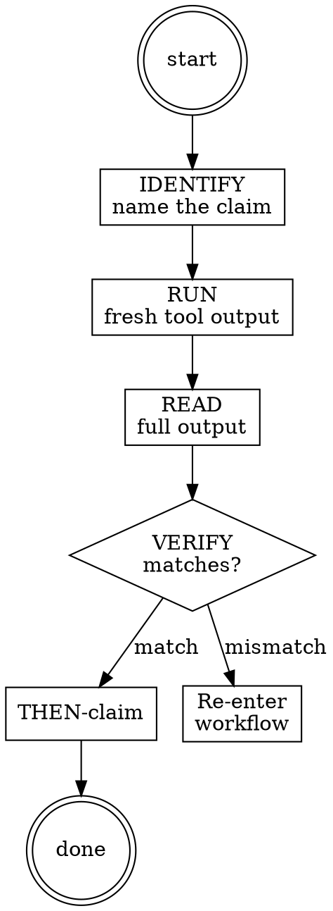

# Completion Gate

**Type:** rigid — follow exactly, do not adapt away discipline.

## Iron Law

This skill is bound by <iron-law name="NO_FIX_WITHOUT_VERIFY" workflow="completion-gate" enforcement="5-step gate procedure: IDENTIFY → RUN → READ → VERIFY → THEN-claim"/> and reinforces every other workflow's `NO_QUALITY_WITHOUT_COVERAGE` / `NO_LAYER_WITHOUT_SCAFFOLD` / `STALENESS_RULE` binding when those workflows reach completion. Read `.claude/rules/iron-laws.md` for canonical wording.

## Red Flags

| Thought | Reality |
|---|---|
| "Should pass / probably passes / seems fine" | Words like "should", "probably", "seems" are evidence-shaped placeholders, not evidence. Run the verification command and read the output before claiming. |
| "Tests passed last run, no need to re-verify" | `STALENESS_RULE`: re-run if any source file was edited since the prior tool result. Last-run results are evidence ONLY for the source state at that timestamp. |
| "Output looks right, claim done" | "Looks right" is pattern-match, not VERIFY. Read the full tool output, locate the specific assertion that confirms the claim, then claim. |
| "Just one quick fix and done" | `NO_FIX_WITHOUT_VERIFY`: every fix loops through tooling. The fix is half the work; the re-verify is the other half. |
| "Skip the gate this once, deadline pressure" | Deadline pressure is the diagnostic signal that the gate matters most. Skipping is when false-completion claims happen. |

## Step Tracking

```
TaskCreate(subject="IDENTIFY: name the claim", activeForm="Identifying claim")
TaskCreate(subject="RUN: fresh verification command", activeForm="Running verification")
TaskCreate(subject="READ: full tool output", activeForm="Reading output")
TaskCreate(subject="VERIFY: output matches claim", activeForm="Verifying match")
TaskCreate(subject="THEN-claim: emit completion message", activeForm="Claiming completion")
```

## Process Flow



# Completion Gate Procedure

<HARD-GATE>
Do NOT emit any 'verification passed' / 'quality SOUND' / 'review complete'
/ 'build done' claim until all 5 steps below complete in order within the
current turn. Stale tool output (from a prior turn that predates source
edits) does NOT satisfy RUN — STALENESS_RULE binds.
</HARD-GATE>

### Step 1 — IDENTIFY

Name the specific claim being made. The claim must be falsifiable from a single tool output. Examples:
- "ivy_verify returns SOUND on `protocol-testing/bgp/bgp_stack/bgp_connection.ivy`"
- "All 5 layers in `quic_stack/` compiled cleanly"
- "RFC 9000 §17.2 coverage is 100% (12/12 MUST requirements)"
- "Phase 4 verification passed AND G4 critic verdict is SOUND"

If the claim is "the model is correct," refine it to the specific tool result that would confirm correctness.

### Step 2 — RUN

Issue the verification command in the current turn. Examples:
- `ivy_verify(relative_path="<file>")` for a verification claim
- `ivy_coverage(...)` + cite the JSON return for a coverage claim
- `ivy_diagnostics(mode="structural", ...)` for a structural claim
- Re-dispatch the gate critic for a gate-verdict claim

Tool output from a prior turn is NOT acceptable evidence if any source file matched by the tool's include closure was edited since (`STALENESS_RULE`).

### Step 3 — READ

Read the FULL tool output, not the summary line:
- Verification: read both `status` AND `counterexample` / `counterexample_trace` fields if present.
- Coverage: read the `gaps` array AND the `covered` count, not just the percentage.
- IUT test: read `experiment_summary` AND assertion logs AND pcap (if applicable).
- Gate verdict: read the verdict, the dissenter reasons, AND the cited file:line locations.

If the output is truncated, fetch more before VERIFY.

### Step 4 — VERIFY

Confirm the read output matches the IDENTIFY-d claim:
- The claim names a result; the output asserts that result.
- The claim asserts SOUND; the output is SOUND with G-critic confirmation (where applicable).
- The claim asserts coverage X/Y; the output's `covered` field equals X.

If the output and claim do not match, the claim is wrong. Re-enter the workflow's diagnose phase. Do NOT proceed to THEN-claim.

### Step 5 — THEN-claim

Only after VERIFY confirms a match:
- Emit the user-facing completion message with the specific tool-output reference (e.g., "ivy_verify SOUND, G4 critic SOUND with no UNSOUND votes, journal entry at `<timestamp>`").
- Update the workflow's active-workflow flag (clear, or set `phase="complete"`).
- Append a `decision` journal entry recording the completion claim and its evidence reference.

## Terminal state

<HARD-GATE>
The terminal state of completion-gate is a returned verdict to the calling
workflow's completion phase: PASS (claim emitted) or FAIL (re-enter
diagnose). Do NOT invoke another workflow skill from completion-gate; it
is a synchronous sub-procedure, not a routing target. Hand-off, if any,
rides on the calling workflow's pending_dispatch logic.
</HARD-GATE>

## Integration

- **Called by:** every rigid workflow at its completion phase — build Phase 6, verify On Completion, review On Completion, triage On Completion, knowledge-capture Step 5 final write, navigate Dispatch (when emitting workflow-resumed).
- **Calls:** none. Pure gate; produces no state mutation other than the journal `decision` entry written in Step 5.
- **Cross-references:**
  - `reflection-patterns` Pattern D (Completion Verification Gate) — the pattern this skill operationalizes.
  - `.claude/rules/iron-laws.md` — canonical NO_FIX_WITHOUT_VERIFY / NO_QUALITY_WITHOUT_COVERAGE / STALENESS_RULE wording.
  - `workflow-verify` skill's Discipline section (RED → GREEN) — the iron-law-binding cycle this skill closes. Resolved via `Skill(skill="panther-ivy-plugin:workflow-verify")`; current location at `skills/workflow-verify/SKILL.md` (flat-with-prefix layout per the 2026-04-27 directory taxonomy restructure).
