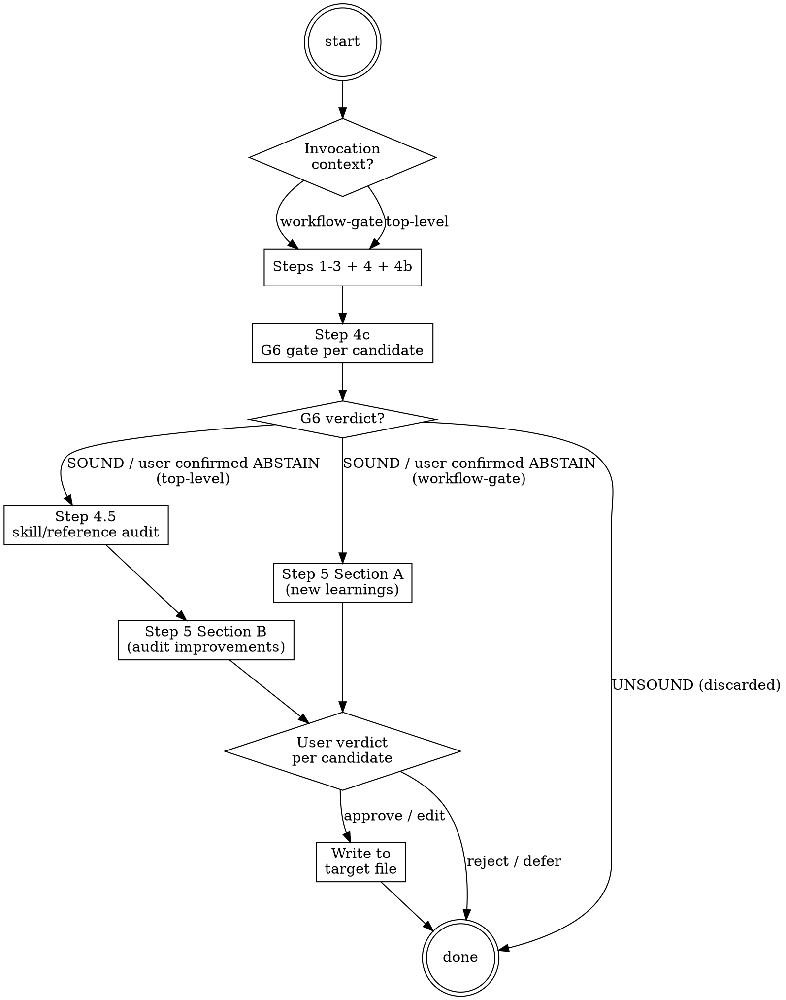

# Knowledge Capture

<role>
You extract session learnings into plugin rules and (for top-level
retrospectives) audit existing plugin skills and references for accuracy,
completeness, and coverage gaps. You detect invocation context from the
active-workflow state, not from a depth counter.
</role>

**Type:** rigid — follow exactly, do not adapt away discipline.

## Red Flags

| Thought | Reality |
|---|---|
| "Nothing learnable this session, skip the gate" | Step 2b (Save Session Log) runs UNCONDITIONALLY at every gate. Only Section A's user-facing prompt is suppressed when nothing learnable; the digest is always written. |
| "Workflow-gate invocation, run Step 4.5 too" | Workflow-gate MUST skip Step 4.5 (skill/reference audit). The audit derails the calling workflow. Top-level invocation only — see the `<branch>` blocks below. |
| "Add a new entry without diffing existing" | Step 4 (Diff Against Existing) prevents duplication. Already-documented = skip; partially-documented = update; new = add. Never blindly append. |
| "Classification is obvious, skip the reviewer agent" | Step 4b dispatches a classification reviewer agent. Its recommendation (plugin-rule / protocol-rule / user-memory) is the calibrated source. Personal heuristic skips this discipline. |
| "User approval can wait, write first" | Every Section A and Section B item requires explicit (a) Approve / (b) Edit / (c) Reject / (d) Change target / (e) Defer. NEVER write to disk without per-candidate approval. |

## Step Tracking

At the start of the gate, create one task per step using `TaskCreate`. Mark each `in_progress` before executing and `completed` after.

```
TaskCreate(subject="Scan existing knowledge", activeForm="Scanning knowledge")
TaskCreate(subject="Reflect on session", activeForm="Reflecting")
TaskCreate(subject="Save session log + digest", activeForm="Saving log")
TaskCreate(subject="Classify candidates via taxonomy", activeForm="Classifying")
TaskCreate(subject="Diff against existing entries", activeForm="Diffing")
TaskCreate(subject="Spawn classification reviewer agent", activeForm="Spawning reviewer")
TaskCreate(subject="Fire G6 knowledge-graduation gate", activeForm="Running G6 gate")
```

Top-level invocation only — additional tasks:
```
TaskCreate(subject="Audit skills + references (Step 4.5)", activeForm="Auditing skills")
```

Final step (both invocation modes):
```
TaskCreate(subject="Draft + confirm per candidate (Step 5)", activeForm="Confirming candidates")
```

## Process Flow



Behaviour depends on how this skill was invoked:

- **Workflow-gate invocation** (a workflow skill is currently active —
  `ivy_workflow_state(action="get")` returns a non-null `workflow` field
  that is not `knowledge-capture`): run the learning-capture flow only
  (Steps 1–4 and 5 Section A). Skip the skill/reference audit layer
  (Step 4.5).
- **Top-level invocation** (no workflow is active, or the `/nct-learn`
  command dispatched this skill, or the user typed a retrospective
  trigger like "session retro", "what did we learn"): run the
  learning-capture flow AND the skill/reference audit layer
  (Step 4.5 + Step 5 Section B).

## Pre-Check

<context>
The pre-cluster-1 schema carried `invocation_depth` + `caller` fields on
the active-workflow state; the cluster 1 refactor removed both. Knowledge
gates no longer skip based on a depth counter — every workflow is a
top-level frame from the state machine's perspective. The gate detects
its invocation context from the active-workflow record itself (see
above).
</context>

<branch condition="active-workflow is set AND workflow != 'knowledge-capture'" name="workflow-gate-invocation">
  This is a gate call from a workflow skill. Run Steps 1–3, Step 4
  Section A (learning-capture), Step 5 Section A, then return to the
  calling workflow. Skip Step 4.5 (audit layer) entirely. Knowledge
  gates must not derail the calling workflow with an audit.
</branch>

<branch condition="active-workflow is unset OR workflow == 'knowledge-capture' OR trigger is /nct-learn" name="top-level-invocation">
  Run the full flow including Step 4.5 (audit layer) and Step 5
  Section B.
</branch>

## Step 1 — Scan Existing Knowledge

Read all target files to understand what is already documented:

- Canonical Ivy 1.7 syntax reference (owned by ivy-writing-guide skill; load via `Skill(skill="panther-ivy-plugin:knowledge-ivy-writing-guide")`). The pointer rule `.claude/rules/ivy-patterns.md` is reference-only (loaded by name, not auto-injected on `.ivy` edits).
- `.claude/rules/iron-laws.md`
- NCT/NACT/NSCT methodology reference (owned by methodology-reference skill; load via `Skill(skill="panther-ivy-plugin:knowledge-methodology-reference")`). The pointer rule `.claude/rules/nct-methodology.md` is reference-only (loaded by name, not auto-injected on `.ivy`/`.spec` edits).
- `.claude/rules/insights.md`
- Self-evaluation protocol (owned by ivy-debugging-methodology skill).
- Tool catalog (owned by ivy-toolkit skill).

Note key topics and patterns already covered. This prevents duplicate entries.

## Step 2 — Reflect on Session

Review what happened since the last knowledge gate (or session start). Look for:

1. **Bug patterns**: Errors diagnosed and fixed — what was non-obvious about the root cause?
2. **Ivy patterns**: `.ivy` code written that revealed a non-obvious construct or anti-pattern
3. **Architecture decisions**: Design choices made during build/review — layer organization, module composition, include structure
4. **Workflow refinements**: Multi-step sequences that were refined through trial and error, tool orderings discovered to matter
5. **Emergent insights**: Anything surprising that doesn't fit above — unexpected behaviors, cross-cutting observations

**If nothing learnable is found, exit silently.** Do not interrupt the user.

## Step 2b — Save Session Log

This runs unconditionally at every gate.

1. Read the current session's observability events from the JSONL log (resolve path via `IVY_OBSERVABILITY_DIR`, `IVY_WORKSPACE_ROOT/.observability/`, or `/tmp/ivy-observability/`).
2. Consolidate events into `.panther-ivy/session-logs/{timestamp}.json`.
3. Write a structured digest to `.panther-ivy/session-logs/{timestamp}.digest.yaml` using the schema from `references/knowledge-taxonomy.md`.

The digest captures: workflow type, protocol, phases reached, files modified, errors and resolutions, patterns applied, verification outcomes, and knowledge candidates from this gate.

## Graduation Sweep

Trigger conditions:

- `/nct-learn` slash command with sweep intent.
- End-of-session retrospective when the user opts in.
- navigate's Phase 1 advisory surfaces (days-since-last-sweep exceeds threshold).

When invoked with sweep intent, follow the full procedure in `references/graduation-sweep.md`. The sweep is per-target with drill-in — the user approves groups of memory entries destined for the same target file, with an option to review entries individually. Archive and delete target classes require explicit user approval; nothing is removed silently. On completion, update `MEMORY.md`'s `Last graduation sweep:` line to today's date.

The `auto-load-skill-references.py` hook will inject `graduation-sweep.md` as `additionalContext` when this skill is invoked (the file is > 100 lines so it will appear as a "Read required" pointer, which is expected).

## Step 3 — Classify Using Taxonomy

Load `references/knowledge-taxonomy.md`. For each candidate learning from Step 2, match against the 5 category recognition heuristics. Assign a primary category and a target file.

## Step 4 — Diff Against Existing

For each candidate, check the target file (read in Step 1):

- **Already documented**: Skip — the rule already covers this.
- **Partially documented**: Propose an update to the existing entry rather than a new one.
- **New knowledge**: Propose a new entry.

## Step 4b — Spawn Classification Reviewer Agent

Dispatch a parallel agent using the prompt template from `references/knowledge-taxonomy.md` (section "Classification Reviewer Agent Prompt"). Pass:

- The candidate list with proposed categories and targets
- The path to session digests: `.panther-ivy/session-logs/`
- The path to plugin rules: `.claude/rules/`

The agent returns a placement recommendation per candidate:
- `plugin-rule` + target file (generic, recurring, protocol-agnostic)
- `protocol-rule` + protocol (generic but protocol-scoped)
- `user-memory` (specific to current work)

Incorporate the agent's recommendations into the presentation.

## Step 4.5 — Audit Skills and References

**Gate**: Run this step only on a top-level invocation (see Pre-Check — no workflow active, or dispatched via `/nct-learn`, or retrospective trigger). When skipped, proceed directly to Step 5 with Section A only.

Walk through the 5-item audit checklist in `references/skill-audit.md` — description accuracy, step accuracy, cross-reference validity, reference currency, and coverage gaps. Dispatch parallel agents for independent audit tasks when the knowledge base is large. Produce a list of improvement recommendations (target file, line/section, what's wrong, proposed fix) that feeds Section B of Step 5.

## Step 4c — Fire G6 (Knowledge-Graduation Gate)

Before presenting any candidate to the user for approval, dispatch the G6 adversarial gate. G6 challenges whether the candidate knowledge is durable, general, surprising, citable, and non-duplicated. This step runs on every candidate regardless of invocation mode — there is no skip path.

For each candidate from Step 4b:

```
<dispatch target="model-reviewer" mode="gate-critic" critic="g6_knowledge">
  <candidate_knowledge>{type: "rule"|"feedback"|"memory", target_path: "...", content: "..."}</candidate_knowledge>
  <session_digest_path>.panther-ivy/session-logs/{timestamp}.digest.yaml</session_digest_path>
  <target_file_content>{current content of the target file, read in Step 1}</target_file_content>
</dispatch>
```

Load the critic prompt verbatim from `Skill(skill="panther-ivy-plugin:cross-cutting-reflection-patterns")` → `references/critic_prompts/g6_knowledge.md`. Default tier: Sonnet × 3, `≥2 SOUND` / `≥2 UNSOUND`.

After collecting verdicts:

- **`SOUND`**: include the candidate in Step 5's presentation with its G6 verdict attached.
- **`UNSOUND(#NN, ...)`**: do NOT surface the candidate to the user for approval. Surface the gate failure reason instead, giving the user one option: (a) revise the candidate, (b) discard it. If the user revises, re-run G6 on the revised text before re-presenting.
- **`ABSTAIN`**: surface the candidate to the user with the abstain reason attached and ask the user to confirm before writing.

Persist the G6 gate result as a `gate_verdict` journal entry with `gate: "g6"` before proceeding to Step 5.

## Step 5 — Draft and Confirm

<HARD-GATE>
Do NOT write any target file (plugin rule, skill, reference, user-memory)
without explicit user approval per candidate via AskUserQuestion. Step 4b
(classification reviewer agent) MUST run on top-level invocation. Step 4
(Diff Against Existing) MUST run before any new-entry write — duplication
of existing guidance is a soundness regression. Step 4c (G6 gate) MUST
run before any candidate is presented for user approval — a candidate that
did not pass G6 SOUND or user-confirmed ABSTAIN must not reach the write step.
</HARD-GATE>

### Section A — New Learnings (from Step 3)

Present each candidate via `AskUserQuestion`:

```
[Knowledge Gate] N learning(s) detected:

1. "{learning text}"
   -> Category: {category}
   -> Agent recommends: {placement} ({target file})
   -> Reason: {agent's reasoning summary}
   -> (a) Approve  (b) Edit  (c) Reject  (d) Change target  (e) Defer
```

For each user response:

- **(a) Approve**: Write the entry to the target file using `Edit` (append to the appropriate section). Update the digest's `knowledge_candidates` entry with `status: approved`.
- **(b) Edit**: Ask the user for the revised text via `AskUserQuestion`, then write.
- **(c) Reject**: Update the digest with `status: rejected`. Do not write.
- **(d) Change target**: Ask the user which file, then write there.
- **(e) Defer**: Update the digest with `status: deferred`. Re-present at the next knowledge gate.

### Section B — Skill/Reference Improvements (from Step 4.5)

Present only when Step 4.5 ran (top-level invocation) and produced improvements. Skip when Step 4.5 was skipped or produced nothing.

```
[Skill & Reference Audit] M improvement(s) identified:

1. {skill-name}/SKILL.md: {issue description}
   -> Proposed fix: {concrete change}
   -> (a) Approve  (b) Edit  (c) Reject

2. .claude/rules/{file}.md: {issue description}
   -> Proposed fix: {concrete change}
   -> (a) Approve  (b) Edit  (c) Reject
```

For each user response:

- **(a) Approve**: Edit the target SKILL.md or reference file with the approved fix. For description changes, verify the new description follows the skill-conventions rules (under 250 chars, front-loaded triggers, third person).
- **(b) Edit**: Ask the user for the revised fix via `AskUserQuestion`, then write.
- **(c) Reject**: Skip the item. No write.

For coverage gaps approved as new skills, create a stub `SKILL.md` with the agreed name, description, and placeholder steps under `skills/<new-name>/`. Flag it for future development.

After all Section B writes, run `git diff --stat` and summarise files changed.

**Success criteria**: Every Section A and Section B item has a user verdict, and every approved item is written to disk. Before emitting the user-facing "knowledge captured" claim, invoke `Skill(skill="panther-ivy-plugin:cross-cutting-completion-gate")` with IDENTIFY claim = "N learnings approved + M skill-audit fixes applied; digest written to .panther-ivy/session-logs/{timestamp}.digest.yaml".

## Deferred Candidate Handling

At the start of each gate (before Step 2), check the most recent digest for `status: deferred` candidates. If found, re-present them in Step 5 alongside any new candidates.

## Plan-Approval Capture Trigger

Fires at session start when the workflow journal contains a `plan_approved` entry that has not yet been paired with a knowledge-capture cycle. Plan-mode sessions produce a distinct class of learnings that don't fit neatly into the general Step 2 reflection — the interesting material is the process of authoring the plan, not the `.ivy` files the plan targets.

### Trigger condition

At session start, before Step 1:

1. Read the last 20 journal entries via `ivy_workflow_state(action="get_journal", protocol="<protocol>", last_n=20)`.
2. Scan for `plan_approved` entries that do not have a corresponding `knowledge_captured` marker further down the journal.
3. For each unmatched `plan_approved` entry, run this capture trigger.

### Prompt

Present once per unmatched entry via `AskUserQuestion`. The block below is an illustrative template, not literal output: the calling skill substitutes the placeholder fields and emits the three labelled choices as the `options` array of the `AskUserQuestion` call.

<example>
```
[Knowledge Gate - Plan Approval]
Last session approved plan: {plan_file}
  Supersedes: {N} prior decision(s)
  Caller workflow: {caller}
  G0 verdict: {SOUND|UNSOUND|ABSTAIN (cycle N)} — {if unsound, dissenter reasons}

Capture learnings from the plan authoring process?
  (a) Yes, walk through typical candidate categories
  (b) No, I'll use /nct-learn manually if something comes up
  (c) Defer to the next session start
```
</example>

### If user picks (a) — walk through candidate categories

Present each of the three typical plan-mode capture categories in sequence, using Step 5's standard approve / edit / reject / change target / defer options per candidate:

1. **Process gaps uncovered.** Surface points during plan authoring where the plugin's workflow skills or hooks failed to do what they should have (e.g., a gate that didn't fire, a dispatch that was silently skipped, a detection signal that was missed). The 2026-04-21 plan-mode-aware-skills spec itself came out of this category. Candidate text template: "In plan mode, <skill or hook> <failed to do X>. Root cause: <what was missing>. Fix: <what was added or planned>."

2. **Decisions reversed by adversarial review.** Surface load-bearing decisions the plan reversed relative to prior `build-state.yaml` entries, with the reason the reversal survived the G0 critic(s). Candidate text template: "Plan <name> superseded <prior decision> because <reason>. G0 critics confirmed the reversal under slice <catalog IDs>."

3. **Syntax/idiom confirmations from Ivy source inspection.** Surface any Ivy syntax patterns verified against `ivy/include/1.7/` stdlib or the parser source during plan writing. These often come from "are you sure Ivy supports X?" challenges that escalated to source-code inspection. Candidate text template: "Ivy 1.7 syntax `<pattern>` is supported per <stdlib-file:line or parser-grammar-rule>. Example: <one-liner>."

After user confirms each candidate, write to the target file chosen by Step 4's classification reviewer agent. Append a `knowledge_captured` journal entry referencing the `plan_approved` entry's timestamp so the trigger does not re-fire on subsequent session starts.

### If user picks (b) or (c)

Record the outcome:
- **(b) No**: Append a `knowledge_captured` entry with `status: user_declined`. Do not re-prompt.
- **(c) Defer**: Do not append `knowledge_captured`. Trigger re-fires at the next session start.

## Graduation Check (Emergent Insights)

After writing to `.claude/rules/insights.md`, check whether 3+ entries cluster around the same theme. If so, recommend promoting them: present the cluster to the user and suggest moving to the appropriate primary-category rule file.

## Terminal state

<HARD-GATE>
The terminal state of knowledge-capture is one of:
- **Workflow-gate invocation**: return to the calling workflow's current
  turn after Step 5 Section A completes. No `pending_dispatch`; no
  active-workflow flag mutation. The calling workflow resumes its phase
  on its own turn.
- **Top-level invocation** (no active workflow OR `/nct-learn` OR
  retrospective trigger): clear active-workflow flag if it was set,
  emit `pending_dispatch(navigate, reason="post-knowledge-capture")` if
  routing back is appropriate, otherwise return silently.
- **Plan-Approval Capture Trigger**: append `knowledge_captured` journal
  entry referencing the `plan_approved` entry's timestamp; do NOT
  emit `pending_dispatch` from this path (capture is opportunistic at
  session start, not a dispatched workflow).

Do NOT write any candidate to disk without per-candidate (a) Approve
verdict from the user. Do NOT skip Step 4b classification reviewer
agent on top-level invocation. Do NOT run Step 4.5 (skill / reference
audit) on workflow-gate invocation — it derails the calling workflow.
</HARD-GATE>

## Integration

- **LOADED BY:** build workflow (Phase 3 Knowledge Gate, Phase 5 Quality Gate), verify workflow (Phase 4 Post-Execution, Phase 7 Post-Fix), review workflow (Phase 2 Knowledge Gate, Phase 3 Findings), and the `/nct-learn` command.
- **WRITES TO:** `.claude/rules/iron-laws.md`, `.claude/rules/insights.md`, `~/.claude/projects/<project>/memory/reference_ivy_patterns.md`, `~/.claude/projects/<project>/memory/reference_nct_methodology.md`, and additional user-memory files when candidates are approved.
- **READS FROM:** `.panther-ivy/session-logs/{timestamp}.json` (session events) and existing `.claude/rules/` + `~/.claude/projects/<project>/memory/reference_*.md` files (to diff against).

**Related skills:**
- **`reflection-patterns`** — Adversarial-gate discipline layer; gate verdicts feed the session digest when this skill runs.
