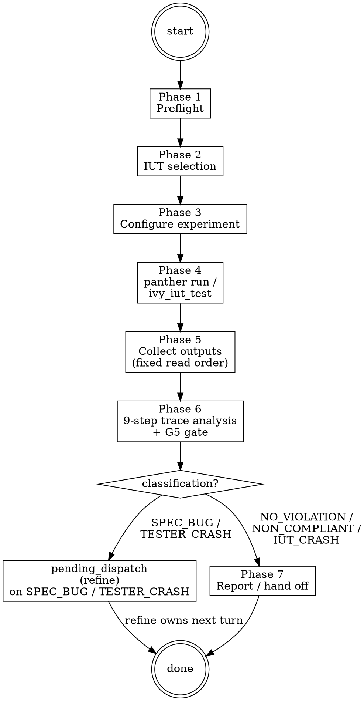

# Experiment Ops

**Type:** rigid — follow exactly, do not adapt away discipline.

Operating procedure for the `ivy-experimenter-agent`. Configures and runs an IUT experiment (compiled Ivy test against a real implementation), collects logs/pcap/qlog, and applies the 9-step trace analysis with the G5 trace-analysis gate inline. The orchestrator dispatches this agent; this body teaches the agent how to operate. Formal verification (compile → ivy_verify → diagnose → fix) is OUT of scope — handed off to `refine-ops` via `pending_dispatch(refine, ...)` when trace analysis attributes a failure to a spec bug.

For the calibrated meanings of MPE, "iron law", "knowledge gate", and `pending_dispatch` as used below, Read `references/iut-output-analysis.md` once for the full 9-step procedure. Gate-verdict semantics (`SOUND` / `UNSOUND` / `ABSTAIN`) live in `.claude/rules/gate-verdicts.md` and auto-load on skill entry.

## Phases

### Phase 0 — Plan-mode option framings

Consumed by `.claude/rules/plan-mode.md` Step 2 (situation briefing) when that rule activates for this skill. `AskUserQuestion` options:

- "Draft a plan for the IUT experiment we want to run"
- "Draft a plan to investigate this trace failure"
- "Clarify which IUT to run against"
- "Learn the 9-step trace analysis procedure first"

### Phase 1 — Preflight

#### Step 1: Stack + experiment health check

Run a read-only stack-health probe via `ivy_status()`. If it fails, dispatch `ivy-triage-agent` for repair before continuing. Confirm the protocol's experiment-config directory is populated:

```
ivy_status()
ls experiment-config/protocols/<protocol>/   # (via Bash) — confirm at least one *.yaml exists
```

`active-workflow` stays on `(workflow=experiment, phase=preflight)` throughout. If the probe is clean, proceed. On failure, dispatch the triage agent for full repair; on completion the agent emits `pending_dispatch(experiment, reason="post-triage-repair")` so the orchestrator re-activates experiment on the next turn.

#### Step 2: Detect target protocol + active test

Resolve protocol from `IVY_WORKSPACE_ROOT` / `ivy_workspace(action="get")` / `protocol-testing/` scan. Resolve the test from the dispatch context (`target_files` field on the agent dispatch) or, if absent, ask the user via `AskUserQuestion` to pick from `protocol-testing/{protocol}/{protocol}_tests/`.

#### Step 3: Update state

Update phase to `"preflight-done"` via `ivy_workflow_state(action="set", workflow="experiment", phase="preflight-done", protocol="<protocol>")`.

### Phase 2 — IUT selection

#### Step 1: Scan available IUTs

List `panther/plugins/services/iut/{protocol}/` for available IUT plugin directories. Group as numbered options.

#### Step 2: Present options via `AskUserQuestion`

Offer the user the numbered IUTs found in Step 1. If only one IUT exists, suggest it directly and ask for confirmation. Per `feedback_use_panther_run`, prefer `panther run` for long-form experiments; `ivy_iut_test` is the MCP shortcut for shorter ones.

#### Situation Briefing — IUT Selection Confirmation

Apply the **Situation Briefing** pattern as the gate checkpoint (do not proceed without explicit confirmation):

- **What happened:** Summarize which IUT(s) were found / selected, the test selected in Phase 1, and any prior runs from the journal.
- **Options:** "Run with selected IUT" / "Pick a different IUT" / "Generate experiment config first" / "Abandon"

#### Step 3: Update state

Update phase to `"iut-selected"` via `ivy_workflow_state(action="set", workflow="experiment", phase="iut-selected", protocol="<protocol>")`.

### Phase 3 — Configure experiment

If an `experiment-config/protocols/<protocol>/<config>.yaml` already covers the selected test + IUT, reuse it. Otherwise, generate one from a template:

- For NCT: copy `experiment-config/base/experiment_config_example_minimal.yaml` and substitute the test/IUT pair.
- For NACT (apt): use the apt-attack-patterns template (`Skill(skill="panther-ivy-plugin:apt-attack-patterns")`).
- For NSCT: use the Shadow-NS template (`skills/methodology/references/nsct-experiment-template.md`).

Update phase to `"configured"` via `ivy_workflow_state(action="set", workflow="experiment", phase="configured", protocol="<protocol>")`.

### Phase 4 — Execute IUT

<HARD-GATE>
Per `feedback_use_panther_run`, prefer `panther run` for any experiment that
may exceed 30 seconds. Do NOT execute Ivy binaries directly — always
through `panther run` or `ivy_iut_test`. Per `feedback_monitor_background_panther`,
spawn a Monitor or background subagent on any panther run that may exceed
60 seconds.
</HARD-GATE>

Two execution paths:

**Short-form (likely < 30 s):** use `ivy_iut_test`:
```
ivy_iut_test(protocol=<detected>, test_name=<from Phase 1>, iut_name=<selected>)
```

**Long-form (anything else):** use `Bash` with `panther run`, optionally backgrounded:
```
panther run --config experiment-config/protocols/<protocol>/<config>.yaml
```

In both paths, after the run completes, capture the `output_dir` (under `outputs/<date>/<experiment_id>/`) — it is the input to Phase 5 trace analysis.

### Phase 5 — Collect outputs

Read the experiment outputs in fixed order (per `references/iut-output-analysis.md` § "G5 Trace Analysis Gate" read order):

1. `analysis/ivy_tester_results.json` — structured tester verdict
2. compile log (`logs/compile.log` or equivalent)
3. tester log (Ivy-side stdout/stderr)
4. IUT log (e.g. `picoquic_server.log`, `frr.log`)
5. pcap (`network/dump.pcap`) — wire-level cross-validation

Note `output_dir` and the full read order — they are the evidence base the G5 gate evaluates.

### Phase 6 — 9-step trace analysis + G5 gate

Apply the 9-step IUT analysis procedure from `references/iut-output-analysis.md`:

1. Parse Ivy assertions (the test's expected protocol behaviour)
2. Parse Ivy stderr for crashes / deser_err / unexpected events
3. Check IUT logs for application-side errors
4. Cross-reference Ivy events with pcap via `tshark` (catalog `#501`)
5. Distinguish IUT bug vs model bug (catalog `#505`)
6. Classify the failure type (compliance violation / IUT crash / tester crash)
7. Identify the responsible RFC section / Ivy isolate
8. Propose a fix location (in IUT or in Ivy spec)
9. Decide handoff target (refine for spec bug, or surface as IUT finding)

#### G5 trace-analysis gate (inline dispatch)

The experimenter agent dispatches G5 critics inline immediately after Phase 5 read completes:

<HARD-GATE>
G5 trace-analysis gate (every IUT run, pass or fail): apply the
**Multi-Perspective Exploration (MPE)** pattern. Dispatch
`g-fidelity-critic` ×3 in parallel (single message, three `Agent` calls)
for asymmetric vote, using verbatim G5 prompts
(`skills/ivy/references/critic_prompts/g5_trace.md`), catalog slices
`#100-107` + `#500-559` (+ `#560-589` for NSCT). Critics receive the
read-order paths (Phase 5) but may NOT re-invoke `ivy_iut_test` or
`panther run`. Verdict actions: SOUND advances; UNSOUND writes
`[GAP: #NN]` markers and surfaces them in the user-facing report;
ABSTAIN proceeds with `abstain_reason` cited in the digest.
The PostToolUse hook (`assess-trace.py`) is a backstop — the experimenter
is responsible for inline dispatch and must not defer to the hook for
the primary G5 invocation. Dispatch shape:
`Skill(skill="panther-ivy-plugin:ivy")` `references/parallel-dispatch.md`.
</HARD-GATE>

Primary G5 checks: `#501` (Ivy trace claims event, pcap shows nothing) and `#505` (model bug misattributed to IUT). Full read order, catalog-slice, and discipline contract: `references/iut-output-analysis.md` § "G5 Trace Analysis Gate".

#### Classify the outcome

After G5 returns, the experimenter classifies:

- **NO_VIOLATION_FOUND** — Test ran, IUT behaved compliantly, no findings.
- **NON_COMPLIANT** — IUT violated a normative requirement; surface the IUT finding to the user with RFC citation + evidence path.
- **TESTER_CRASH** — Ivy-side issue (deser_err, unhandled message variant). Hand off to refine via `pending_dispatch`.
- **IUT_CRASH** — IUT exited unexpectedly. Surface as IUT bug; do NOT classify as compliance failure.
- **SPEC_BUG** — Trace analysis attributes the failure to the Ivy spec, not the IUT. Hand off to refine via `pending_dispatch(refine, phase_hint="diagnose-from-trace")`.

### Phase 7 — Hand off or report

- **NO_VIOLATION_FOUND / NON_COMPLIANT / IUT_CRASH:** Surface the verdict + evidence to the user; offer follow-ups via `AskUserQuestion` ("Run another IUT?" / "Run another test?" / "Done").
- **TESTER_CRASH / SPEC_BUG:** Emit `append_pending_dispatch(refine, phase_hint="diagnose-from-trace", reason="experiment Phase 6 attributed failure to spec / tester")` and clear active-workflow. The refiner agent picks up on the next turn with the trace evidence in `prior_findings`.

#### Knowledge Gate: post-experiment

**Knowledge Gate.** Pause for the G6 knowledge-capture vote (g-knowledge-critic ×3, asymmetric vote): focus areas are non-obvious IUT findings, IUT-bug-vs-spec-bug distinguishers, and any new patterns for the verification-failures or apt-attack-patterns catalogs. Classify and present capture candidates for user confirmation.

## Process Flow



## Step Tracking

At the start of each phase, create tasks for each step using `TaskCreate`. Mark each `in_progress` before executing and `completed` after.

Phase 4 (Execute) tasks:
```
TaskCreate(subject="Confirm experiment config", activeForm="Confirming config")
TaskCreate(subject="Run panther run / ivy_iut_test", activeForm="Running IUT experiment")
TaskCreate(subject="Capture output_dir", activeForm="Capturing output directory")
```

Phase 5/6 (Collect + Analyse) tasks:
```
TaskCreate(subject="Read ivy_tester_results.json", activeForm="Reading tester results")
TaskCreate(subject="Walk fixed read-order (logs + pcap)", activeForm="Walking read order")
TaskCreate(subject="Apply 9-step IUT analysis", activeForm="Applying 9-step analysis")
TaskCreate(subject="Dispatch G5 trace critics x3 inline", activeForm="Dispatching G5 trace gate")
TaskCreate(subject="Classify outcome", activeForm="Classifying outcome")
```

Mark each task `completed` as soon as it finishes. Incomplete tasks stay visible to the user and read as unfinished work.

## Journal Requirements

Throughout this workflow, record state changes to the workflow journal:

- **Decisions**: When making or confirming a design / implementation choice (e.g., choosing one IUT over another, accepting an ABSTAIN G5 verdict provisionally), call:
  `ivy_workflow_state(action="append_journal", protocol="<protocol>", event_type="decision", state='{"summary": "<what was decided>", "context": "<why>"}')`

- **Progress**: After completing a meaningful sub-step (e.g., panther run completed, G5 verdict, classification), call:
  `ivy_workflow_state(action="append_journal", protocol="<protocol>", event_type="progress", state='{"detail": "<what completed>"}')`

These journal entries enable warm session resume, decision traceability across sessions, and `/nct-observability` surfacing of gate verdicts.

## Background Execution

When `panther run` would block for minutes (typical for full handshake-cycle tests), spawn a background subagent or Monitor. Per `feedback_monitor_background_panther`, on any panther run or Docker build in background spawn a Monitor or subagent for completion notification. The staleness rule applies: re-run if any input file was edited since the background run started.

## On Completion

Before completing, invoke `Skill(skill="panther-ivy-plugin:ivy")` and read `references/completion-gate.md` for the 5-step IDENTIFY → RUN → READ → VERIFY → THEN-claim sequence. Apply the **Reflection Gate** pattern at completion — pause to verify each acceptance criterion before claiming done.

If this experiment run needs another workflow next (e.g., spec-bug → refine, or user picked "review coverage"), append `pending_dispatch(<next>, reason=<why>)` first. Then clear the active-workflow flag via `ivy_workflow_state(action="clear", protocol="<protocol>")`.

## Terminal state

The 4-step Terminal-state HARD-GATE (optional `pending_dispatch` → `clear_active_workflow` → emit `[ivy-experiment] {phase} {verdict}. {next_action_phrase}` → END TURN) is defined in `.claude/rules/journaling-contract.md` §5. The per-experiment specifics:

<HARD-GATE>
The terminal state of experiment is one of:
- `append_pending_dispatch(refine, phase_hint="diagnose-from-trace", reason="experiment Phase 6 attributed failure to spec / tester")` + clear active-workflow flag.
- `append_pending_dispatch(review, reason="experiment Phase 7 user requested coverage/quality review on PASS")` + clear active-workflow flag.
- Bare clear of active-workflow flag (default routing — the orchestrator re-activates on the next user turn; typical on NO_VIOLATION_FOUND).

Do NOT invoke any other workflow's ops skill (`scaffold-ops`, `refine-ops`, `review-ops`,
`triage-ops`) directly from experiment. Hand-off rides on `append_pending_dispatch`
so the causal chain stays visible in the journal. The On Completion gate
MUST clear before any `pending_dispatch` is written.
</HARD-GATE>

## Failure recovery (sub-agent dispatches)

Experiment dispatches `g-fidelity-critic` ×3 (Phase 6 G5 inline gate) and may dispatch MPE Explore agents on ambiguous classifications. Apply the canonical failure-recovery contract from `.claude/rules/agent-dispatch.md` for every dispatch:

- Append `progress{kind: "agent_dispatch_start", agent: "<name>", workflow: "experiment", phase: "<phase>"}` before dispatch.
- Use the per-tier timeout (Sonnet: 90 s; Opus: 180 s).
- On `timeout` / `context_exhaustion` / `partial` / `malformed`: classify, append `agent_dispatch_failure`, auto-retry once. On second failure or `tool_not_found` / `explicit_error`: present `AskUserQuestion(retry-manually | skip | abandon)`.

For MCP tools (`ivy_iut_test`, `ivy_workflow_state`), apply `.claude/rules/mcp-tool-reliability.md`: on `InputValidationError`, re-load the schema via `ToolSearch({query: "select:<tool>"})` and retry once; on second failure, route to triage. Note: `ivy_iut_test` is NOT auto-retried by the read-only retry hook (not idempotent).

## Integration

- **Called by:** orchestrator on experiment dispatch (`Skill(skill="panther-ivy-plugin:ivy")` routing); user requests like "run this against picoquic", "check the IUT trace", "analyse the last experiment"; `refine` post-PASS hand-off when user picks "Run against a real implementation".
- **Shortcut command alternative:** `/nct-iut-test` for a single-shot experiment without workflow state; see `commands/README.md`.
- **Calls:** `triage` (preflight only), `g-fidelity-critic` (Phase 6 G5 inline), MPE Explore agents (ambiguous classification), `refine` workflow (post-experiment when classification is SPEC_BUG / TESTER_CRASH via `pending_dispatch`), `review` workflow (post-experiment coverage / quality follow-up via `pending_dispatch`).
- **Knowledge skills loaded:** `apt-attack-patterns` (NACT classification), `ivy-toolkit` (tool selection).
- **Inline patterns:** Situation Briefing (Phase 2 IUT-selection confirmation), Multi-Perspective Exploration (Phase 6 G5 trace gate). G6 knowledge-capture vote (`g-knowledge-critic` ×3) at the Knowledge Gate after Phase 7. Completion gate (`Skill(skill="panther-ivy-plugin:ivy")` `references/completion-gate.md`) on Completion. Multi-Agent dispatch shape: `Skill(skill="panther-ivy-plugin:ivy")` `references/parallel-dispatch.md`.
- **MCP tools used:** `ivy_iut_test`, `ivy_workspace`, `ivy_workflow_state`, `ivy_diagnostics`. Bash for `panther run` long-form experiments.
- **State files:** `.panther-ivy/active-workflow`, `.panther-ivy/journal/*.jsonl`. Outputs land at `outputs/<experiment_date>/<experiment_id>/`.
- **Failure-recovery contract:** `.claude/rules/agent-dispatch.md` for sub-agent dispatches; `.claude/rules/mcp-tool-reliability.md` for MCP tool failures.
- **Hook backstop:** `assess-trace.py` (G5 PostToolUse on `ivy_iut_test`) fires as backstop for trace analysis. Primary G5 dispatch is inline in Phase 6.

## References

- `references/iut-output-analysis.md` — Phase 5/6 9-step IUT failure analysis (assertions → stderr → IUT logs → pcap), error-code reference, G5 trace-analysis gate read order.
