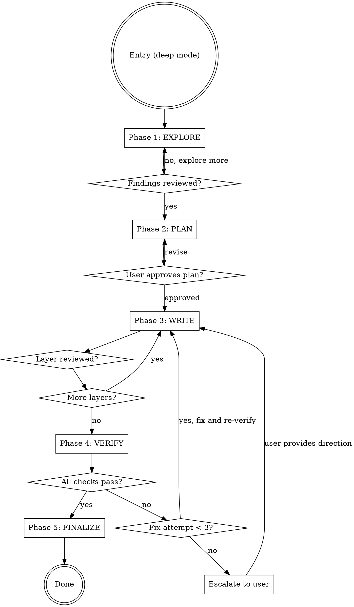

# Ivy Workflow Orchestrator

Central phase engine for all Ivy specification work. Enforces exploration-first,
plan-before-write, verify-before-compile discipline.

<HARD-GATE>
Do NOT write any Ivy code, scaffold any spec file, or invoke ivy_compile until
Phase 1 (Explore) and Phase 2 (Plan) are BOTH complete and the user has approved
the approach. This applies to EVERY specification task regardless of perceived
simplicity.
</HARD-GATE>

## Iron Laws

1. **NO SPEC WRITING** without completed Phase 1 (Explore) + Phase 2 (Plan)
2. **NO COMPILATION** without passing Phase 4 (Verify)
3. **NO PHASE SKIPPING** — every phase gate requires explicit user approval
4. **EXPLORE FIRST** — even "just add one assertion" needs context
5. **MAX 3 FIX ATTEMPTS** in Phase 4 before escalating to user

## Anti-Pattern: "This Is Too Simple For Phases"

Every spec task goes through this process. A single assertion addition, a new layer,
a test variant — all of them. "Simple" tasks are where unexamined assumptions cause
the most verification failures and broken includes.

## Checklist (track each phase as a task)

1. **Phase 1: EXPLORE** — Understand what exists
2. **Phase 2: PLAN** — Map requirements to layers
3. **Phase 3: WRITE** — Create/modify specs layer by layer
4. **Phase 4: VERIFY** — Run ivy_verify, review model quality
5. **Phase 5: FINALIZE** — Compile, audit traceability, report

## Process Flow

## Phase 1: EXPLORE

**Goal:** Understand the existing specification landscape before changing anything.

**Actions:**
- Dispatch `spec-analyst` agent with the target protocol directory
- Load the relevant methodology skill (nct/nact/nsct-methodology) for context
- Load `ivy-toolkit` skill for tool operations
- Run `ivy_include_graph` on the target directory
- Run `ivy_model_info` on key files
- Check existing bracket-tag coverage with `ivy_coverage mode=stats`

**Gate:** Present findings to user. Ask: "Here's what exists. What do you want to
build/change?" Do NOT proceed until user confirms direction.

**Loads:** ivy-toolkit, [nct|nact|nsct]-methodology
**Dispatches:** spec-analyst agent

## Phase 2: PLAN

**Goal:** Map requirements to formal layers and get user approval.

**Actions (NCT/NACT):**
- Dispatch `traceability-agent` to parse RFC normative language
- Load `workflow-reference` skill for RFC-to-Ivy mapping patterns
- Load `specification-patterns` skill for layer decomposition
- Present: requirement list, layer mapping, file plan

**Actions (NSCT):**
- Load `nsct-methodology` for topology planning
- Present: topology config, simulation parameters

**Gate:** Present the plan. Ask: "Here is the layer mapping and file plan.
Approve before I start writing?" Do NOT proceed until user approves.

**Loads:** specification-patterns, workflow-reference (NCT/NACT), nsct-methodology (NSCT)
**Dispatches:** traceability-agent (NCT/NACT)

## Phase 3: WRITE

**Goal:** Create/modify spec files one layer at a time.

**Actions:**
- Load `ivy-writing-guide` skill for Ivy syntax reference
- Load `incremental-spec-dev` skill for the add-verify-iterate loop
- Write one layer at a time, presenting each for review
- Dispatch methodology-guide agent as writing assistant

**Gate:** User reviews each layer. Ask: "Does this layer look correct?
Proceed to next?" Do NOT write the next layer until current is approved.

**Loads:** ivy-writing-guide, incremental-spec-dev
**Dispatches:** methodology-guide agent

## Phase 4: VERIFY

**Goal:** Formal verification + model quality review.

**Actions:**
- Run `ivy_verify` on each new/modified file (via workflow-reference skill)
- Dispatch `spec-analyst` agent for error diagnosis
- Dispatch `model-reviewer` agent for quality audit
- Run `ivy_diagnostics(mode="structural")` for fast pattern checks

**Gate:** All verification must pass. If failures:
- Attempt 1-3: Fix and re-verify. Fix attempts return to Phase 3 (WRITE) for the fix, then re-enter Phase 4 (VERIFY).
- After 3 attempts: STOP. Present failures to user. Ask for direction.

**Loads:** workflow-reference
**Dispatches:** spec-analyst, model-reviewer agents

## Phase 5: FINALIZE

**Goal:** Compile test binary and audit traceability.

**Actions:**
- Run `ivy_compile` to generate test binary
- Dispatch `traceability-agent` for coverage audit
- Run `ivy_coverage mode=gaps` to identify uncovered requirements
- Present: compilation result, coverage report, next steps

**Gate:** Present final report. Ask: "Coverage report above. Any requirements
to add, or are we done?"

**Dispatches:** traceability-agent

## Methodology-Specific Hooks

Each methodology skill (NCT/NACT/NSCT) injects its own specializations:
- **NCT:** Role inversion logic in Phase 3, test variant selection
- **NACT:** APT lifecycle stages in Phase 2, attack entity creation in Phase 3
- **NSCT:** Topology design in Phase 2, Shadow NS config in Phase 3

## Reference Files
- **references/phase-gates-detail.md** — Detailed gate conditions and bypass prevention
- **references/anti-patterns.md** — Full rationalization prevention table
- **references/agent-dispatch-reference.md** — Agent selection matrix per phase

## Integration
- **LOADED BY:** nct-methodology, nact-methodology, nsct-methodology (deep mode)
- **LOADED BY:** /nct-scaffold command (deep mode)
- **LOADS:** ivy-toolkit, specification-patterns, workflow-reference, ivy-writing-guide,
             incremental-spec-dev
- **DISPATCHES:** spec-analyst, traceability-agent, methodology-guide, model-reviewer
