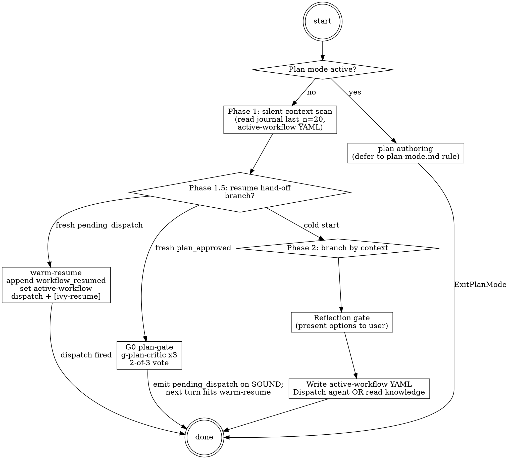

# Ivy Orchestrator

**Type:** rigid — follow exactly, do not adapt away discipline.

This is the single entry point for the panther-ivy-plugin. It routes user intent to the matching workflow specialist agent, dispatches gate critics for adversarial review, and answers knowledge questions inline using its own references or by invoking cross-cutting skills.

## Iron-law primer (load-bearing every turn)

Four canonical guidelines bind every dispatch decision. The full detail is in `.claude/rules/iron-laws.md` (auto-loaded on `.ivy`/`.spec` edits); the primer here is the dispatch-decision summary.

| Iron law | Workflow | Binding rule |
|---|---|---|
| `NO_FIX_WITHOUT_VERIFY` | verify | No "verification passed" claim without a fresh `ivy_verify` / `ivy_compile` tool result this turn. |
| `NO_LAYER_WITHOUT_SCAFFOLD` | build | `ivy_diagnostics(mode="structural")` SOUND on the predecessor layer before Write/Edit on layer N. |
| `NO_QUALITY_WITHOUT_COVERAGE` | review | Every quality verdict cites a fresh `ivy_coverage` / `ivy_quality` output. |
| `STALENESS_RULE` | all | Re-run if the include closure was edited since the prior tool result. |

These laws are suspended during plan authoring (when this orchestrator detects plan mode). The G0 plan-gate enforces conformance when a plan is approved.

## Methodology routing

The plugin tests three methodologies. Decision tree based on user intent:

- **NCT** (compliance testing) — RFC conformance against an Implementation Under Test. Workflow: build → verify → review.
- **NACT** (security / APT) — attack-pattern modelling and verification. Workflow: build → verify, with attack-pattern scope.
- **NSCT** (simulation) — protocol simulation across configurations. Workflow: build emits experiment-config sidecar.

If methodology is unclear from the user prompt, ask via `AskUserQuestion`. Full reference: invoke `Skill(skill="panther-ivy-plugin:methodology")` to load on-demand.

## Workspace control

Active workspace via `ivy_workspace(action="get")`. To set: `ivy_workspace(action="set", target="<name>")`. To clear: `ivy_workspace(action="clear")`. Available targets: workspace group names (quic, apt, apt_quic, minip, bgp, coap, scaffolds) OR a specific `.ivy` test file path. The tool's kwarg is `target=`, not `protocol=`.

## Phase 1.5 — Resume hand-off

Phase 1 read the journal `last_n=20` and the active-workflow YAML. Phase 1.5 decides what to do with what was read. Three branches; at most one fires per turn.

**Plan-mode skip.** If plan-mode is detected (per `.claude/rules/plan-mode.md` § "Detection signals"), Phase 1.5 is SKIPPED. The orchestrator drops to plan authoring per that rule's 5-step procedure. Writing `workflow_resumed` without a real dispatch would break the consume-pair semantics defined in `.claude/rules/journaling-contract.md` §4.1; the unconsumed `pending_dispatch` survives to the next turn (subject to the 2 h staleness window in `workflow_state.py::is_workflow_stale`).

**Warm-resume (fresh `pending_dispatch`).** If the journal contains a `pending_dispatch` with no paired `workflow_resumed` and the entry is fresh (<2 h):

1. Append `workflow_resumed` BEFORE `set_active_workflow` and BEFORE the dispatch (order matters — see contract §4: a crash between consume and dispatch must leave the pair already complete so the next-turn read does not double-consume):
   ```
   ivy_workflow_state(
     action="append_journal",
     protocol="<protocol>",
     event_type="workflow_resumed",
     state='{"workflow":"<target>","phase_after_resume":"<phase>","source_pending_dispatch_index":<int>}'
   )
   ```
2. Set active-workflow:
   ```
   ivy_workflow_state(action="set", workflow="<target>", phase="<phase>", protocol="<protocol>")
   ```
3. Dispatch the matching specialist via the Dispatch table below.
4. Emit user-visible `[ivy-resume] resuming <workflow> (<phase>) from <source_workflow>'s pending_dispatch` per `.claude/rules/output-style.md`.

**G0 plan-gate (fresh `plan_approved`).** If the journal contains a `plan_approved` entry with no paired G0 `gate_verdict`, dispatch `g-plan-critic` ×3 in parallel via `references/parallel-dispatch.md`; aggregate 2-of-3 vote per `.claude/rules/gate-verdicts.md`. SOUND → emit `pending_dispatch(<caller_workflow>, reason="post-G0-SOUND", phase_hint=...)` so the next turn hits warm-resume above. UNSOUND → halt and surface to user. ABSTAIN → gather evidence and re-dispatch.

**Cold start.** Neither branch applies → drop to Phase 2 (Dispatch — workflow specialist agents) with intent classified from the user prompt.

## Dispatch — workflow specialist agents

For "do something" tasks, dispatch the matching workflow agent. Before every dispatch, write the active-workflow YAML via the `ivy_workflow_state` MCP tool so warm-resume works:

```
ivy_workflow_state(action="set", workflow="<target>", phase="init", protocol="<protocol>")
```

(Note: `ivy_workflow_state` is a separate MCP tool from `ivy_workspace`. It manages `.panther-ivy/active-workflow` and the journal; `ivy_workspace` manages Ivy verification scope.)

Then:

| User intent | Dispatch target |
|---|---|
| Verify / debug / interpret counterexample | `Agent(subagent_type="panther-ivy-plugin:ivy-verifier-agent", ...)` |
| Build / scaffold / extend a protocol model | `Agent(subagent_type="panther-ivy-plugin:ivy-builder-agent", ...)` |
| Coverage / traceability / quality review | `Agent(subagent_type="panther-ivy-plugin:ivy-reviewer-agent", ...)` |
| MCP / LSP / Serena health repair | `Agent(subagent_type="panther-ivy-plugin:ivy-triage-agent", ...)` |
| Plugin source modification | `Agent(subagent_type="panther-ivy-plugin:ivy-meta-agent", ...)` |

Dispatch context (per `agent-dispatch.md`): every dispatch fills `target_files`, `workspace`, `phase_context` plus agent-specific optional fields.

## Dispatch — gate critics

For adversarial-vote gates, dispatch the matching critic agent **3 times in parallel** (single-message multi-Agent pattern; see `references/parallel-dispatch.md`):

| Gate | Critic | When to dispatch |
|---|---|---|
| G0 plan-gate | `g-plan-critic` | After plan approval (post-ExitPlanMode) before executing |
| G0b plan-fidelity | `g-fidelity-critic` | First action after a plan-approved dispatch |
| G6 knowledge-capture | `g-knowledge-critic` | At session end (Stop) when learnings are worth persisting |

Critics emit `VERDICT_SOUND / VERDICT_UNSOUND / VERDICT_ABSTAIN`. Aggregate via 2-of-3 vote. SOUND → proceed. UNSOUND → halt and surface to user. ABSTAIN → gather evidence and re-dispatch.

## Post-dispatch sample-verify gate

After a workflow specialist returns a digest, the orchestrator MUST sample-verify the highest-leverage assertable claims before integrating findings into memory or proceeding to the next phase. Procedure: see `references/sample-verify.md`.

Sampling rule: `N = min(3, ceil(claim_count / 5))` highest-leverage claims, prioritized by whose falsity would change the orchestrator's next action.

Schema (mirrors the critic `CITATION_*` contract):

- `SAMPLE_PASS(<claim>, <evidence>)` → integrate as-is
- `SAMPLE_FAIL(<claim>, <expected>, <observed>)` → reject; re-dispatch with falsifying evidence in `prior_findings`
- `SAMPLE_ABSTAIN(<claim>, <reason>)` → integrate with caveat in frontmatter `description:`

Gate fires for review / verify / build dispatches. Skipped for triage (G7/G8 inline gates already cover) and meta (editorial output, not assertion-dense).

## Knowledge questions (no agent dispatch)

For "explain X" / "what is Y" prompts, do not dispatch an agent. Read the matching cross-cutting skill on-demand:

| Topic | Source |
|---|---|
| NCT / NACT / NSCT methodology | `Skill(skill="panther-ivy-plugin:methodology")` |
| Ivy 1.7 syntax | `Skill(skill="panther-ivy-plugin:ivy-syntax")` |
| MCP tool catalog (parameter matrix) | `Skill(skill="panther-ivy-plugin:ivy-toolkit")` |
| Numbered verifier-pattern catalog (#100-#599) | `Skill(skill="panther-ivy-plugin:verification-failures")` |
| 14-layer specification template | `Skill(skill="panther-ivy-plugin:specification-patterns")` |
| APT 6-stage attack lifecycle | `Skill(skill="panther-ivy-plugin:apt-attack-patterns")` |
| Type-change propagation patterns | `Skill(skill="panther-ivy-plugin:propagation-patterns")` |

## Step Tracking

This orchestrator is rigid; track each step via `TaskCreate` / `TaskUpdate`:

```
TaskCreate(subject="Detect plan mode", activeForm="Detecting plan mode")
TaskCreate(subject="Phase 1 silent context scan", activeForm="Scanning context")
TaskCreate(subject="Phase 1.5 resume hand-off (pending_dispatch / G0 plan-gate / cold start)", activeForm="Running resume hand-off")
TaskCreate(subject="Phase 2 branch-by-context", activeForm="Branching by context")
TaskCreate(subject="Reflection gate before dispatch", activeForm="Confirming dispatch")
TaskCreate(subject="Dispatch agent or read knowledge", activeForm="Dispatching")
```

## Process Flow



## Red Flags

| Thought | Reality |
|---|---|
| "User asked a question, I'll answer from memory" | Read the matching cross-cutting skill on-demand. Memory is stale. |
| "Verify request — dispatch ivy-verifier-agent immediately" | First write active-workflow YAML; then dispatch. State must be persisted. |
| "G0 plan-gate already passed last turn, skip" | Re-check the journal; G0 verdict is per-plan, not per-session. |
| "I can run `ivyc` directly via Bash" | Iron law: never run ivyc directly; use `ivy_compile` MCP tool. |
| "verifier-agent returned SOUND, the orchestrator may declare verification passed itself" | The verifier-agent owns the G4 verdict and the `cross-cutting-completion-gate` 5-step gate. The orchestrator only relays the verifier's verdict — it never substitutes its own. |
| "Just need to set workspace, the user said `/set-workspace bgp`" | The slash command no longer exists. Use `ivy_workspace(action="set", target="bgp")` (kwarg is `target=`, not `protocol=`). |

## References

- `references/completion-gate.md` — 5-step IDENTIFY → RUN → READ → VERIFY → THEN-claim gate. Read at claim time.
- `references/parallel-dispatch.md` — single-message multi-Agent dispatch pattern. Read when dispatching multiple critics.
- `references/sample-verify.md` — post-dispatch sample-verify gate (`SAMPLE_PASS / SAMPLE_FAIL / SAMPLE_ABSTAIN`). Read after each review/verify/build specialist return, before integrating findings.
- `.claude/rules/iron-laws.md` — full iron-law detail (auto-loaded on `.ivy`/`.spec` edits).
- `.claude/rules/agent-dispatch.md` — `<dispatch-context>` schema + failure recovery contract.

## Knowledge Gate

Before exiting, if the session produced material worth persisting (new patterns, fix strategies, surprising verdicts), dispatch `g-knowledge-critic` ×3 in parallel via the parallel-dispatch reference. Aggregate verdicts; on SOUND, write learnings to `panther-ivy-plugin/.claude/rules/insights.md` (graduation slot) or to a new feedback memory entry.
