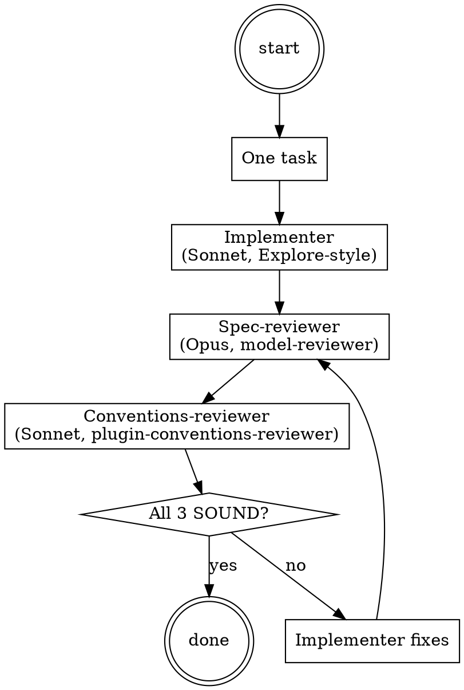

# Plugin Self-Modification

**Type:** rigid — follow exactly, do not adapt away discipline.

## When this applies

Activates when the user is editing `panther-ivy-plugin` source: SKILL.md, agent files, hook scripts, `.claude/rules/*.md`, command files, output styles, or `routing-rules.json`. Wired via `routing-rules.json` paths (see Integration).

Does NOT apply to Ivy spec authoring (use `build` / `verify` / `review`), plugin testing (use `panther run`), or plugin documentation (`docs/`, `README.md`, `CHANGELOG.md`) — those have lower drift risk and don't need the 3-loop.

## Iron Law

<iron-law name="PLUGIN_3LOOP" workflow="meta-plugin-self-mod" enforcement="implementer / spec-reviewer / plugin-conventions-reviewer dispatch per task; all three SOUND before ship"/>

No plugin-source change ships without all three loops returning SOUND on the change.

## Red Flags

| Thought | Reality |
|---|---|
| "Quick fix, skip the loop" | Quick fixes are where convention drift accumulates. The 3-loop is the calibrated source of truth, not personal heuristic. |
| "Implementer ran cleanly, ship it" | Implementer output is a candidate; spec-reviewer + plugin-conventions-reviewer verdicts are mandatory before claim. |
| "I'm the implementer + reviewer in one context" | Single-context dispatch loses the dual-context isolation that catches drift. Three context-isolated agents catch what one in-context Claude misses. |
| "Plugin conventions are 'soft' guidelines" | The plugin-local `skill-conventions.md`, three-layer split, and audit doc make drift detectable. The PostToolUse hooks make it loud. |
| "Both reviewers will say the same thing" | spec-compliance-reviewer audits change-vs-spec; plugin-conventions-reviewer audits change-vs-conventions. Different axes, different verdicts. |

## Step Tracking

```
TaskCreate(subject="Implementer dispatch", activeForm="Implementing")
TaskCreate(subject="Spec-compliance review dispatch", activeForm="Spec-reviewing")
TaskCreate(subject="Plugin-conventions review dispatch", activeForm="Conventions-reviewing")
TaskCreate(subject="Aggregate verdicts", activeForm="Aggregating verdicts")
```

## Process Flow



# Plugin Self-Modification Workflow

<HARD-GATE>
Do NOT Write/Edit a plugin source file (skills/*, agents/*, hooks/*,
.claude/rules/*, commands/*, output-styles/*, routing-rules.json) without
running the three-agent loop on the change. Direct edits without the
loop are the convention-drift anti-pattern this workflow prevents.
</HARD-GATE>

## Three-Agent Loop

### Step 1 — Implementer dispatch

Dispatch a generic Explore-style agent to implement the task. Pass: target files, plan / requirements, exact change spec. The implementer can use `Edit` and `Write` on the named target files only.

`Agent(subagent_type="Explore", description="Implement <task>", prompt="<...>")`

### Step 2 — Spec-compliance review

Dispatch the existing `model-reviewer` agent (Opus tier, 180 s budget) with `review_scope="spec-compliance"` set in the dispatch-context. The agent compares the implementer's diff against the original task spec. Returns SOUND / UNSOUND / ABSTAIN.

Per `.claude/rules/agent-dispatch.md` for fault handling.

### Step 3 — Plugin-conventions review

Dispatch the new `plugin-conventions-reviewer` agent (Sonnet tier, 90 s budget) with `review_scope="plugin-conventions"` in the dispatch-context. The agent audits the diff against:
- `skill-conventions.md` §1–§7 (frontmatter, type, HARD-GATE, Red Flags, Process Flow, Step Tracking, CSO).
- Three-layer split (agent owns capability, orchestrator owns usage, agent-dispatch.md owns fault handling).
- No `superpowers/specs/*` citations in plugin artifacts.
- No external-plugin authority (math-olympiad, etc.).
- Per-skill `references/` placement (no plugin-root references/).
- Cross-skill access via `Skill` tool (no hardcoded paths into another skill's references/).

Returns SOUND / UNSOUND / ABSTAIN.

### Step 4 — Aggregate verdicts

All three loops must return SOUND for the task to be complete. If any returns UNSOUND or ABSTAIN, dispatch the implementer again with the cited issues, then re-run Steps 2 and 3 (the implementer step skips on the second pass; only the reviewers re-run).

When all three SOUND: invoke `completion-gate` to finalize the claim before user-facing emission.

## Terminal state

<HARD-GATE>
The terminal state of plugin-self-mod is one of:
- All three loops SOUND + completion-gate verdict PASS → claim emitted, task complete.
- Any loop UNSOUND/ABSTAIN with implementer-retry budget exceeded → present
  AskUserQuestion: retry with broader fix / accept loop verdict / abandon task.

Do NOT ship plugin-source changes without all three loops SOUND. The
3-loop is iron-law-bound; bypassing is convention drift the
plugin-conventions-reviewer is designed to catch.
</HARD-GATE>

## Integration

- **Called by:** PostToolUse on Write/Edit when target path matches plugin source globs (configured in `routing-rules.json`); user directly when modifying plugin code.
- **Calls:** Explore (implementer), `model-reviewer` (spec compliance), `plugin-conventions-reviewer` (plugin conventions), `completion-gate` (final claim emission).
- **Cross-references:** `parallel-dispatch` (Steps 2 and 3 reviewers can run in parallel — they audit different axes); `.claude/rules/agent-dispatch.md` (fault handling for any of the three dispatches).
- **MCP tool reliability:** N/A — this workflow does not invoke MCP tools directly. Reviewers may invoke MCP tools; their failures follow `.claude/rules/mcp-tool-reliability.md`.
