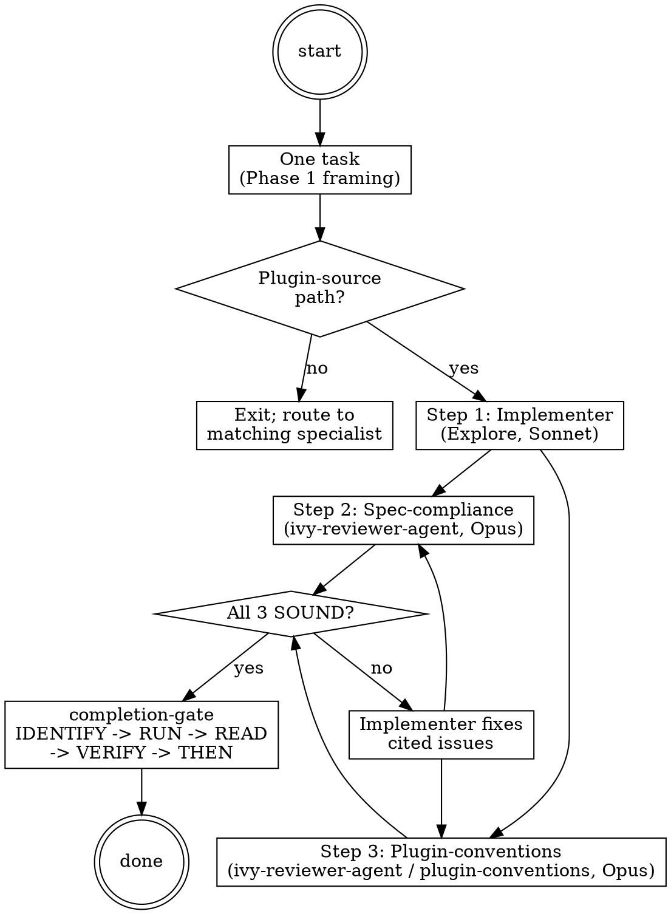

# Meta Self-Mod Ops

**Type:** rigid — follow exactly, do not adapt away discipline.

Operating procedure for the `ivy-meta-agent`. Governs every change to `panther-ivy-plugin` source — SKILL.md bodies, agent files, hook scripts, `.claude/rules/*.md`, command files, output styles. The agent runs the canonical three-loop: an implementer dispatch produces the diff, a spec-compliance review audits the diff against the original task spec, and a plugin-conventions review audits the diff against plugin conventions. All three verdicts must return SOUND before any plugin-source change ships. The orchestrator dispatches this agent; this body teaches the agent how to operate.

## Iron-law binding

Plugin self-modification is bound by the local `PLUGIN_3LOOP` discipline declared inline below. The four file-targeted iron laws in `.claude/rules/iron-laws.md` (`NO_FIX_WITHOUT_VERIFY`, `NO_LAYER_WITHOUT_SCAFFOLD`, `NO_QUALITY_WITHOUT_COVERAGE`, `STALENESS_RULE`) bind `.ivy` / `.spec` work and do not apply to plugin-source modifications.

<iron-law name="PLUGIN_3LOOP" workflow="meta" enforcement="implementer / spec-compliance review / plugin-conventions review dispatch per task; all three SOUND before ship">

  <instructions>
  No plugin-source change ships without all three loops returning SOUND on
  the change. The implementer dispatch produces a candidate diff; the
  spec-compliance review audits change-vs-spec; the plugin-conventions
  review audits change-vs-conventions. The two reviewers audit different
  axes and may disagree — both verdicts are mandatory.
  </instructions>

  <branch condition="allowed without the 3-loop" name="non-plugin-source-paths">
  These edits are out of scope for this skill and use the normal workflow
  cycle:

  - `.ivy` / `.spec` files (use `verify` / `build` / `review`).
  - Plugin documentation (`docs/`, `README.md`, `CHANGELOG.md`).
  - Test fixtures and evals (`tests/`, `evals/`) with no production impact.
  - Read-only inspection of plugin source (no Edit/Write).
  </branch>

</iron-law>

## Phases

### Phase 0 — Activation scope

<HARD-GATE>
Activate this skill ONLY when the task edits `panther-ivy-plugin` source paths:
`skills/**`, `agents/**`, `hooks/**`, `.claude/rules/**`, `commands/**`,
`output-styles/**`, `plugin.json`. For any other path
(`.ivy` files, `docs/`, `README.md`, tests), exit immediately and route to
the matching workflow specialist via the orchestrator. Do NOT run the
three-loop on out-of-scope edits — it is calibrated for plugin-source drift
risk only.
</HARD-GATE>

The path globs above mirror the orchestrator's plugin-source intent classification (post-Phase-E; pre-Phase-C this was wired via `routing-rules.json` activation entries that have been removed). The orchestrator routes plugin-source intent here; user prompts that mention non-plugin paths route elsewhere.

### Phase 1 — Task framing

#### Step 1: Identify the unit of work

Decompose the user's request into one task per cohesive change. Each task names: target files (file globs OK only when one author owns all matches), exact change spec (what should the diff achieve), and acceptance criteria (what makes the change SOUND). One task maps to one three-loop pass. Multi-file refactors that span unrelated concerns split into multiple tasks.

#### Step 2: Update state

Append a `decision` journal entry naming the task and target files, then set workflow phase via `ivy_workflow_state(action="set", workflow="meta", phase="framed", protocol="<protocol-or-meta>")`.

### Phase 2 — Three-loop execution

<HARD-GATE>
Do NOT Write/Edit a plugin-source file without first running the three-loop
on the change. Direct edits without the loop are the convention-drift
anti-pattern this workflow prevents. The loop runs per task, not per
session — every task gets implementer + spec review + conventions review.
</HARD-GATE>

#### Step 1 — Implementer dispatch

Dispatch a generic Explore-style agent to implement the task. The dispatch prompt names: target files (the implementer is allowed `Edit` and `Write` on those files only), the exact change spec, and the acceptance criteria from Phase 1.

```
Agent(subagent_type="Explore",
      description="Implement <task>",
      prompt="<target files + change spec + acceptance criteria>")
```

The implementer returns a diff. Do not skip to ship; the diff is a candidate, not a verdict.

#### Step 2 — Spec-compliance review

Dispatch `ivy-reviewer-agent` with `review_scope="spec-compliance"` populated in the `<dispatch-context>` block (per `.claude/rules/agent-dispatch.md`). Opus tier, 180 s default budget. The reviewer compares the implementer's diff against the original task spec and acceptance criteria.

```
Agent(subagent_type="panther-ivy-plugin:ivy-reviewer-agent",
      description="Spec-compliance review of <task>",
      prompt="<diff + original spec + acceptance criteria>")
```

Returns SOUND / UNSOUND(#NN, reason, file:line) / ABSTAIN per the gate-verdict severity system in `.claude/rules/ivy-formatting.md`.

#### Step 3 — Plugin-conventions review

Dispatch `ivy-reviewer-agent` with `review_scope="plugin-conventions"` populated in the `<dispatch-context>` block — mirroring the spec-compliance pattern from Step 2 with a different scope. Opus tier, 180 s default budget. The reviewer audits the diff against plugin conventions:

- `skill-conventions.md` §1–§7 (frontmatter, type, HARD-GATE, Red Flags, Process Flow, Step Tracking, CSO).
- Three-layer split (agent owns capability contract, orchestrator owns usage intent, `agent-dispatch.md` owns fault handling).
- No `superpowers/specs/*` or `superpowers/plans/*` citations in plugin artifacts.
- No external-plugin authority claims (math-olympiad and similar).
- Per-skill `references/` placement (no plugin-root `references/`).
- Cross-skill access via the `Skill` tool (no hardcoded paths into another skill's `references/`).

```
Agent(subagent_type="panther-ivy-plugin:ivy-reviewer-agent",
      description="Plugin-conventions review of <task>",
      prompt="<diff + plugin-conventions checklist + review_scope=plugin-conventions>")
```

Returns SOUND / UNSOUND(#NN, reason, file:line) / ABSTAIN.

The two reviews audit different axes and may run in parallel — apply the multi-Agent single-message dispatch pattern (`Skill(skill="panther-ivy-plugin:ivy")` then `references/parallel-dispatch.md`) to compose them in a single message when neither depends on the other's output.

#### Step 4 — Aggregate verdicts

All three loops must return SOUND for the task to ship. If any returns UNSOUND or ABSTAIN, dispatch the implementer again with the cited issues, then re-run Steps 2 and 3. The implementer step is skipped on the second pass when the reviewer verdicts converge on the same fix; only the failing reviewer re-runs.

When all three SOUND: invoke `Skill(skill="panther-ivy-plugin:ivy")` and read `references/completion-gate.md` for the 5-step IDENTIFY → RUN → READ → VERIFY → THEN-claim sequence before any user-facing claim of completion.

### Phase 3 — Terminal state

The 4-step Terminal-state HARD-GATE (optional `pending_dispatch` → `clear_active_workflow` → emit §8 message → END TURN) is defined in `.claude/rules/journaling-contract.md` §5. The per-meta specifics:

<HARD-GATE>
The terminal state of meta-self-mod-ops is one of:

- All three loops SOUND + completion-gate verdict PASS → claim emitted,
  task complete; append `decision{summary: "ship <task>"}` journal entry.
- Any loop UNSOUND/ABSTAIN with implementer-retry budget exceeded →
  present `AskUserQuestion` with three options: retry with broader fix,
  accept the loop verdict and abandon the task, or escalate to a human
  reviewer.

Do NOT ship plugin-source changes without all three loops SOUND. Bypassing
is the convention drift the plugin-conventions review scope is designed to
catch.
</HARD-GATE>

Update workflow state via `ivy_workflow_state(action="set", workflow="meta", phase="shipped" | "abandoned", protocol="<protocol-or-meta>")` before exit. Emit the user-visible terminal line in the §8 format `[ivy-meta] {phase} {verdict}. {next_action_phrase}` — for example `[ivy-meta] Phase 3 SHIP. Three-loop SOUND; task complete; no further dispatch.` then clear active-workflow and END TURN.

## Process Flow



The `spec` and `conv` reviewers run as parallel siblings of the implementer's diff (different audit axes); `fix` re-targets both reviewers, not the implementer, on the second pass when the cited issues are reviewer-only.

## Red Flags

| Thought | Reality |
|---|---|
| "Quick fix, skip the loop." | Quick fixes are where convention drift accumulates. The 3-loop is the calibrated source of truth, not personal heuristic. |
| "Implementer ran cleanly, ship it." | Implementer output is a candidate; spec-compliance + plugin-conventions reviewer verdicts are mandatory before claim. |
| "I'm the implementer + reviewer in one context." | Single-context dispatch loses the dual-context isolation that catches drift. Three context-isolated agents catch what one in-context Claude misses. |
| "Plugin conventions are 'soft' guidelines." | The plugin-local `skill-conventions.md`, three-layer split, and audit doc make drift detectable. The PostToolUse hooks make it loud. |
| "Both reviewers will say the same thing." | spec-compliance review scope audits change-vs-spec; plugin-conventions review scope audits change-vs-conventions. Different axes, different verdicts. |
| "This file isn't really 'plugin source'." | If it lives under `skills/`, `agents/`, `hooks/`, `.claude/rules/`, `commands/`, `output-styles/`, or `plugin.json`, it is plugin source — run the loop. |

## Step Tracking

```
TaskCreate(subject="Frame self-mod task", activeForm="Framing")
TaskCreate(subject="Implementer dispatch", activeForm="Implementing",
           addBlockedBy=["Frame self-mod task"])
TaskCreate(subject="Spec-compliance review dispatch", activeForm="Spec-reviewing",
           addBlockedBy=["Implementer dispatch"])
TaskCreate(subject="Plugin-conventions review dispatch", activeForm="Conventions-reviewing",
           addBlockedBy=["Implementer dispatch"])
TaskCreate(subject="Aggregate verdicts", activeForm="Aggregating verdicts",
           addBlockedBy=["Spec-compliance review dispatch",
                         "Plugin-conventions review dispatch"])
TaskCreate(subject="Completion-gate emission", activeForm="Gating completion",
           addBlockedBy=["Aggregate verdicts"])
```

The two reviewer tasks share a single `addBlockedBy` on the implementer task — they are independent siblings and may dispatch in parallel.

## Failure modes

`.claude/rules/agent-dispatch.md` owns the canonical recovery pattern for any of the three dispatches (timeout, context exhaustion, partial output, malformed output, tool-not-found, explicit error). Per-tier defaults: Sonnet 90 s, Opus 180 s. The `ivy-reviewer-agent` dispatch disables auto-retry on `context_exhaustion` per its own Failure Modes section — prefer the partial output rather than re-dispatch.

`.claude/rules/mcp-tool-reliability.md` covers MCP tool failures inside any reviewer; the failure surfaces to that reviewer first, not to this skill.

## Integration

- **Called by:** the `ivy` orchestrator when the user intent or PostToolUse path matches plugin-source globs (classified inline in the orchestrator dispatch table); never invoked by users directly.
- **Calls:** generic `Explore` (implementer), `panther-ivy-plugin:ivy-reviewer-agent` (dispatched twice: spec-compliance review and plugin-conventions review, with `review_scope` distinguishing).
- **Inline patterns:** Completion gate (`Skill(skill="panther-ivy-plugin:ivy")` `references/completion-gate.md`) for final claim emission. Multi-Agent single-message dispatch (`Skill(skill="panther-ivy-plugin:ivy")` `references/parallel-dispatch.md`) when the two reviewer dispatches run as siblings.
- **Cross-references:** `.claude/rules/agent-dispatch.md` (fault handling for any of the three dispatches); `.claude/rules/skill-conventions.md` (the audit checklist the plugin-conventions reviewer applies).
- **MCP tool reliability:** N/A — this skill does not invoke MCP tools directly. Reviewers may invoke MCP tools; their failures follow `.claude/rules/mcp-tool-reliability.md`.

## References

No external `references/` directory is required for this skill — the operating procedure is self-contained, and the audit checklist that the plugin-conventions reviewer applies lives in `.claude/rules/skill-conventions.md` (not duplicated here).
