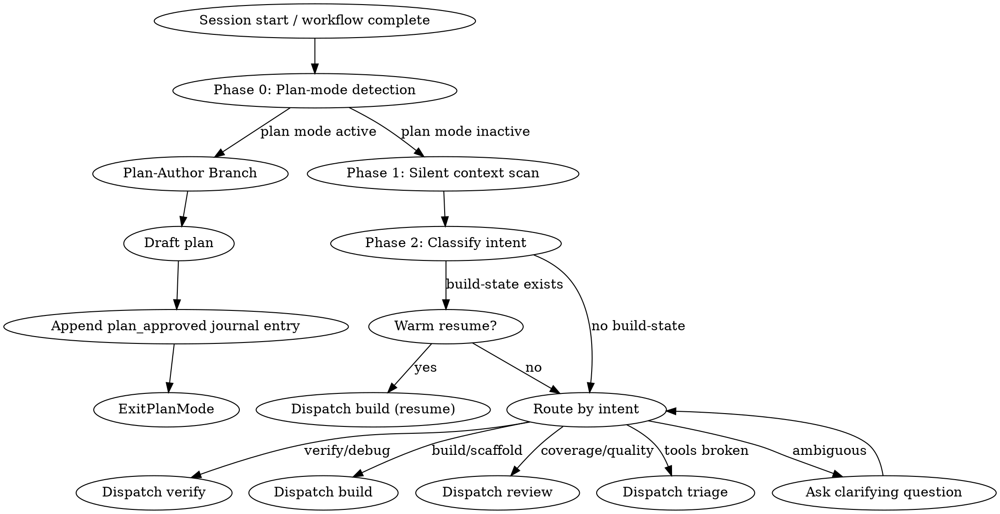

## Output Style

This workflow's output formatting is managed by the style system.
Follow the style directives injected via `additionalContext` -- they contain
the active workflow overlay and phase modifier. Do not invent
formatting for tool results that arrive pre-formatted in `hookSpecificOutput`.

## Anti-Rationalization

| Thought | Reality |
|---------|---------|
| "I already know what to do" | Route to the correct workflow. Don't freelance. |
| "This is a quick fix" | Quick fixes in formal specs create unsound models. Route to verify. |
| "Let me just edit this one file" | Edits without verification break assume-guarantee contracts. Route to build or verify. |
| "The user just wants me to do it" | The user wants correct results. Workflows exist to ensure correctness. |

## Step Tracking

Create tasks for the navigate dispatch cycle:
```
TaskCreate(subject="Context scan (silent)", activeForm="Scanning context")
TaskCreate(subject="Classify user intent", activeForm="Classifying intent")
TaskCreate(subject="Dispatch to workflow", activeForm="Dispatching workflow")
```

## Process Flow



# Navigate Workflow

Read `.panther-ivy/active-workflow` on every turn to determine the current phase before proceeding. If the file names a phase, resume that phase directly.

Navigate is the central hub. Every other workflow returns here on completion. Navigate dispatches to a workflow which eventually returns to navigate — it never returns to itself.

---

## Phase 0 — Plan-mode detection

Before the silent context scan, inspect the active session context for plan-mode indicators. Plan mode is a Claude Code harness feature that forbids non-plan edits; if active, navigate must route to the Plan-Author Branch rather than dispatching a workflow that would mutate state.

### Detection signals

Look for any of these in the session's system-reminder messages and `additionalContext` blocks accumulated since session start:

1. The literal phrase `Plan mode is active`.
2. The edit-restriction phrase `You MUST NOT make any edits` (plan mode's enforcement text).
3. A plan file path of the form `/Users/*/plans/*.md` named in a plan-mode system-reminder (e.g., `No plan file exists yet. You should create your plan at /Users/<user>/.claude/plans/<name>.md`).

Any single indicator is sufficient. The three exist because Claude Code's plan-mode activation surfaces at different places depending on whether plan mode was set via CLI flag, keybinding, or `EnterPlanMode` mid-session.

### Routing rule

- **If any indicator is present:** set mode = `plan-author`. Skip Phase 1's Step 4 (triage preflight) because it mutates state. Run the read-only parts of Phase 1 (the silent context scan is safe in plan mode), then route to the **Plan-Author Branch** further down this skill instead of Phase 2's dispatch.
- **If no indicator is present:** proceed to Phase 1 normally.

### Journal note

After Phase 0 routes to Plan-Author (or falls through to Phase 1), append a `context_switch` journal entry recording the detection outcome:

```
ivy_workflow_state(
  action="append_journal",
  protocol="<protocol>",
  event_type="context_switch",
  payload={"detection": "plan_mode_active" | "plan_mode_inactive", "mode": "plan-author" | "normal"}
)
```

This is advisory — if the MCP tool is unavailable (e.g., during plugin development sessions), skip the journal write and continue. The detection outcome is also captured downstream by the Plan-Author Branch's `plan_approved` entry.

---

## Phase 1 — Silent Context Scan

Do not produce user-facing output during this phase. Gather context silently.

### Step 1: Locate the protocol directory

Resolve the protocol directory by calling `ivy_workflow_state(action="get", protocol="<protocol>")`. The `protocol_dir` field in the response gives the resolved path. If not found, fall through to the cold-start branch in Phase 2.

**Note:** The PostToolUse hook on Skill automatically sets the active-workflow to `navigate/init` when this skill is invoked. Explicit `set` calls are only needed when dispatching to other workflows or updating phase.

### Step 2: Check for active build

Read build state via `ivy_workflow_state(action="get_build", protocol="<protocol>")`. Record whether a build is in progress, its protocol, methodology, and layer completion status.

### Step 2b: Check workflow journal

Call `ivy_workflow_state(action="get_journal", protocol="<protocol>", last_n=20)`.

If journal entries exist, compose a session context summary for the situation briefing:
- Count decisions, errors, progress events
- Check if last session ended cleanly (look for `session_end` with `clean: true`)
- If no `session_end` exists after the last `session_start`, the previous session was interrupted

Include this summary in the Situation Briefing: "Last session: [N] decisions, [M] errors, ended [cleanly/interrupted] at phase [phase]."

### Step 3: Check recent Ivy changes

```bash
git log --oneline -5 -- '*.ivy'
```

Record the results. If there are recent changes, note which files and when.

### Step 4: Run triage preflight

Invoke the `triage` workflow as a sub-workflow to confirm stack health before proceeding:

1. Read the current active-workflow state (if any)
2. Set a new active-workflow flag:
   - `workflow = "triage"`
   - `phase = "preflight"`
   - `invocation_depth = 1`
   - `caller = "navigate"`
3. Invoke: `Skill(skill="triage")`
4. Triage runs Phase 1 only (because `invocation_depth > 0`). If the stack is healthy, it returns silently. If the stack is broken, triage handles diagnosis and repair interactively before returning.
5. After triage returns, restore navigate's active-workflow state:
   - `workflow = "navigate"`
   - `phase = "context-scan"`

### Situation Briefing — Context Scan Results

Load the `reflection-patterns` skill. Apply **Pattern C (Situation Briefing)** with this context:

- **What happened:** Summarize the context scan results — whether a build-state was found, whether recent Ivy changes exist, whether the stack health check passed or required intervention.
- **Options to present:**
  - If build-state found: "Resume your in-progress [protocol] build" / "Start something new"
  - If recent changes found: "Verify recent changes" / "Review coverage" / "Do something else"
  - If cold start: "Build a new model" / "Verify existing specs" / "Review quality" / "Learn about methodology"

The user's choice determines which Phase 2 branch to take.

### Knowledge Gate: Session Resume Check

**KNOWLEDGE GATE (KG)**: Pause and invoke: `Skill(skill="panther-ivy-plugin:knowledge-capture")`
- Check if the most recent session digest has deferred candidates to re-present
- On warm resume: review the previous session's learnings that were deferred
- Save session log (observability events + digest)
- If deferred candidates found, present for user confirmation before routing
- Resume workflow after gate completes

---

## Phase 2 — Branch by Context

Based on the context gathered in Phase 1, choose exactly ONE of the three branches below. Evaluate them in order and take the first match.

### Branch A: Warm Resume

**Condition:** `build-state.yaml` exists and contains an in-progress build.

1. Read the build state: workflow, protocol, methodology, layers with their completion status.
2. Infer actual progress from the file system:
   - Which `.ivy` files exist under the protocol directory
   - Run `ivy_diagnostics(mode="structural")` on recently modified files to check compilation status
3. Present a progress summary to the user:
   ```
   You're in the middle of building the [protocol] model using [methodology].
   [N/M] layers complete. Last session ended at [layer/phase context].
   Pick up where you left off? Or do something else?
   ```
4. **Skip redundant questions** — if journal contains `decision` events, present them as confirmed decisions rather than re-asking.
5. **Flag errors** — if journal contains recent `error` events, present them upfront as potential blockers.
6. Wait for user response:
   - **Pick up:** Dispatch to the appropriate workflow (usually `build`), setting the active-workflow flag via `ivy_workflow_state(action="set", workflow="<workflow_name>", phase="resume", protocol="<protocol>")`
   - **Something else:** Proceed to the user interview below, then dispatch based on their answer

### Branch B: Activity Summary

**Condition:** No `build-state.yaml`, but `git log` found recent `.ivy` changes.

1. Summarize what happened since the last session:
   ```
   Last session you [modified/created/verified] [file list].
   [Brief summary of changes from git log.]
   ```
2. Offer context-appropriate next steps:
   - If changes look like spec edits: "Want to verify these changes? Or continue working on the spec?"
   - If changes look like test additions: "Want to run the tests? Or review coverage?"
3. Wait for user response, then dispatch based on their choice.

### Branch C: Cold Start

**Condition:** Neither build state nor recent Ivy changes found.

#### Multi-Perspective Exploration — Ambiguous Goals

If the user's goal is ambiguous (no clear workflow match), load the `reflection-patterns` skill and apply **Pattern B (Multi-Perspective Exploration)** before interviewing:

- **Exploration question:** "What workflow best serves this user's needs?"
- **Agent perspectives:** Use these 3 roles instead of the defaults:
  - **Methodology Expert** (Explore): "Given the protocol and user's background, which NCT/NACT/NSCT approach fits best?"
  - **Tool Expert** (Explore): "Which tools and workflows are most relevant to what the user described?"
  - **Testing Expert** (Explore): "What kind of testing should be prioritized based on the protocol's maturity?"
- Present the synthesized recommendation to the user, then proceed with the interview.

If the user's goal is clear, skip the MPE and proceed directly to the interview.

Interview the user with 1-3 focused questions. Ask one question at a time.

1. **What protocol?** "Which protocol are you working with?" (Skip if the workspace is already set or there's only one protocol directory.)
2. **What's your goal?** "What would you like to do?" Offer concise options:
   - Build a new protocol model
   - Continue or extend an existing model
   - Verify or debug a specification
   - Review coverage or quality
   - Learn about the methodology
3. **Which methodology?** "Which testing approach?" NCT (compliance), NACT (security), or NSCT (simulation). Skip if implied by the goal or if the user seems unfamiliar with the options — default to NCT.

Dispatch based on answers.

---

## Plan-Author Branch (only when Phase 0 detected plan mode)

This branch replaces Phase 2's dispatch. Plan mode blocks state-mutating actions, so the normal workflow-dispatch path cannot run. The Plan-Author Branch gathers context, helps the user draft the plan, records an auditable handoff, and then ExitPlanMode returns control to the harness.

### Step 1 — Silent context scan (safe in plan mode)

Run Phase 1's Steps 1–3 (locate protocol, check active build, check recent `.ivy` changes) and Step 2b (check workflow journal). Skip Step 4 (triage preflight) because triage may mutate state. Gather the same context that normal navigate would — the information is still useful even though dispatch won't happen.

### Step 2 — Situation Briefing framed for plan-mode options

Load `reflection-patterns` skill and apply Pattern C (Situation Briefing) with options framed for plan authoring rather than workflow dispatch:

- "Write a plan for X" — where X is inferred from the user's opening question and the context scan.
- "Audit an existing plan" — if the user references an existing plan file.
- "Clarify scope before writing" — when the user's intent is ambiguous enough that drafting would be premature.
- "Learn before planning" — if the context suggests the user should load a methodology or syntax reference first.

### Step 3 — Draft the plan

When the user is ready to draft, help them produce the plan file at the path named in the plan-mode system-reminder (e.g., `/Users/<user>/.claude/plans/<name>.md`). If the plan involves a non-trivial implementation, invoke `Skill(skill="superpowers:writing-plans")` to apply that skill's structure. Do NOT attempt to dispatch `build`, `verify`, or `review` — they would fail under plan mode's edit restrictions.

Throughout drafting, present option-level decisions via `AskUserQuestion` (not inline prose) per the `feedback_askuserquestion_always` convention. Implementation-plan tasks should present 2–3 options per modification task per `feedback_plan_task_options`.

### Step 4 — Append `plan_approved` journal entry

Before the user calls `ExitPlanMode`, append the handoff record that Phase 1.5 will consume on the next invocation (see Task 3):

```
ivy_workflow_state(
  action="append_journal",
  protocol="<protocol>",
  event_type="plan_approved",
  payload={
    "workflow": "<caller workflow, e.g. build or verify>",
    "phase_before_plan": "<phase name the caller was in>",
    "plan_file": "<absolute path to the plan file>",
    "supersedes": ["<optional list of build-state decisions the plan reverses>"]
  }
)
```

The `caller` field is best-effort: if `active-workflow` names a paused workflow, use that; otherwise infer from the user's opening intent. The `supersedes` array is populated from a `## Supersedes` block in the plan file, if present.

### Step 5 — ExitPlanMode

Call `ExitPlanMode` to return control to the harness. Navigate's Phase 1.5 (defined later in this skill) fires on the next user turn to dispatch G0 and re-activate the caller workflow.

---

## Dispatch

### Reflection Gate — Pre-Dispatch Check

Load the `reflection-patterns` skill. Apply **Pattern A (Reflection Gate)** with this context:

- **Current state:** Summarize the branch taken in Phase 2 and the workflow about to be dispatched.
- **Alternative workflows:** Name 1-2 alternatives and why they might be relevant.
- **Example:** If dispatching to `build` but the user mentioned "test" or "verify" in their last message, offer `verify` as an alternative.

After the user confirms, proceed with dispatch.

When dispatching to a workflow:

1. Call `ivy_workflow_state(action="set", workflow="<workflow_name>", phase="init", protocol="<protocol>")` to write the active-workflow flag.
2. Invoke the workflow: `Skill(skill="{workflow_name}")`

### Routing Table

| Goal | Dispatch Target |
|------|----------------|
| Build or scaffold a protocol model | `build` workflow |
| Verify or debug a specification | `verify` workflow |
| Review quality or coverage | `review` workflow |
| Diagnose broken tools | `triage` workflow |
| Learn methodology | `methodology-reference` skill |
| Extract RFC requirements | `traceability-agent` agent |

If the user's goal doesn't clearly map to a workflow, ask one clarifying question before dispatching.

---

## Sub-Workflow Return Rule

When a workflow is invoked by another workflow (not by navigate directly):

- The calling workflow sets `invocation_depth += 1` and `caller = calling_workflow` on the active-workflow flag before invoking.
- On completion: if `invocation_depth > 0`, the called workflow decrements depth and returns to `caller`, not to navigate.
- If `invocation_depth == 0`, the workflow clears the active-workflow flag and navigate re-activates on the next user turn.

---

## Integration

- **Called by:** Session start (routing hook), other workflows on completion
- **Calls:** `triage` (preflight, skipped under plan mode), then dispatches to `build`, `verify`, `review`, or skills/agents. Plan-Author Branch may call `superpowers:writing-plans`.
- **Knowledge skills loaded:** `reflection-patterns` (SB after Phase 1, RG before dispatch, MPE on cold start, Plan-Author Step 2), `knowledge-capture` (KG after Phase 1)
- **State files:** `.panther-ivy/active-workflow`, `.panther-ivy/build-state.yaml`
- **Infrastructure:** `ivy_workflow_state` MCP tool for state reads/writes; `track-workflow-skill.py` PostToolUse hook for automatic state on skill activation

### Journal entry types this skill produces or consumes

| Type | Direction | Introduced by |
|------|-----------|---------------|
| `context_switch` | produces (Phase 0 detection) | Phase 0 |
| `plan_approved` | produces (Plan-Author Step 4) | Plan-Author Branch |
| `workflow_resumed` | produces (Phase 1.5, see Task 3) | Post-plan-approval handoff |
| `gate_verdict` with `gate: "g0"` | produces (Phase 1.5, via `reflection-patterns` G0 dispatch) | Post-plan-approval handoff |
| `decision`, `phase_transition`, `session_start`, `session_end`, `error`, `progress` | both | Existing schema (unchanged) |

Full schema for each type lives in `references/gates.md` (gate_verdict payload) and in `superpowers:writing-plans` (plan file conventions consumed by the `supersedes` extraction).
