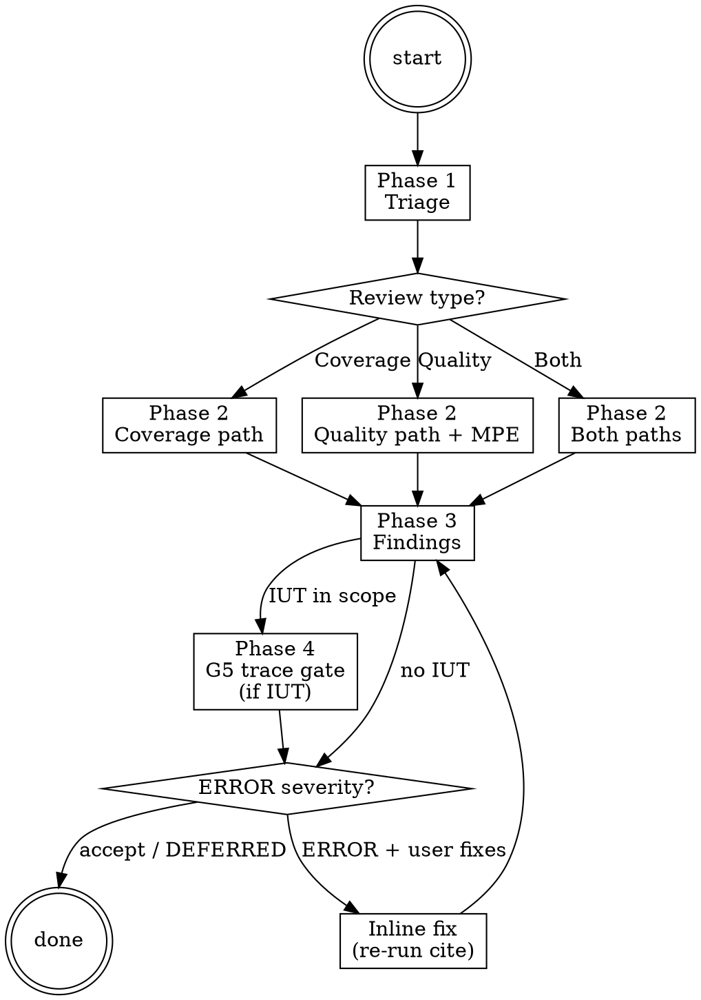

# Review Ops

**Type:** rigid — follow exactly, do not adapt away discipline.

Operating procedure for the `ivy-reviewer-agent`. Audits an Ivy protocol model along three concerns — RFC coverage (traceability), structural quality, and post-IUT trace fidelity. The agent runs the Coverage path inline using `ivy_coverage` / `ivy_extract_requirements`, runs the Quality path inline using `ivy_quality` plus a Multi-Perspective Exploration (MPE), absorbs RFC requirement extraction and audit inline (no separate traceability dispatch), and dispatches G5 trace-analysis critics on IUT-test results. The orchestrator dispatches this agent; this body teaches the agent how to operate.

## Iron-law binding

Review is bound by `NO_QUALITY_WITHOUT_COVERAGE` and `STALENESS_RULE` (`.claude/rules/iron-laws.md`).

- `NO_QUALITY_WITHOUT_COVERAGE` — Every quality verdict MUST cite a fresh `ivy_coverage` / `ivy_quality` tool output. Personal heuristic ("looks fine", "covers the obvious cases") does not discharge the rule. Coverage and quality are evidence-bound; the verdict carries the tool-output reference.
- `STALENESS_RULE` — A tool result is stale if any file in its include closure (per `ivy_analysis(mode="includes")`) was modified after the result's timestamp. Re-run before citing a verdict, transitioning phases, or marking findings resolved.

The other iron laws (`NO_FIX_WITHOUT_VERIFY`, `NO_LAYER_WITHOUT_SCAFFOLD`) bind verify and build respectively; they do not apply to review's audit-only domain. Read `.claude/rules/iron-laws.md` for canonical wording, branch conditions, and edge cases before exiting Phase 1.

## Phases

### Phase 0 — Plan-mode option framings

Consumed by `.claude/rules/plan-mode.md` Step 2 (situation briefing) when that rule activates for this skill. `AskUserQuestion` options:

- "Draft a plan to close specific RFC coverage gaps"
- "Draft a plan to refactor the model quality issues we found"
- "Clarify the review scope before writing"
- "Learn the coverage / traceability conventions first"

### Phase 1 — Triage

#### Step 1: Detect review type

Classify the user's intent into one of three review types:

| Review Type | Trigger Keywords |
|-------------|-----------------|
| **Coverage** | "RFC gaps", "how much do I cover", "coverage", "traceability", "requirements" |
| **Quality** | "review my model", "issues", "quality", "check for problems", "audit" |
| **Both** | Ambiguous request, or user explicitly asks for both |

#### Step 2: Detect target protocol

Resolve the protocol in this order:

1. Check the active workspace via `ivy_workspace(action="get")`.
2. Check the `IVY_WORKSPACE_ROOT` environment variable.
3. Scan the current working directory for `protocol-testing/` subdirectories.

If still ambiguous, ask: "Which protocol should I review?"

#### Step 3: Stack health check (inline preflight)

Run a read-only stack-health probe via `ivy_status()`. If it fails, dispatch `ivy-triage-agent` for repair before continuing.

```
ivy_status()
```

`active-workflow` stays on `(workflow=review, phase=triaged)` throughout. On healthy: proceed. On failure: dispatch the triage agent (`Agent(subagent_type="panther-ivy-plugin:ivy-triage-agent", ...)`) for full repair; on completion the agent emits `pending_dispatch(review, reason="post-triage-repair")` so the orchestrator re-activates review on the next turn.

#### Situation Briefing — Review Type Confirmation

Apply the **Situation Briefing** pattern (a structured pre-action context dump):

- **What happened:** "Detected review type: [Coverage / Quality / Both]. Protocol: [protocol]. Stack health: [passed / required intervention]."
- **What it means:** Explain what this review type will check and approximately how long it takes.
- **Options:** "Proceed with [detected type] review" / "Switch to [other type]" / "Run both coverage and quality"

#### Step 4: Update state

Update phase to `"triaged"` via `ivy_workflow_state(action="set", workflow="review", phase="triaged", protocol="<protocol>")`.

### Phase 2 — Execute

<HARD-GATE>
Do NOT enter Coverage or Quality paths without a fresh `ivy_workspace(action="get")`
result this turn. Do NOT skip the `ivy-toolkit` parameter-matrix consult before
the first `ivy_coverage` / `ivy_quality` call — flag-from-memory is a known
source of false-pass verdicts. Coverage and quality outputs are the evidence
bound to `NO_QUALITY_WITHOUT_COVERAGE`; every verdict must cite a fresh result.
</HARD-GATE>

**Tool selection.** Before the first tool call in this phase, load `Skill(skill="panther-ivy-plugin:ivy-toolkit")` and consult its parameter matrix for `ivy_coverage`, `ivy_extract_requirements`, and `ivy_quality`. The toolkit skill owns the canonical tool taxonomy; do not rely on memory for tool flags or modes.

Branch by the review type detected in Phase 1.

#### Coverage Path (inline traceability extraction + audit)

The reviewer agent absorbs RFC requirement extraction and traceability audit inline — there is no separate traceability dispatch. The capability is embedded in this operating procedure.

1. **Extract requirements.** Call:
   ```
   ivy_extract_requirements(output="structured")
   ```
   For manifest-style output suitable for cross-checking against existing YAML manifests, call instead with `output="manifest"`.
2. **Measure coverage.** Call:
   ```
   ivy_coverage(mode="matrix")
   ```
   Use `mode="stats"` for headline coverage numbers, `mode="gaps"` for an uncovered-requirement list, and `mode="diff"` to compare against a prior run.
3. **Read bracket-tag annotations.** Scan `.ivy` files for `# [rfcNNNN:X.Y]` annotations and align against the extracted requirement set.
4. **Report by priority** — covered/total for MUST, SHOULD, and MAY requirements separately, with uncovered MUST listed first.
5. **Cite the `ivy_coverage` / `ivy_extract_requirements` tool-output reference** in every coverage verdict, per `NO_QUALITY_WITHOUT_COVERAGE`.

#### Quality Path (inline measurement + MPE)

<HARD-GATE>
Do NOT emit a quality verdict without a fresh `ivy_quality(mode="gate")` tool
result this turn. The MPE roles below are calibrated discipline, not an
optional aesthetic check — the reviewer agent dispatches the three Explore
roles in parallel (single message, three Agent calls) and aggregates findings
before classifying severity.
</HARD-GATE>

1. **Run quality measurement.** Call `ivy_quality(mode="suggestions")` for an exhaustive suggestion list, then `ivy_quality(mode="gate")` for the gate verdict (SOUND / UNSOUND / ABSTAIN). The gate verdict is the citable evidence for `NO_QUALITY_WITHOUT_COVERAGE` on the quality side.
2. **Multi-Perspective Exploration.** Apply the **Multi-Perspective Exploration (MPE)** pattern. Dispatch 3 sibling `Explore` agents in parallel — single message, three `Agent` tool calls (`Skill(skill="panther-ivy-plugin:ivy")` `references/parallel-dispatch.md` for the canonical dispatch shape). The three roles:

   - **Conservative Architect** — 6-category structural audit: structural correctness (headers, includes, circular deps), type safety (annotations, mismatches, enumerations), invariant completeness (ungrounded vars, missing invariants, strength), action well-formedness (preconditions, postconditions, guards), initialization (`after init` blocks, consistency with invariants), organization (naming, isolate boundaries, duplication).
   - **Pragmatic Engineer** — verification readiness (will `ivy_verify` pass?), include trace correctness (resolved paths, missing modules), layer coherence (consistent use of the 14-layer template).
   - **Adversarial Auditor** — red-team the model: edge cases the structured roles miss, assumptions in the spec, unreachable-but-asserted states.

3. **Aggregate** findings from all three roles before presenting. Bucket by severity: ERROR / WARNING / INFO (per `.claude/rules/ivy-formatting.md` "Finding severity").

#### Both Paths

Run Coverage and Quality paths in parallel — interleave the tool calls so the agent does not idle waiting on one path. Aggregate all findings into a unified report.

#### Update state

Update phase to `"executed"` via `ivy_workflow_state(action="set", workflow="review", phase="executed", protocol="<protocol>")`.

#### Knowledge Gate: Post-Execution

**Knowledge Gate.** Pause for the G6 knowledge-capture vote (g-knowledge-critic ×3, asymmetric vote): focus areas are cross-model patterns identified by the structural audit and recurring quality findings worth remembering for future reviews (rules, references, feedback memory).

### Phase 3 — Findings

<HARD-GATE>
Do NOT emit a finding-severity verdict without a fresh `ivy_coverage` /
`ivy_quality` citation per `NO_QUALITY_WITHOUT_COVERAGE`. Do NOT mark a
WARNING / INFO finding silently resolved — every finding either gets fixed
(with re-run citation) or DEFERRED-promoted with date + reason.
</HARD-GATE>

#### Step 1: Present findings

Present findings with severity classification (per `.claude/rules/ivy-formatting.md` "Finding severity"):

- **ERROR:** Verification will fail, or the model is unsound. Must fix before committing.
- **WARNING:** Quality concern that a code reviewer would flag. Should fix.
- **INFO:** Improvement that doesn't affect correctness.

For contested findings, follow the structured discussion pattern from `Skill(skill="panther-ivy-plugin:verification-failures")` (claim-resolution gate).

#### Gate checkpoint on ERROR findings

If ERROR findings were produced, ask: "These ERRORs were found: [list]. Fix them now? Run verify on flagged files?" Wait for explicit confirmation before any fix path.

#### Reflection Gate — Post-Findings Direction

Apply the **Reflection Gate** pattern (pause and re-evaluate before escalating):

- **Current state:** "[N] critical, [N] important, [N] suggestion findings across [coverage / quality / both] analysis."
- **Re-evaluate:** Do the findings suggest a different workflow is needed?
  - Many structural issues — `build` workflow to fix the model architecture.
  - Verification failures — `verify` workflow to diagnose specific failures.
  - Coverage gaps only — stay in `review` to address gaps.
- **Alternative workflows:** `build` (structural fixes), `verify` (targeted verification), stay in `review` (address findings inline).

#### Step 2: Handle user response

**If the user wants fixes:** Adversarial gates G2 (layer modeling) and G3 (test-spec) do NOT fire on review-inline fixes — they are build-time gates by design. For structural concerns that warrant G2/G3 re-run, dispatch back to `build` via `append_pending_dispatch(target_workflow="build", phase_hint="layer-check")` and clear the active-workflow flag; review is for audit, not construction. Otherwise guide fixes inline using the structural-audit recommendations, then re-run the analysis that found the issue (fresh `ivy_coverage` or `ivy_quality` citation) to confirm resolution.

After any `Write` / `Edit` on a `.ivy` file during this inline-fix path, inspect the tool result for a workspace-scope violation from the `check-workspace-scope.py` PreToolUse hook. If blocked, append `progress{kind: "workspace_edit_blocked", file: "<path>", workspace_active: "<current>"}` to the journal and present `AskUserQuestion` per `.claude/rules/mcp-tool-reliability.md`: switch workspace to the file's protocol, clear workspace restrictions, or abandon the fix.

**If the user wants verification:** Emit a `pending_dispatch` naming `verify` and let the orchestrator route the hand-off on the next turn — review does not dispatch verify directly:

```
append_pending_dispatch(
  protocol="<protocol>",
  target_workflow="verify",
  reason="review Phase 3 — user requested targeted verification of flagged findings"
)
```

Then clear the active-workflow flag via `ivy_workflow_state(action="clear", protocol="<protocol>")` and end the turn. On verify's completion it may emit `pending_dispatch(review, phase_hint="findings")` to hand control back; review then re-enters with the verify outcome readable from the journal (`gate_verdict`, `progress`).

**If the user accepts as-is:** Proceed to completion.

#### Knowledge Gate: Post-Findings-Resolution

**Knowledge Gate.** Pause for the G6 knowledge-capture vote (g-knowledge-critic ×3, asymmetric vote): focus areas are workflow refinements from the resolution process and fix strategies that worked or did not (rules, references, feedback memory).

### Phase 4 — Trace analysis (post-IUT, optional)

Entered when review is dispatched on IUT-test results (typically via `pending_dispatch(review, ...)` from verify Phase 5 with a `reason` referencing `ivy_iut_test`). Skip this phase entirely if no IUT run is in scope.

#### G5 trace-analysis gate (inline dispatch)

<HARD-GATE>
G5 trace-analysis gate (every IUT-test scope): apply the
**Multi-Perspective Exploration (MPE)** pattern. The reviewer agent dispatches
`g-fidelity-critic` ×3 in parallel (single message, three `Agent` calls) for
asymmetric vote, using verbatim G5 prompts
(`critic_prompts/g5_trace_analysis`), catalog slices `#100-107` +
`#500-559` (+ `#560-589` for NSCT). Critics analyse the existing run's output
directory in fixed read order: `analysis/ivy_tester_results.json` → compile
log → tester log → IUT log → pcap. Primary checks: `#501` (Ivy trace claims
event, pcap shows nothing) and `#505` (model bug misattributed to IUT).
Critics may NOT re-invoke `ivy_iut_test`. The PostToolUse hook
(`assess-trace.py`) is a backstop — the reviewer is responsible for inline
dispatch and must not defer to the hook for the primary G5 invocation.
Dispatch shape: `Skill(skill="panther-ivy-plugin:ivy")`
`references/parallel-dispatch.md`.
</HARD-GATE>

Verdict actions:

- **SOUND** — IUT/model fidelity confirmed; record the gate verdict in the journal and proceed to completion.
- **UNSOUND(#NN)** — write `[GAP: #NN]` markers and feed back into Phase 3 findings; the trace-fidelity finding is treated as ERROR severity unless the user explicitly DEFERRED-promotes it with date + reason.
- **ABSTAIN** — append `gate_verdict{verdict: "abstain", abstain_reason: "<text>"}` and ask the user whether to re-run the IUT test (route via `pending_dispatch(verify, phase_hint="iut")`) or accept inconclusive.

For Ivy trace vs. wire validation discipline — events in the Ivy log do not guarantee wire transmission — always cross-validate via pcap (`tshark`). The G5 catalog patterns above are the calibrated source for the model-bug-vs-IUT-bug classification; do not classify without the gate.

## Process Flow



## Red Flags

| Thought | Reality |
|---|---|
| "Coverage looks good, skip the citation" | `NO_QUALITY_WITHOUT_COVERAGE`: every verdict MUST cite a fresh `ivy_coverage` / `ivy_quality` tool output. Personal heuristic is not a substitute. |
| "Findings are obvious, skip the MPE roles" | The three MPE roles (Conservative Architect / Pragmatic Engineer / Adversarial Auditor) are the calibrated source. Skipping bypasses the asymmetric-vote discipline and context-isolation invariants. |
| "RFC requirements feel covered" | Run `ivy_extract_requirements` and compare against bracket-tag annotations. Do not assert coverage without measurement. |
| "Just inline-fix the structural issues here" | Review is for audit, not construction. Structural fixes belong in `build` via `pending_dispatch(target_workflow="build", phase_hint="layer-check")`. G2/G3 are build-time gates and will not fire on review-inline edits. |
| "WARNING/INFO findings can be ignored" | They surface in the resolution lifecycle. Mark `// DEFERRED YYYY-MM-DD: <reason>`, do not silently skip. |
| "G5 will fire from the post-tool hook, I'll skip the inline dispatch" | The reviewer dispatches G5 inline on every IUT-test scope. The `assess-trace.py` hook is a backstop only; inline dispatch is what the workflow consumes for its verdict. |
| "Ivy trace shows the event, that's enough" | Ivy log events do NOT guarantee wire transmission. Always cross-validate via pcap (G5 catalog `#501`). |

## Step Tracking

At the start of each phase, create tasks for each step using `TaskCreate`. Mark each `in_progress` before executing and `completed` after.

Phase 1 (Triage) tasks:

```
TaskCreate(subject="Classify review type", activeForm="Classifying review type")
TaskCreate(subject="Detect target protocol", activeForm="Detecting protocol")
TaskCreate(subject="Run triage preflight", activeForm="Running triage preflight")
```

Phase 2 (Execute) with dependencies:

```
TaskCreate(subject="Coverage path (ivy_coverage + ivy_extract_requirements)")  # task A
TaskCreate(subject="Quality path (ivy_quality + MPE x3)")                       # task B
TaskUpdate(taskId=B, addBlockedBy=[A])    # if review type = Both, run sequentially
```

Phase 3 (Findings) tasks:

```
TaskCreate(subject="Present findings to user", activeForm="Presenting findings")
TaskCreate(subject="Resolve contested findings", activeForm="Resolving findings")
TaskCreate(subject="Run completion-gate before claiming done", activeForm="Running completion gate")
```

Phase 4 (Trace analysis, IUT-only) tasks:

```
TaskCreate(subject="Dispatch G5 critics x3 inline", activeForm="Dispatching G5 trace-analysis gate")
TaskCreate(subject="Interpret G5 verdict", activeForm="Interpreting G5 verdict")
```

Mark each task `completed` as soon as it finishes. Incomplete tasks stay visible to the user and read as unfinished work.

## Journal Requirements

Throughout this workflow, record state changes to the workflow journal:

- **Decisions**: When making or confirming a design / implementation choice (e.g., deferring a coverage gap, accepting an ABSTAIN G5 verdict provisionally), call:
  `ivy_workflow_state(action="append_journal", protocol="<protocol>", event_type="decision", state='{"summary": "<what was decided>", "context": "<why>"}')`

- **Progress**: After completing a meaningful sub-step (e.g., coverage measured, MPE aggregated, G5 dispatched), call:
  `ivy_workflow_state(action="append_journal", protocol="<protocol>", event_type="progress", state='{"detail": "<what completed>"}')`

- **Gate verdicts**: Every G5 dispatch yields a verdict; record via:
  `ivy_workflow_state(action="append_journal", protocol="<protocol>", event_type="gate_verdict", state='{"gate": "G5", "verdict": "sound|unsound|abstain", "patterns": [<#NN>...]}')`

These journal entries enable warm session resume, decision traceability across sessions, and `/nct-observability` surfacing of gate verdicts and coverage/quality runs.

## On Completion

Before completing, invoke `Skill(skill="panther-ivy-plugin:ivy")` and read `references/completion-gate.md` for the 5-step IDENTIFY → RUN → READ → VERIFY → THEN-claim sequence. Apply the **Reflection Gate** pattern at completion — pause to verify each acceptance criterion before claiming done.

If this review run needs another workflow next (e.g., the user asked for targeted verification on a flagged finding), append `pending_dispatch(<next>, reason=<why>)` first. Then clear the active-workflow flag via `ivy_workflow_state(action="clear", protocol="<protocol>")`. The orchestrator's next-turn routing consumes any pending dispatch. If no hand-off is needed, simply clear the flag — the orchestrator re-activates on the next user turn.

## Terminal state

<HARD-GATE>
The terminal state of review is one of:
- `append_pending_dispatch(verify, reason="review Phase 3 — user requested targeted verification of flagged findings")` + clear active-workflow flag.
- `append_pending_dispatch(build, phase_hint="layer-check", reason="review surfaced structural fixes that belong in build")` + clear active-workflow flag.
- Bare clear of active-workflow flag (default routing — the orchestrator re-activates on the next user turn).

Do NOT invoke any other workflow's ops skill (`build-ops`, `verify-ops`,
`triage-ops`) directly from review. Hand-off rides on `append_pending_dispatch`
so the causal chain stays visible in the journal. The On Completion gate
MUST clear before any `pending_dispatch` is written. G2/G3 build-time gates
DO NOT fire on review-inline edits — structural fixes belong in `build`,
not here.
</HARD-GATE>

## Failure recovery (sub-agent dispatches)

Review dispatches `Explore` MPE agents (Phase 2 quality path, three roles) and `g-fidelity-critic` ×3 (Phase 4 G5 inline gate). Apply the canonical failure-recovery contract from `.claude/rules/agent-dispatch.md` for every dispatch:

- Append `progress{kind: "agent_dispatch_start", agent: "<name>", workflow: "review", phase: "<phase>"}` before dispatch.
- Use the per-tier timeout (Sonnet: 90 s; Opus: 180 s).
- On `timeout` / `context_exhaustion` / `partial` / `malformed`: classify, append `agent_dispatch_failure`, auto-retry once. On second failure or `tool_not_found` / `explicit_error`: present `AskUserQuestion(retry-manually | skip | abandon)`.

For MCP tools (`ivy_coverage`, `ivy_quality`, `ivy_extract_requirements`, `ivy_workspace`, `ivy_workflow_state`, `ivy_analysis`), apply `.claude/rules/mcp-tool-reliability.md`: on `InputValidationError`, re-load the schema via `ToolSearch({query: "select:<tool>"})` and retry once; on second failure, route to triage. Read-only ivy_* tools (`ivy_coverage`, `ivy_status`, `ivy_diagnostics`, `ivy_model_info`) are auto-retried once via the `retry-ivy-mcp.py` PostToolUseFailure hook; write-side tools are not.

## Integration

- **Called by:** orchestrator on review dispatch (`Skill(skill="panther-ivy-plugin:ivy")` routing); user requests like "review my model", "check coverage", "what MUSTs am I missing?"; verify post-PASS hand-off via `pending_dispatch(review, ...)` for coverage / quality follow-up; verify post-IUT hand-off for G5 trace analysis.
- **Calls:** `triage` (preflight only via Skill), `Explore` ×3 MPE roles (Phase 2 Quality path), `g-fidelity-critic` ×3 (Phase 4 G5 inline gate), `verify` workflow via `pending_dispatch` (post-findings targeted verification), `build` workflow via `pending_dispatch` (post-findings structural fixes).
- **Knowledge skills loaded:** `verification-failures` (Phase 3 contested-finding claim resolution), `ivy-toolkit` (tool selection).
- **Inline patterns:** Situation Briefing (Phase 1 review-type confirmation), Multi-Perspective Exploration (Phase 2 quality MPE, Phase 4 G5 trace gate), Reflection Gate (Phase 3 post-findings direction). G6 knowledge-capture vote (`g-knowledge-critic` ×3) at the Knowledge Gates in Phase 2 and Phase 3. Completion gate (`Skill(skill="panther-ivy-plugin:ivy")` `references/completion-gate.md`) on Completion. Multi-Agent dispatch shape: `Skill(skill="panther-ivy-plugin:ivy")` `references/parallel-dispatch.md`.
- **MCP tools used:** `ivy_workspace` (protocol detection), `ivy_coverage`, `ivy_extract_requirements`, `ivy_quality`, `ivy_workflow_state`, `ivy_analysis`.
- **State files:** `.panther-ivy/active-workflow`, `.panther-ivy/journal/*.jsonl`.
- **Failure-recovery contract:** `.claude/rules/agent-dispatch.md` for sub-agent dispatches; `.claude/rules/mcp-tool-reliability.md` for MCP tool failures.
- **Iron laws:** `NO_QUALITY_WITHOUT_COVERAGE`, `STALENESS_RULE` (`.claude/rules/iron-laws.md`).
- **Hook backstop:** `assess-trace.py` (G5 PostToolUse on `ivy_iut_test`) fires as backstop for trace analysis. Primary G5 dispatch is inline in Phase 4.

## References

This skill keeps its operating procedure inline. For canonical Ivy term definitions (`SOUND`, `ABSTAIN`, MPE, iron law, knowledge gate, `pending_dispatch`), consult `Skill(skill="panther-ivy-plugin:verify-ops")` references — the calibrated definitions are shared across ops skills. For G5 trace-analysis read order and catalog slices, consult `Skill(skill="panther-ivy-plugin:verification-failures")`.
