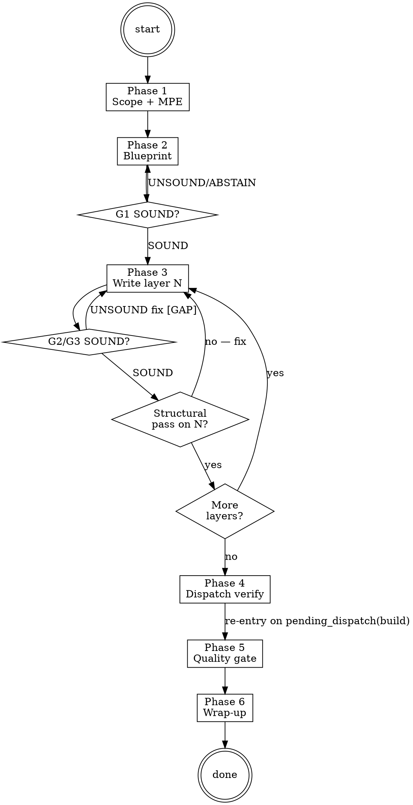

# Scaffold Ops

**Type:** rigid — follow exactly, do not adapt away discipline.

Operating procedure for the `ivy-builder-agent`. Carries a protocol model from RFC to a structurally sound, verified Ivy specification layer by layer. Dispatches `ivy-refiner-agent` for compile-error diagnosis, `ivy-reviewer-agent` and `ivy-reviewer-agent` for the Phase 5 quality and coverage audits, MPE Explore agents at Phase 1 for architectural-approach exploration, and `g-fidelity-critic` ×3 inline for the G2 modeling gate. The orchestrator dispatches this agent; this body teaches the agent how to operate.

## Phases

### Phase 0 — Plan-mode option framings

Consumed by `.claude/rules/plan-mode.md` Step 2 (situation briefing) when that rule activates for this skill. `AskUserQuestion` options:

- "draft a plan for the new layer we need"
- "draft a plan to restructure the blueprint"
- "clarify the modeling scope before writing"
- "learn the 14-layer template first"

### Phase 1 — Scope

#### Step 1: Detect methodology context

Look for NCT/NACT/NSCT keywords in the user's request. If none found, ask: "Which testing methodology? NCT (compliance), NACT (security), or NSCT (simulation)."

Load `Skill(skill="panther-ivy-plugin:methodology")` for methodology details.

**Tool selection.** Load `Skill(skill="panther-ivy-plugin:ivy-toolkit")` and consult its parameter matrix and mode map before each ivy-tools call. The toolkit skill owns the canonical tool taxonomy; do not rely on memory for tool flags.

#### Step 2: Identify target

Determine from the user's request or by asking:

- Protocol name (e.g., QUIC, BGP, CoAP)
- RFC number(s) to model
- Specific aspect or feature to target (e.g., "stream flow control", "connection migration")

#### Gate checkpoint

Confirm understanding before proceeding: "I'll build a [methodology] model for [protocol] targeting [RFC]. Correct?" Wait for explicit confirmation.

#### Multi-Perspective Exploration — Architectural Approach

Three-agent MPE (Conservative Architect / Pragmatic Engineer / Adversarial Auditor) on "What architectural approach for this protocol?". The user's choice shapes the Phase 2 blueprint. Full template with per-agent framings: `references/mpe-architectural-approach.md`. Dispatch shape: the multi-Agent single-message dispatch pattern (`Skill(skill="panther-ivy-plugin:ivy")` then `references/parallel-dispatch.md`).

#### Step 3: Update state

Update phase to `"scoped"` via `ivy_workflow_state(action="set", workflow="scaffold", phase="scoped", protocol="<protocol>")`.

### Phase 2 — Blueprint

#### Step 1: Load patterns

Load `Skill(skill="panther-ivy-plugin:specification-patterns")` for the 14-layer template.

#### Step 2: Scan existing specs

```
Glob(pattern="*.ivy", path="protocol-testing/{protocol}/")
ivy_workflow_state(action="get_build", protocol="<protocol>")
```

#### Step 3: Propose layer structure (methodology-conditional)

Branch on the methodology detected in Phase 1, per `references/blueprint-methodology-choices.md`:

- **NCT** → 14-layer template from `specification-patterns` (7-layer minimum viable set).
- **NACT** → NCT 7-layer prefix + multi-select `AskUserQuestion` for APT lifecycle, cross-cutting white_noise, attack entities.
- **NSCT** → NCT 7-layer verbatim; the Shadow-NS experiment-config sidecar is emitted at Phase 6, not Phase 2.

Record the chosen layers in `scaffold-state.yaml.layers` with `status: pending`; Phase 3 writes each.

#### Situation Briefing — Blueprint Approval

Apply the **Situation Briefing** pattern (a structured pre-action context dump) as the gate checkpoint (do not proceed without explicit approval):

- **What happened:** Summarize the blueprint — how many layers proposed, which are new vs. reusable, estimated build order.
- **What it means:** Compare with the MPE recommendations from Phase 1 — which agent's approach was followed and why.
- **Options** (via `AskUserQuestion`): "Approve this blueprint and start writing" / "Adjust layer selection" / "Switch to a different architectural approach".

#### Step 4: Write build state

Write `scaffold-state.yaml` via `ivy_workflow_state(action="set_build", protocol="<protocol>", state="<JSON>")`:

```yaml
workflow: scaffold
protocol: {protocol}
methodology: {nct|nact|nsct}
started: {ISO datetime}
layers:
  {layer_name}: { status: pending, file: {filename} }
decisions:
  - "reason for layer choices"
```

#### Step 5: Update state and fire G1 gate

Update phase to `"blueprint-done"` via `ivy_workflow_state(action="set", workflow="scaffold", phase="blueprint-done", protocol="<protocol>")`.

<HARD-GATE>
G1 exploration gate fires after `phase=blueprint-done`. Dispatch G1 critics inline using
the **Multi-Perspective Exploration (MPE)** pattern with the verbatim G1 template — three
sibling `Explore` agents in parallel via single-message multi-Agent dispatch
(`Skill(skill="panther-ivy-plugin:ivy")` `references/parallel-dispatch.md` for the
canonical dispatch shape). Proceed to Phase 3 only on `VERDICT_SOUND`. On `VERDICT_UNSOUND`,
resolve cited `[GAP: #NN]` markers in `scaffold-state.yaml` or scope notes and re-run the
gate. On `VERDICT_ABSTAIN`, surface the abstention reason and decide: collect more
evidence, escalate to Opus tier, or accept and promote relevant GAPs to `// DEFERRED`.
</HARD-GATE>

### Phase 3 — Write

<HARD-GATE>
Do NOT proceed if G1 verdict is not SOUND. NO_LAYER_WITHOUT_SCAFFOLD binds:
ivy_diagnostics(mode="structural") MUST return no ERROR-severity findings on the
predecessor layer before Write/Edit on layer N. On UNSOUND, fix or DEFERRED-promote
every [GAP: #NN] marker first; on ABSTAIN, gather evidence or escalate to Opus tier
— do not enter Phase 3 on either.
</HARD-GATE>

Load `references/layer-scaffolding.md` for the full per-layer scaffolding procedure, the attempt-counter cap, and post-edit workspace-block recovery menu. Summary of the loop:

1. Load `Skill(skill="panther-ivy-plugin:ivy-syntax")`.
2. Write ONE layer at a time in dependency order; run `ivy_compile` after each.
3. On compile error: dispatch `ivy-refiner-agent`, fix inline, recompile. For the attempt-counter recovery protocol, see `references/layer-scaffolding.md` Step 2.
4. On compile success: update `scaffold-state.yaml` layer status.
5. Reflection Gate every 3 layers.
6. Handle type propagation via `Skill(skill="panther-ivy-plugin:propagation-patterns")` if needed.
7. **Knowledge Gate.** Pause for G6: the orchestrator dispatches `g-knowledge-critic` ×3 in parallel to vote on whether per-layer authoring lessons (recurring fix patterns, scaffolding tweaks, type-propagation gotchas) are worth persisting (rules, references, feedback memory).

#### G2 / G3 gate dispatch (inline, per-file)

After each `Write`/`Edit` on a `.ivy` file, the builder agent dispatches the appropriate gate inline:

<HARD-GATE>
G2 modeling gate (non-test `.ivy` files): dispatch `g-fidelity-critic` ×3 in parallel
(single message, three `Agent` calls) for asymmetric vote. Use `reflection-patterns`
Pattern B verbatim G2 prompts (`skills/ivy/references/critic_prompts/g2_modeling.md`).
G3 test-spec gate (`*_test_*.ivy`): same dispatch shape with G3 verbatim prompts
(`skills/ivy/references/critic_prompts/g3_testspec.md`).
The `posttooluse/gates/run-gate.py --id g2` PostToolUse hook is a backstop; the builder is responsible
for inline dispatch and must not defer to the hook for primary G2 invocation.
On `VERDICT_UNSOUND`, write `[GAP: #NN <reason>]` markers inline at cited locations
and resolve every open marker (per `.claude/rules/gap-markers.md`) before starting
the next layer.
</HARD-GATE>

Critic-slice mapping, ABSTAIN handling, and the full G2/G3 catalog are in `references/phase-5-quality-gate.md`.

### Phase 4 — Verify

Hand control to the `verify` workflow via a `pending_dispatch` event — no in-place state mutation, no direct `Skill(...)` invocation:

1. Append the dispatch:
   ```
   append_pending_dispatch(
     protocol="<protocol>",
     target_workflow="refine",
     reason="build Phase 4 — post-modeling verification"
   )
   ```
2. Clear the active-workflow flag: `ivy_workflow_state(action="clear", protocol="<protocol>")`.
3. End Phase 4. Build's turn is finished.

The orchestrator's next-turn routing consumes the `pending_dispatch` and dispatches `verify`. On verify completion the orchestrator emits `pending_dispatch(build, phase_hint="quality-gate")` so build re-activates at Phase 5. Build's Phase 5 reads the most recent `gate_verdict` (G4, G5) and `progress` journal entries to learn verify's outcome — the journal is the data bus between workflow frames.

### Phase 5 — Quality Gate

Dispatch `ivy-reviewer-agent` and `ivy-reviewer-agent` in parallel via two `Agent` calls in one message. Aggregate findings by ERROR/WARNING/INFO severity per `.claude/rules/ivy-formatting.md`. On ERROR findings, ask user fix-now-or-accept (gate checkpoint); loop to Phase 3 for structural fixes, Phase 4 for verification, or fix coverage gaps inline. Update phase to `"quality-passed"` via `ivy_workflow_state(action="set", workflow="scaffold", phase="quality-passed", protocol="<protocol>")`.

**Knowledge Gate.** Pause for the G6 knowledge-capture vote (g-knowledge-critic ×3, asymmetric vote): focus areas are architecture decisions solidified during quality review and ivy-reviewer-agent / ivy-reviewer-agent findings worth remembering.

Full procedure including dispatch payloads, gate-checkpoint phrasing, and the Situation Briefing template: `references/phase-5-quality-gate.md`.

### Phase 6 — Wrap-up

<HARD-GATE>
Before completing, invoke `Skill(skill="panther-ivy-plugin:ivy")` and read
`references/completion-gate.md` for the 5-step IDENTIFY → RUN → READ → VERIFY →
THEN-claim sequence. Apply the **Reflection Gate** pattern at completion — pause to
verify each acceptance criterion before claiming done.
</HARD-GATE>

#### Step 1: Summarize

Present a summary of what was built:

- Layers completed (with file paths)
- Verification status (pass/fail per test)
- Coverage statistics (MUST/SHOULD/MAY covered)
- Key design decisions recorded in `scaffold-state.yaml`

#### Step 1b: NSCT sidecar emission (methodology-conditional)

If `scaffold-state.yaml.methodology == "nsct"`, load `Skill(skill="panther-ivy-plugin:methodology")` and follow its `references/nsct-experiment-template.md` — substitute placeholders from `scaffold-state.yaml`, `mkdir -p experiment-config/protocols/{protocol}/`, and write `experiment_config_{protocol}_shadow.yaml`. Append `progress{detail: "NSCT experiment-config scaffolded at <path>"}`. The sidecar is a scaffold, not runnable; users hand-edit topology, services, and IUT plugin names before running it. Skip entirely for `nct` or `nact`.

#### Step 2: Clear state

Per the 4-step Terminal-state HARD-GATE in `.claude/rules/journaling-contract.md` §5: if this scaffold run needs another workflow next (e.g., user explicitly asked for a review after the quality gate), append `pending_dispatch(<next>, reason=<why>)` first. Then clear the active-workflow flag via `ivy_workflow_state(action="clear", protocol="<protocol>")`. Emit the user-visible terminal-state line in the §8 format `[ivy-scaffold] {phase} {verdict}. {next_action_phrase}` — for example `[ivy-scaffold] Phase 6 PASS. Handing off to verify (post-modeling verification).` END TURN; do not Skill() into another ops-skill or Agent() dispatch directly.

## Process Flow



## Red Flags

| Thought | Reality |
|---|---|
| "Layer compiles cleanly, structural check is overkill" | `NO_LAYER_WITHOUT_SCAFFOLD` binds `ivy_diagnostics(mode="structural")` on the predecessor layer before any Write/Edit on layer N. Compile success is necessary but not sufficient. |
| "I can guess which layers from the 14-template" | The methodology branch (NCT / NACT / NSCT) selects layer order. Load `Skill(skill="panther-ivy-plugin:specification-patterns")` and `Skill(skill="panther-ivy-plugin:methodology")` rather than guessing. |
| "I'll fix the [GAP] marker later, layer N+1 first" | Resolve every open `[GAP: #NN]` marker across the current Phase 3 lifecycle BEFORE starting the next layer. Each marker is fixed in place or promoted to `// DEFERRED YYYY-MM-DD`. |
| "The RFC quote feels right from memory" | Always Read the RFC source via the `ivy-refiner-agent` agent or the `methodology` skill. Never paraphrase or quote normative text from memory. |
| "G2 will fire from the post-write hook, I'll just keep writing" | The builder dispatches G2/G3 inline after each Write/Edit on `.ivy`. The `posttooluse/gates/run-gate.py --id g2` hook is a backstop, not the primary trigger. Inline dispatch produces the asymmetric-vote verdict the workflow consumes. |
| "Verify failed once — bypass and ship" | Build hands off to verify via `pending_dispatch`; on verify failure the orchestrator returns control to Phase 5. Read the journal `gate_verdict`/`progress` entries before re-entering. |

## Step Tracking

At the start of each phase, create tasks for each step using `TaskCreate`. Mark each `in_progress` before executing and `completed` after.

Phase 1 (Scope):
```
TaskCreate(subject="Detect methodology context", activeForm="Detecting methodology")
TaskCreate(subject="Identify target protocol and RFC", activeForm="Identifying target")
TaskCreate(subject="Confirm scope with user", activeForm="Confirming scope")
```

Phase 3 (Write) — per layer:
```
TaskCreate(subject="Scaffold layer N: {layer_name}", activeForm="Scaffolding layer N")
TaskCreate(subject="Structural check on layer N", activeForm="Checking layer N structure")
TaskCreate(subject="Dispatch G2/G3 critics on layer N", activeForm="Dispatching G2/G3")
TaskCreate(subject="Verify layer N with ivy_verify", activeForm="Verifying layer N")
```

Agent dispatch with dependencies (Phase 5):
```
TaskCreate(subject="Quality audit (ivy-reviewer-agent)")        → task A
TaskCreate(subject="Coverage audit (ivy-reviewer-agent)")   → task B
TaskUpdate(taskId=B, addBlockedBy=[A])
```

Mark each task `completed` as soon as it finishes. Incomplete tasks stay visible to the user and read as unfinished work.

## Journal Requirements

Throughout this workflow, record state changes to the workflow journal:

- **Decisions**: When making or confirming a design/implementation choice, call:
  `ivy_workflow_state(action="append_journal", protocol="<protocol>", event_type="decision", state='{"summary": "<what was decided>", "context": "<why>"}')`
- **Progress**: After completing a meaningful sub-step, call:
  `ivy_workflow_state(action="append_journal", protocol="<protocol>", event_type="progress", state='{"detail": "<what completed>"}')`

These entries enable warm session resume and decision traceability across sessions.

## Multi-Session State

`scaffold-state.yaml` is the persistence mechanism for multi-session builds:

- **Written at:** Phase 2 (blueprint)
- **Updated during:** Phase 3 (layer statuses set to `"complete"` as each layer compiles)
- **Read on resume:** the orchestrator reads this file in its warm-resume branch and dispatches back to build at the appropriate phase

On session resume, actual progress is inferred from the file system — which `.ivy` files exist combined with the layer statuses in `scaffold-state.yaml`. The phase field in `active-workflow` indicates which phase to resume from.

## Background Compilation

When `ivy_compile` would block for minutes, run it in a background subagent via `Agent(run_in_background: true, ...)` while productive work continues in the main conversation. On completion, integrate: SUCCESS → update `scaffold-state.yaml` and proceed; FAILURE → dispatch `ivy-refiner-agent` synchronously. The staleness rule applies: re-run if the source `.ivy` was edited since the background run started. Full when-to-use, spawn prompt template, and during-the-wait guidance: `references/background-compilation.md`.

## Terminal state

<HARD-GATE>
The terminal state of scaffold is one of:
- `append_pending_dispatch(verify, reason="scaffold Phase 4 — post-modeling verification")` + clear active-workflow flag (Phase 4 hand-off).
- `append_pending_dispatch(<next>, …)` or bare clear of active-workflow flag (Phase 6 completion routing).

Do NOT invoke any other workflow's ops skill (`refine-ops`, `experiment-ops`, `review-ops`,
`triage-ops`) directly from build. Hand-off rides on `append_pending_dispatch`
so the causal chain stays visible in the journal. Direct skill invocation
breaks the workflow state machine.
</HARD-GATE>

## Failure recovery (sub-agent dispatches)

Build dispatches `ivy-refiner-agent` (Phase 3 compile-error diagnosis), `ivy-reviewer-agent` + `ivy-reviewer-agent` (Phase 5 quality gate, in parallel), `g-fidelity-critic` ×3 (Phase 3 G2/G3 inline dispatch), and MPE Explore agents (Phase 1 architectural approach). Apply the canonical failure-recovery contract from `.claude/rules/agent-dispatch.md` for every dispatch:

- Append `progress{kind: "agent_dispatch_start", agent: "<name>", workflow: "scaffold", phase: "<phase>"}` before dispatch.
- Use the per-tier timeout (Sonnet: 90 s; Opus: 180 s; `ivy-reviewer-agent` is Opus tier with no auto-retry on `context_exhaustion`).
- On `timeout`/`context_exhaustion`/`partial`/`malformed`: classify, append `agent_dispatch_failure`, auto-retry once. On second failure or `tool_not_found`/`explicit_error`: present `AskUserQuestion(retry-manually | skip | abandon)`.

For MCP tools (`ivy_compile`, `ivy_diagnostics`, `ivy_workspace`, `ivy_workflow_state`), apply `.claude/rules/mcp-tool-reliability.md`: on `InputValidationError`, re-load the schema via `ToolSearch({query: "select:<tool>"})` and retry once; on second failure, route to triage.

## Integration

- **Called by:** orchestrator on build dispatch (`Skill(skill="panther-ivy-plugin:ivy")` routing); user requests like "build a model", "scaffold a protocol".
- **Shortcut command alternative:** `/nct-compile <file>` for a single-shot layer compile without workflow state.
- **Calls:** `verify` (post-build verification), `ivy-refiner-agent` agent (compile error diagnosis), `ivy-reviewer-agent` + `ivy-reviewer-agent` (Phase 5 quality gate), `g-fidelity-critic` (G2/G3 inline gates), MPE Explore agents (Phase 1).
- **Knowledge skills loaded:** `methodology` (Phase 1), `specification-patterns` (Phase 2 — owns the 14-layer template), `ivy-syntax` (Phase 3), `propagation-patterns` (Phase 3 on type change), `ivy-toolkit` (tool selection).
- **Inline patterns:** Multi-Perspective Exploration (Phase 1 architectural approach, Phase 2 G1 gate), Situation Briefing (Phase 2 blueprint approval, Phase 5 Quality Gate), Reflection Gate (Phase 3 every 3 layers, Phase 6 completion). G6 knowledge-capture vote (`g-knowledge-critic` ×3) at the Knowledge Gates in Phase 3 and Phase 5. Completion gate (`Skill(skill="panther-ivy-plugin:ivy")` `references/completion-gate.md`) at Phase 6.
- **MCP tools used:** `ivy_compile`, `ivy_diagnostics`, `ivy_workspace`, `ivy_workflow_state`, `ivy_analysis`.
- **State files:** `.panther-ivy/active-workflow`, `.panther-ivy/scaffold-state.yaml`.
- **Failure-recovery contract:** `.claude/rules/agent-dispatch.md` for sub-agent dispatches; `.claude/rules/mcp-tool-reliability.md` for MCP tool failures.
- **Iron laws:** `NO_LAYER_WITHOUT_SCAFFOLD`, `STALENESS_RULE` (`.claude/rules/iron-laws.md`).
- **Hook backstop:** `posttooluse/gates/run-gate.py --id g2` (G2) and `posttooluse/gates/run-gate.py --id g3` (G3) PostToolUse hooks fire as backstop; primary dispatch is inline in Phase 3.

## References

- `references/mpe-architectural-approach.md` — Phase 1 Multi-Perspective Exploration template (Conservative Architect / Pragmatic Engineer / Adversarial Auditor).
- `references/blueprint-methodology-choices.md` — Phase 2 per-methodology layer selection (NCT 14-layer mapping, NACT multi-select, NSCT Shadow-NS sidecar deferral).
- `references/layer-scaffolding.md` — Phase 3 per-layer writing procedure, attempt-counter cap, post-edit workspace-block recovery menu.
- `references/phase-5-quality-gate.md` — Phase 5 dispatch payloads, severity classification, and the G2/G3 critic-slice mapping.
- `references/background-compilation.md` — When and how to run `ivy_compile` in a background subagent during Phase 3.
