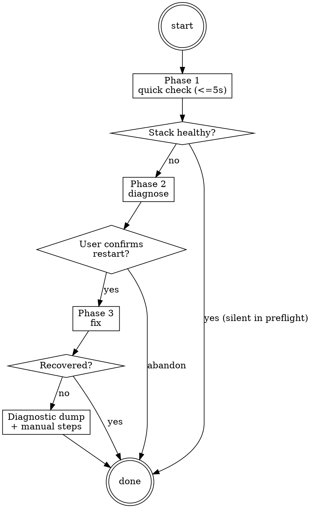

# Triage Ops

**Type:** rigid — follow exactly, do not adapt away discipline.

Operating procedure for the `ivy-triage-agent`. Diagnoses and repairs MCP server, LSP server, and Serena indexer failures via three invocation modes: `preflight` (read-only health check, silent pass-through when healthy, escalates to interactive diagnosis on failure), `full-health-check` (the 9-step deep-validation runbook in `references/full-health-check.md`), and direct/no-args (full Phase 1–3 diagnose-and-fix cycle). The orchestrator dispatches this agent; this body teaches the agent how to operate.

## Iron-law binding

Triage is bound by `STALENESS_RULE` (`.claude/rules/iron-laws.md`). Stale PID files, stale port files, and stale tool-result caches are the primary failure modes; Phase 1 quick checks treat any `ps -p` mismatch, log-file age divergence, or unreachable port as evidence of staleness, not as a transient hiccup. Treat tool-result freshness as load-bearing: re-run `ivy_status(mode="capabilities")` rather than reusing a prior turn's result when verifying recovery.

The other iron laws (`NO_FIX_WITHOUT_VERIFY`, `NO_LAYER_WITHOUT_SCAFFOLD`, `NO_QUALITY_WITHOUT_COVERAGE`) bind the verify, build, and review workflows respectively; they do not apply to triage's stack-repair domain.

## Phases

### Phase 1 — Quick Check

Target: under 5 seconds. Run all checks before producing any output.

#### Check 1: Stale PID files

```bash
for f in /tmp/ivy-lsp-*.pid /tmp/ivy-mcp-*.pid; do
  [ -f "$f" ] || continue
  pid=$(cat "$f" 2>/dev/null)
  if ps -p "$pid" > /dev/null 2>&1; then
    echo "ALIVE: $f (pid=$pid)"
  else
    echo "STALE: $f (pid=$pid)"
  fi
done
```

Record which PIDs are alive and which are stale.

#### Check 2: MCP server

Call `ivy_status(mode="capabilities")` (canonical name from `Skill(skill="panther-ivy-plugin:ivy-toolkit")`) with no other arguments. This is the fastest MCP round-trip. If it returns a tool list, MCP is alive.

#### Check 3: LSP server

Look for recent diagnostics in `<new-diagnostics>` blocks from the current session. If none, check `/tmp/ivy-lsp-lsp-latest.log` for activity within the last 60 seconds:

```bash
if [ -f /tmp/ivy-lsp-lsp-latest.log ]; then
  age=$(( $(date +%s) - $(stat -f %m /tmp/ivy-lsp-lsp-latest.log) ))
  echo "LSP log age: ${age}s"
  tail -5 /tmp/ivy-lsp-lsp-latest.log
fi
```

#### Check 4: Serena server (conditional)

Only check if `PANTHER_IVY_ENABLE_SERENA=1` is set:

```bash
if [ "$PANTHER_IVY_ENABLE_SERENA" = "1" ]; then
  pgrep -f "serena" > /dev/null 2>&1 && echo "SERENA: ALIVE" || echo "SERENA: DEAD"
fi
```

#### Evaluate Results

**If everything is healthy:**

- `args="preflight"`: return silently to the caller's turn. Do not produce user-facing output. Do not write the active-workflow file (preflight is read-only). The caller's skill body resumes immediately.
- `args="full-health-check"`: continue into the deep runbook (`references/full-health-check.md`).
- direct/no-args: report "Stack is healthy. MCP, LSP [, and Serena] all responding." Then clear the active-workflow flag via `ivy_workflow_state(action="clear", protocol="<protocol>")` and yield to the orchestrator.

**If something is dead:** Update phase to `"diagnose"` via `ivy_workflow_state(action="set", workflow="triage", phase="diagnose", protocol="<protocol>")` and proceed to Phase 2. Preflight callers fall through to Phase 2 too — broken tools block the caller, so the user sees the diagnose-and-fix flow regardless of invocation mode.

---

### Phase 2 — Diagnose

Only reached when Phase 1 found at least one dead component.

#### Situation Briefing — Unhealthy Stack

Apply the **Situation Briefing** pattern (a structured pre-action context dump):

- **What happened:** "Phase 1 quick check found [N] dead component(s): [list with component names]."
- **What it means:** Explain the impact — which workflows are blocked, which tools won't work.
- **Options** (present via `AskUserQuestion`, per `feedback_askuserquestion_always` from memory):
  - "Diagnose and attempt automatic repair"
  - "Show me the logs first — I want to understand before fixing"
  - "Skip diagnostics — I know what's wrong and will fix manually"

If the user picks option 2, show the relevant log excerpts (from the log files listed below) before proceeding. If option 3, clear the active-workflow flag and return.

#### Identify failures

For each dead component, check logs for the crash reason:

| Component | Log File | Common Causes |
|-----------|----------|---------------|
| MCP | `/tmp/ivy-mcp-latest.log` | Port conflict, import error, uncaught exception |
| LSP | `/tmp/ivy-lsp-lsp-latest.log` | Indexing failure, Z3 import error, workspace path issue |
| Serena | Serena's own log path | Missing `.venv`, missing submodule |

```bash
# Check for port conflicts
for f in /tmp/ivy-mcp-*.port; do
  [ -f "$f" ] || continue
  port=$(cat "$f" 2>/dev/null)
  lsof -i :"$port" 2>/dev/null | head -5
done
```

#### Present diagnosis

Report to the user with specifics:

```
[Component] is down.
Reason: [extracted from log — last error line or traceback summary]
[If port conflict: "Port N is in use by another process."]
[If stale PID: "PID file exists but process is dead."]

Want me to restart it?
```

Wait for user confirmation before proceeding to Phase 3. Update phase to `"fix"` via `ivy_workflow_state(action="set", workflow="triage", phase="fix", protocol="<protocol>")`.

---

### Phase 3 — Fix

<HARD-GATE>
Do NOT clean stale state, remove PID files, or trigger MCP/LSP restart
without explicit user confirmation from Phase 2. The user owns the
decision to mutate stack state. Aggressive cleanup (kill processes,
remove all state files) is the escalation option, not the default.
</HARD-GATE>

Only reached after user confirms they want a restart.

#### Step 1: Clean up stale state

```bash
# Remove stale PID files for dead processes
for f in /tmp/ivy-lsp-*.pid /tmp/ivy-mcp-*.pid; do
  [ -f "$f" ] || continue
  pid=$(cat "$f" 2>/dev/null)
  if ! ps -p "$pid" > /dev/null 2>&1; then
    rm -f "$f"
    echo "Removed stale PID file: $f"
  fi
done

# Remove stale port files if TCP is unreachable
for f in /tmp/ivy-mcp-*.port; do
  [ -f "$f" ] || continue
  port=$(cat "$f" 2>/dev/null)
  if ! nc -z -w 2 127.0.0.1 "$port" 2>/dev/null; then
    rm -f "$f"
    echo "Removed stale port file: $f"
  fi
done
```

#### Step 2: Trigger restart

Claude Code auto-restarts MCP/LSP servers on the next tool invocation. After cleaning stale files, invoke a lightweight MCP call to trigger the restart:

- For MCP: call `ivy_status(mode="capabilities")` — the sidecar restarts automatically
- For LSP: the next LSP-dependent operation triggers restart

#### Step 3: Verify recovery

Re-run Phase 1 checks to confirm the stack is back up. Per `STALENESS_RULE`, do not reuse the prior `ivy_status` result — issue a fresh call.

**If recovered:** Report success and proceed to completion.

#### Reflection Gate — Recovery Failed

If recovery failed, apply the **Reflection Gate** pattern (pause and re-evaluate before escalating):

- **Current state:** "Attempted automatic recovery for [component(s)]. Recovery failed — [component] is still unresponsive."
- **Re-evaluate:** Is this a deeper infrastructure problem beyond automatic repair?
- **Alternative options** (present via `AskUserQuestion`):
  - "Retry with more aggressive cleanup (kill processes, remove all state files)"
  - "Escalate — show full diagnostic dump and manual recovery steps"
  - "Abandon triage — work without the broken component"

If the user picks "Retry", loop back to Phase 3 Step 1 with more aggressive cleanup. If "Escalate", proceed to the diagnostic dump below. If "Abandon", clear the active-workflow flag and return.

**If still broken:** Escalate with a full diagnostic dump:

```
Recovery failed. Full diagnostics:
- MCP log (last 20 lines): [content]
- LSP log (last 20 lines): [content]
- PID files: [list]
- Port files: [list]
- Environment: IVY_WORKSPACE_ROOT=[value], IVY_LSP_DEV_ROOT=[value]

Suggested manual steps:
1. Check if uvx is on PATH
2. Try: kill $(cat /tmp/ivy-lsp-*.pid) then retry
3. Re-run the full triage diagnostic cycle (Phases 2-3)
```

#### Knowledge Gate: Post-Fix

**KNOWLEDGE GATE (KG)**: Pause for knowledge capture; the orchestrator dispatches `g-knowledge-critic` ×3 in parallel for the G6 vote on whether this session's debugging patterns are worth persisting.
- Reflect on debugging patterns from infrastructure troubleshooting.
- Capture the diagnosis-to-fix sequence for future triage sessions.
- Save session log (observability events + digest).
- If candidates found, classify and present for user confirmation.
- Resume workflow after gate completes.

---

## Process Flow



## Invocation Modes

The orchestrator passes one of three invocation modes via `args`:

- `args="preflight"` — read-only stack-health check used by other workflows to confirm tools are responsive before dispatching. Runs Phase 1 only; on healthy, returns silently to the caller without mutating workflow state. On failure, escalates to Phase 2–3 inline.
- `args="full-health-check"` — the 9-step validation runbook in `references/full-health-check.md` (the `/nct-health` slash-command target). Deep diagnostic, user-facing.
- *(no args)* — direct invocation: runs the full Phase 1–3 cycle interactively, with user-facing summaries.

Read `.panther-ivy/active-workflow` on every turn to determine the current phase before proceeding.

## Red Flags

| Thought | Reality |
|---|---|
| "MCP timed out once, just retry" | Timeout is a triage signal. Run Phase 1 quick check (≤ 5 s) before retrying. Stale PIDs masquerade as transient timeouts. STALENESS_RULE binds: a stale tool result is not evidence of liveness. |
| "kill -9 the process to fix it" | Use `ps -p` for liveness; `pkill -9` is a last-resort Phase 3 escalation. Stale PID file removal first, restart trigger second. Per `feedback_no_kill_process` (memory): never use `kill -0` for process checks. |
| "Preflight passed, nothing to surface" | Silent pass-through is correct in preflight mode. But on failure, preflight escalates — do not suppress the diagnose-and-fix flow from the user. |
| "Restart everything to be safe" | Restart only the dead component. Aggressive cleanup is the Phase 3 escalation option, not the default — over-restarting churns workspace state. |
| "Skip user confirmation, just fix it" | Phase 3 enters only after explicit user confirmation. NEVER restart processes silently — the user owns the decision to mutate stack state. The HARD-GATE in Phase 3 enforces this. |
| "Capabilities returned a tool list, MCP is healthy" | Necessary but not sufficient. The `full-health-check` runbook enforces inline content validation: tool count, CLI tool PATH, layer-staging consistency. Liveness alone is not health. |
| "Recovery failed, escalate to a full restart of everything" | Apply the Reflection Gate (Phase 3). Present three options to the user (aggressive cleanup, manual diagnostic dump, abandon) instead of unilateral escalation. |

## Step Tracking

At the start of each phase, create tasks for each step using `TaskCreate`. Mark each `in_progress` before executing and `completed` after.

Phase 1 (Quick Check):
```
TaskCreate(subject="Check stale PID files", activeForm="Checking PIDs")
TaskCreate(subject="Check MCP server health", activeForm="Checking MCP")
TaskCreate(subject="Check LSP server activity", activeForm="Checking LSP")
TaskCreate(subject="Check Serena server (if enabled)", activeForm="Checking Serena")
```

Phase 2 (Diagnose, only if Phase 1 found a dead component):
```
TaskCreate(subject="Identify failure cause from logs", activeForm="Identifying failure")
TaskCreate(subject="Present diagnosis and request user confirmation", activeForm="Presenting diagnosis")
```

Phase 3 (Fix, only after user confirmation):
```
TaskCreate(subject="Clean up stale state files", activeForm="Cleaning state")
TaskCreate(subject="Trigger restart via lightweight MCP call", activeForm="Triggering restart")
TaskCreate(subject="Verify recovery via Phase 1 re-run", activeForm="Verifying recovery")
```

## Journal Requirements

Throughout this workflow, record state changes to the workflow journal:

- **Decisions**: When making or confirming a design/implementation choice (e.g., abandoning recovery after Phase 3 escalation, opting for aggressive cleanup), call:
  `ivy_workflow_state(action="append_journal", protocol="<protocol>", event_type="decision", state='{"summary": "<what was decided>", "context": "<why>"}')`
- **Progress**: After completing a meaningful sub-step (e.g., "Phase 1 found 2 dead components", "Phase 3 cleaned 3 stale PID files"), call:
  `ivy_workflow_state(action="append_journal", protocol="<protocol>", event_type="progress", state='{"detail": "<what completed>"}')`

These entries enable warm session resume and decision traceability.

---

## Preflight Export

Other workflows (build, verify, review) silently call triage Phase 1 before their first MCP tool invocation by dispatching the `ivy-triage-agent` with `args="preflight"`. The orchestrator manages dispatch; this body documents the contract:

- Phase 1 only. No write to `active-workflow`.
- On healthy: returns to the caller's turn with no user interaction.
- On failure: proceeds to Phase 2–3 (user interaction required; broken tools block the calling workflow). Because preflight did not write `active-workflow`, the caller's flag remains intact while triage handles repair; upon completion triage emits `pending_dispatch(<caller>, reason="post-triage-repair")` so the orchestrator hands control back to the caller naturally.

---

## Failure recovery (sub-agent dispatches)

The deep `full-health-check` runbook dispatches `spec-analyst` for per-phase reviews (see `references/full-health-check.md` Phase 1/2/3 Review sections). Apply the canonical failure-recovery contract from `.claude/rules/agent-dispatch.md` for every dispatch:

- Append `progress{kind: "agent_dispatch_start", agent: "spec-analyst", workflow: "workflow-triage", phase: "<phase>"}` before dispatch.
- Use the per-tier timeout (Sonnet: 90 s).
- On `timeout`/`context_exhaustion`/`partial`/`malformed`: classify, append `agent_dispatch_failure`, auto-retry once. On second failure or `tool_not_found`/`explicit_error`: present `AskUserQuestion(retry-manually | skip | abandon)`. The "abandon" branch emits `append_pending_dispatch(target_workflow="workflow-navigate", reason="agent dispatch failed: spec-analyst")` and clears the active-workflow flag.

For the underlying MCP tools (`ivy_status`, `ivy_diagnostics`, `ivy_coverage`), apply `.claude/rules/mcp-tool-reliability.md`: on `InputValidationError`, re-load the schema via `ToolSearch({query: "select:<tool>"})` and retry once; on second failure, route to direct triage (recursive call is forbidden — escalate to user instead).

---

## On Completion

Before completing, invoke `Skill(skill="panther-ivy-plugin:ivy")` and read `references/completion-gate.md` for the 5-step completion procedure (IDENTIFY → RUN → READ → VERIFY → THEN-claim). For triage, the IDENTIFY claim is "stack health restored" and only the structural check (Step 1) is required — skip the anti-pattern checklist and coverage delta. The 5-step gate is otherwise unchanged.

Clear the active-workflow flag via `ivy_workflow_state(action="clear", protocol="<protocol>")`. If triage was reached via the preflight-failure escalation path, emit a paired `pending_dispatch` naming the original caller workflow before clearing, so the orchestrator re-activates the caller on its next turn. Otherwise, simply clear the flag — the orchestrator re-activates on the next user turn.

---

## Terminal state

<HARD-GATE>
The terminal state of triage is one of:
- `append_pending_dispatch(<original-caller>, reason="post-triage-repair")` + clear active-workflow flag (preflight-failure escalation path; the caller is read from the originating workflow's preflight invocation).
- Clear active-workflow flag → return silently to caller's turn (preflight-mode silent pass; no journal entry).
- Clear active-workflow flag → orchestrator re-activates next user turn (direct/no-args mode, or full-health-check completion).

Do NOT dispatch any workflow directly from triage. Caller resumption
rides on `append_pending_dispatch(<caller>, reason="post-triage-repair")`.
Aggressive cleanup actions (kill processes, remove all state files) are
escalation options gated by user confirmation in Phase 3, not default
behavior.
</HARD-GATE>

## Integration

- **Called by:** orchestrator on triage dispatch (preflight, full-health-check, or direct user-facing repair).
- **MCP tools:** `ivy_status`, `ivy_diagnostics`, `ivy_coverage`, `ivy_workflow_state` — canonical names from `Skill(skill="panther-ivy-plugin:ivy-toolkit")`.
- **Knowledge skills loaded:** `cross-cutting-reflection-patterns` (SB Phase 2, RG Phase 3), `cross-cutting-knowledge-capture` (KG Phase 3), `cross-cutting-completion-gate` (terminal verification).
- **Log files:** `/tmp/ivy-lsp-lsp-latest.log`, `/tmp/ivy-mcp-latest.log`.
- **PID files:** `/tmp/ivy-lsp-*.pid`, `/tmp/ivy-mcp-*.pid`.
- **Port files:** `/tmp/ivy-mcp-*.port`.
- **Iron law:** `STALENESS_RULE` (`.claude/rules/iron-laws.md`).
- **Failure-recovery contract:** `.claude/rules/agent-dispatch.md` for sub-agent dispatches; `.claude/rules/mcp-tool-reliability.md` for MCP tool failures.

## References

- `references/full-health-check.md` — 9-step deep-validation runbook invoked when `args="full-health-check"`. Includes per-phase `spec-analyst` reviewer dispatches and content-validation procedures (CLI-tool PATH parity, layer-staging consistency, cross-layer goToDefinition).
