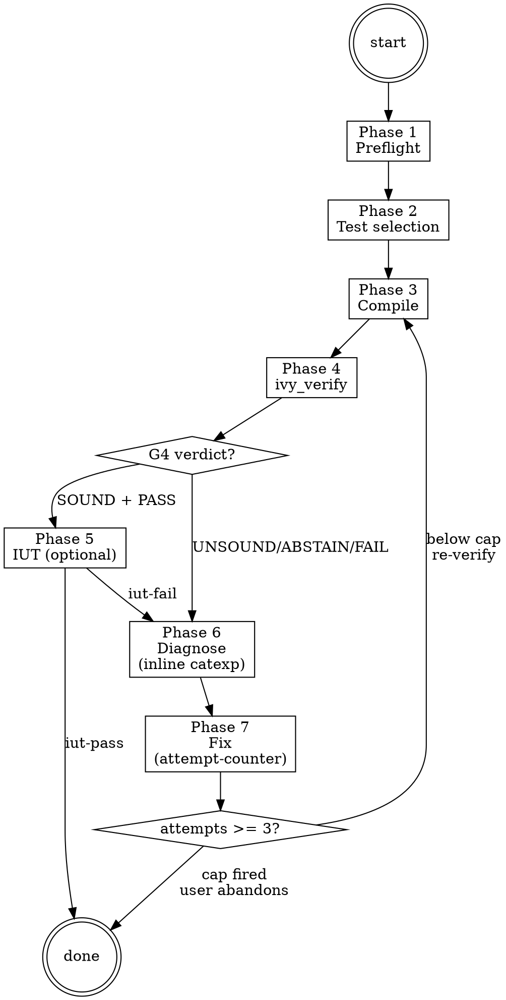

# Verify Ops

**Type:** rigid — follow exactly, do not adapt away discipline.

Operating procedure for the `ivy-verifier-agent`. Carries an Ivy test spec through the compile → verify → IUT cycle, dispatches the G4 verification gate inline to catch false `SOUND`, interprets counterexamples in-place via the preloaded `verification-failures` catalog, and runs the Phase 7 fix loop under an attempt-counter cap. The orchestrator dispatches this agent; this body teaches the agent how to operate.

For the calibrated meanings of MPE, "iron law", "knowledge gate", and `pending_dispatch` as used below, Read `references/glossary.md` once — these terms have fixed definitions and are not paraphrased here. Gate-verdict semantics (`SOUND` / `UNSOUND` / `ABSTAIN`) live in `.claude/rules/gate-verdicts.md` and auto-load on skill entry.

## Phases

### Phase 0 — Plan-mode option framings

Consumed by `.claude/rules/plan-mode.md` Step 2 (situation briefing) when that rule activates for this skill. `AskUserQuestion` options:

- "Draft a plan for the verify failure we hit"
- "Draft a plan to restructure the verification approach"
- "Clarify the verification scope before writing"
- "Learn the Ivy verification model first"

### Phase 1 — Preflight

#### Step 1: Stack health check (inline preflight)

Run a read-only stack-health probe via `ivy_status()`. If it fails, dispatch `ivy-triage-agent` for repair before continuing.

```
ivy_status()
```

`active-workflow` stays on `(workflow=verify, phase=preflight)` throughout. If the probe is clean, proceed. On failure, dispatch the triage agent (`Agent(subagent_type="panther-ivy-plugin:ivy-triage-agent", ...)`) for full repair; on completion the agent emits `pending_dispatch(verify, reason="post-triage-repair")` so the orchestrator re-activates verify on the next turn.

#### Step 2: Detect target protocol

Resolve the protocol in this order:

1. Check `IVY_WORKSPACE_ROOT` environment variable
2. Check the active workspace state via `ivy_workspace(action="get")`
3. Scan the current working directory for `protocol-testing/` subdirectories

If the protocol is still ambiguous, ask the user: "Which protocol are you working with?"

#### Step 3: Update state

Update the active-workflow phase to `"preflight-done"` via `ivy_workflow_state(action="set", workflow="verify", phase="preflight-done", protocol="<protocol>")`.

### Phase 2 — Test selection

#### Step 1: Scan existing tests

Look in `protocol-testing/{protocol}/{protocol}_tests/` for files matching `*_test*.ivy`. Group them by subdirectory:

- `server_tests/` — tests targeting server IUTs (Ivy acts as client)
- `client_tests/` — tests targeting client IUTs (Ivy acts as server)
- `mim_tests/` — man-in-the-middle attack tests

#### Step 2: Present options via `AskUserQuestion`

Offer the user three choices:

1. **Run ALL existing tests** for the target protocol
2. **Pick specific test(s)** from the list found in Step 1
3. **Design a new test inline** — pulls supplementary knowledge for test authoring

If the user picks option 3, invoke `Skill(skill="panther-ivy-plugin:ivy-syntax")` and `Skill(skill="panther-ivy-plugin:specification-patterns")` to load authoring guidance. Guide the user through creating the test spec, then continue to Phase 3.

#### Situation Briefing — Test Selection Confirmation

Apply the **Situation Briefing** pattern (a structured pre-action context dump) as the gate checkpoint (do not proceed without explicit confirmation):

- **What happened:** Summarize which test(s) were found / selected and what they test (protocol feature, role, RFC section).
- **Options:** "Compile and run all selected tests" / "Narrow selection" / "Design a new test instead"

#### Step 3: Update state

Update phase to `"test-selected"` via `ivy_workflow_state(action="set", workflow="verify", phase="test-selected", protocol="<protocol>")`.

### Phase 3 — Compile

**Tool selection.** Before the first tool call in this phase, load `Skill(skill="panther-ivy-plugin:ivy-toolkit")` and consult its parameter matrix for `ivy_compile`. The toolkit skill owns the canonical tool taxonomy; do not rely on memory for tool flags or modes.

For each selected test file, call:

```
ivy_compile(relative_path=<test_file>, target="test")
```

#### On SUCCESS

Move to Phase 4. Update phase to `"compiled"` via `ivy_workflow_state(action="set", workflow="verify", phase="compiled", protocol="<protocol>")`.

#### On compile ERROR

1. Load `Skill(skill="panther-ivy-plugin:verification-failures")` for the compile-error catalog and counterexample-pattern index.
2. Diagnose the error inline against the catalog (the verifier agent owns this — no separate dispatch is needed because `verification-failures` is preloaded).
3. Present the diagnosis and a suggested fix to the user.
4. If the user agrees, apply the fix, then loop back to Phase 3 (recompile). The Phase 7 attempt-counter applies to recompile loops as well — increment on each retry.
5. If the user declines, ask whether they want to fix it themselves or abandon.

### Phase 4 — Execute

<HARD-GATE>
Do NOT proceed to `ivy_verify` if Phase 3 (Compile) did not return success
on the target file. Do NOT skip the inline G4 verification-gate dispatch
after `ivy_verify` returns — the gate dispatch is what catches false SOUND.
Do NOT claim verification complete until G4 emits SOUND (or UNSOUND has
been resolved via `[GAP: #NN]` fix-or-DEFERRED-promotion).
</HARD-GATE>

Run the compiled test:

```
ivy_verify(relative_path=<test_file>)
```

#### G4 verification gate (inline dispatch — false-SOUND catcher)

The verifier agent dispatches G4 critics inline immediately after `ivy_verify` returns, in the same turn:

<HARD-GATE>
G4 verification gate (every `ivy_verify` return, pass or fail): apply the
**Multi-Perspective Exploration (MPE)** pattern. Dispatch
`g-fidelity-critic` ×3 in parallel (single message, three `Agent` calls)
for asymmetric vote, using verbatim G4 prompts
(`skills/ivy/references/critic_prompts/g4_verification.md`), catalog slices
`#200-249` + `#250-299` + `#400-499`. Verdict actions: SOUND advances;
UNSOUND writes `[GAP: #NN]` markers and blocks until fix-and-re-verify
or promotion to `// DEFERRED YYYY-MM-DD`; ABSTAIN proceeds to Phase 6
with `abstain_reason` as the starting hypothesis.
The PostToolUse hook (`assess-trace.py` is the post-IUT analogue;
G4 has its own backstop) is a backstop — the verifier is responsible
for inline dispatch and must not defer to the hook for the primary G4
invocation. Dispatch shape: `Skill(skill="panther-ivy-plugin:ivy")`
`references/parallel-dispatch.md`.
</HARD-GATE>

The load-bearing purpose of inline G4 is to catch **false `SOUND`** — `ivy_verify` returning `status: OK` when the proof obligation collapsed via unsound `assume`, trusted-isolate leakage, or solver wall-timeout masqueraded as pass (catalog `#401`, `#402`, `#403`, `#404`). Full discipline contract, verbatim critic prompts, and catalog details: `references/failure-diagnosis.md` § "G4 Verification Gate".

For an end-to-end walkthrough of one verify cycle (compile → FAIL with counterexample → inline counterexample interpretation → fix → re-verify → SOUND → completion-gate) showing the verbatim `ivy_verify` JSON, the catalog-`#410` application, and the unified diff, Read `references/worked-example-quic-handshake.md`.

#### On PASS

1. Report in the §8 terminal-state format from `.claude/rules/journaling-contract.md`: `[ivy-verify] Phase 4 PASS (G4 SOUND, vote N-of-3). Verification passed for <test_file>; <next_action_phrase>`. Append the verdict to the journal as a `gate_verdict` event.
2. Offer follow-ups via `AskUserQuestion`: "Run another test? Check coverage? Review model quality? Done."
3. If the user picks coverage or review, do NOT dispatch review directly. Emit a `pending_dispatch` naming `review` and let the orchestrator hand control over on the next turn:
   ```
   append_pending_dispatch(
     protocol="<protocol>",
     target_workflow="review",
     reason="verify Phase 4 PASS — user requested coverage/quality review"
   )
   ```
   Then clear the active-workflow flag via `ivy_workflow_state(action="clear", protocol="<protocol>")` and end the turn.
4. If the user picks "Run another test" or "Done", update phase to `"pass"` and proceed to completion.

#### Reflection Gate — Post-Execution Direction

After Phase 4 completes (pass or fail), apply the **Reflection Gate** pattern (pause and re-evaluate before escalating):

- **Current state:** "Verification [passed/failed] for [test_file]. [Brief result summary]."
- **On pass — alternative workflows:**
  - `review`: "Check coverage and quality of the verified model"
  - `build`: "Continue building additional layers or tests"
- **On fail — alternative workflows:**
  - `build`: "The failure may indicate structural issues — switch to build to fix the model"
  - Stay in `verify`: "Continue to diagnosis (Phase 6)"

#### Knowledge Gate: Post-Execution

**Knowledge Gate.** Pause for the G6 knowledge-capture vote (g-knowledge-critic ×3, asymmetric vote): focus areas are verification pass/fail patterns and what drove the outcome (rules, references, feedback memory).

#### On FAIL

Move to Phase 6. Update phase to `"executed"` via `ivy_workflow_state(action="set", workflow="verify", phase="executed", protocol="<protocol>")`.

### Phase 5 — IUT testing (optional)

Entered whenever Phase 4 succeeds. IUT testing runs unconditionally on Phase 4 PASS — including when verify was reached via `pending_dispatch` from build.

#### Step 1: Offer IUT testing

Present the user with the option:

> "Formal verification passed. Want to run this test against a real implementation?"

If the user declines, proceed directly to completion.

#### Step 2: Select IUT

Scan `panther/plugins/services/iut/{protocol}/` for available IUT plugin directories. Present as numbered options via `AskUserQuestion`. If only one IUT exists, suggest it directly and ask for confirmation.

#### Step 3: Execute

```
ivy_iut_test(protocol=<detected>, test_name=<from Phase 2>, iut_name=<selected>)
```

#### G5 trace-analysis gate

A PostToolUse hook (`assess-trace.py`) spawns G5 critics with verbatim G5 prompts from the trace-analysis catalog slice `#100-107` + `#500-559` (+ `#560-589` for NSCT). Critics analyse the existing run's output directory in fixed read order: `analysis/ivy_tester_results.json` → compile log → tester log → IUT log → pcap. Primary checks: `#501` (Ivy trace claims event, pcap shows nothing) and `#505` (model bug misattributed to IUT). Critics may NOT re-invoke `ivy_iut_test`. On UNSOUND, GAP markers are written and the reported verdict is suspect. Full read order, catalog-slice, and discipline contract: `references/iut-output-analysis.md` § "G5 Trace Analysis Gate".

#### On PASS

1. Report: "IUT test passed. `<test_name>` succeeded against `<iut_name>` in {duration_seconds}s."
2. Show `output_dir` for reference.
3. Offer follow-ups via `AskUserQuestion`: "Run another test? Check coverage? Review model quality?"
4. Update phase to `"iut-pass"`, then proceed to completion.

#### On FAIL

Load `references/iut-output-analysis.md` for the full 9-step IUT failure analysis procedure (parse assertions → parse stderr → check IUT logs → cross-reference pcap via `tshark` → classify bug type → propose fix location). Summary:

1. Present `experiment_summary` details and `output_dir` to the user.
2. Offer via `AskUserQuestion`: "Investigate the failure? Or fix it yourself?"
3. If investigation chosen, move to Phase 6 (Diagnose) with the IUT failure context.
4. Update phase to `"iut-fail"` via `ivy_workflow_state(action="set", workflow="verify", ...)`.

#### On ERROR or TIMEOUT

1. Present the error details from `test_stderr`.
2. Suggest: "Check Docker status (`docker ps`), verify IUT plugin configuration, and ensure the test binary compiled successfully."
3. Update phase to `"iut-error"`.

#### Step 4: Update state

Update active-workflow phase to match the outcome: `phase="iut-pass"`, `phase="iut-fail"`, or `phase="iut-error"`.

### Phase 6 — Diagnose

#### G2/G3 scope note

G2/G3 gates do NOT fire on verify Phase 7 fix edits (they are build-time only). If a fix raises structural concerns, append `pending_dispatch(target_workflow="build", phase_hint="layer-check")` and clear the active-workflow flag; the orchestrator re-enters `build` on its next turn and the re-edit path re-engages G2 naturally. The rationale: G2/G3 are scoped to layer authoring (build-only), not patch-edits during verification — re-entering build is what causes the structural critic to fire on the new layer state.

#### Counterexample interpretation (inline)

When `ivy_verify` returns FAIL with a counterexample, the verifier agent interprets it inline — `verification-failures` is preloaded at agent spawn. There is no separate diagnostic-agent dispatch:

1. Load the catalog: `Skill(skill="panther-ivy-plugin:verification-failures")` for the numbered counterexample-pattern index, debugging methodology, and claim-resolution gate.
2. Walk the counterexample trace step-by-step, mapping each step to a catalog pattern (e.g., `#410` missing-guard, `#420` invariant-induction-gap, `#430` array-bounds-state-coupling).
3. For structural / include-graph concerns, dispatch `model-reviewer` for a deeper audit (the structural-issue case is the only Phase 6 sub-agent dispatch — pattern-based diagnosis stays inline).
4. Cite the catalog pattern by number in the diagnosis presented to the user. Catalog pattern numbers are referenced verbatim from `verification-failures`; do not coin new numbers locally.

#### MPE diagnosis (when patterns disagree)

When inline pattern interpretation is ambiguous (multiple catalog patterns plausible, or the trace does not cleanly match any single pattern), apply the **Multi-Perspective Exploration (MPE)** pattern. Dispatch 3 sibling `Explore` agents in parallel — single message, three `Agent` tool calls (`Skill(skill="panther-ivy-plugin:ivy")` `references/parallel-dispatch.md` for the canonical dispatch shape). Roles: Conservative Architect (top-down design analysis) + Pragmatic Engineer (state-machine walk-through) + Adversarial Auditor (alternative-input stress test). Aggregate the three findings before classifying.

#### Classify the failure

Classify into one of three categories:

- **Invariant violation** — a property that should hold does not. The counterexample trace shows a reachable state where an invariant or `require` is falsified.
- **Type error** — type mismatch, missing type interpretation, or unresolved type in the model.
- **Structural issue** — include path problems, missing modules, circular dependencies, unresolved symbols.

#### Gate checkpoint

Ask via `AskUserQuestion`: "Fix it yourself, or want me to attempt the fix?" Wait for explicit confirmation before proceeding. Update phase to `"diagnosed"` via `ivy_workflow_state(action="set", workflow="verify", phase="diagnosed", protocol="<protocol>")`.

#### Post-Edit workspace-block recovery

If a Phase 7 `Edit` on a `.ivy` file is blocked by the `check-workspace-scope.py` PreToolUse hook, append a `progress` journal entry (`{kind: "workspace_edit_blocked"}`) and present `AskUserQuestion` with three options: switch workspace, clear workspace restrictions, or abandon the edit. Full journal payload, AskUserQuestion phrasing, and the platform-limitation note: `references/workspace-block-recovery.md`.

### Phase 7 — Fix loop (attempt-counter accountability)

<HARD-GATE>
Entry to the fix loop is gated by the attempt-counter cap. Before any
Edit / Write that applies a fix, evaluate the gate (Step 1 below). If the
cap has fired, present the 3-option escalation menu via `AskUserQuestion`
and DO NOT apply the fix.
</HARD-GATE>

#### Situation Briefing — Fix Strategy

Apply the **Situation Briefing** pattern (a structured pre-action context dump):

- **What happened:** Summarize the diagnosis: failure classification, root cause hypothesis, catalog pattern cited.
- **Options via `AskUserQuestion`:**
  - "Apply the recommended fix from the diagnosis" (describe the specific fix)
  - "Try a different fix approach" (if MPE roles disagreed, present the alternative)
  - "Fix it manually — I'll handle this"
  - "Abandon this test and move on"

#### Step 1: Attempt-counter gate evaluation

1. Compute the attempt key as the test file path relative to the protocol directory.
2. Read the journal (`ivy_workflow_state(action="get_journal", last_n=200)`), walk backward to the most recent `decision{kind: "override_attempt_cap", key: <same>}` entry (`override_idx`), then count `progress{kind: "fix_attempt", key: <same>}` entries after `override_idx`.
3. If `count >= 3`, DO NOT apply the fix. Present the 3-option escalation menu via `AskUserQuestion`:
   - **Continue anyway** — record an `override_attempt_cap` decision and reset the cap.
   - **Abandon this file** — record a decision and exit to On Completion.
   - **Switch workflow** — emit `pending_dispatch(build, ...)` for structural rethink.
4. Otherwise, append the fix-attempt marker and proceed:
   ```
   ivy_workflow_state(
     action="append_journal",
     protocol="<protocol>",
     event_type="progress",
     state='{"kind": "fix_attempt", "key": "<test_file>", "attempt": <int>}'
   )
   ```

The cap value (3) is documented inline; raise it only via the `override_attempt_cap` decision event so the change is journal-visible. ABSTAIN handling (treat as inconclusive — proceed to Phase 6 with `abstain_reason` as starting hypothesis): see `references/failure-diagnosis.md` Steps 1–2.

#### Step 2: Apply the fix

Apply the fix indicated by the inline counterexample interpretation. If editing `.ivy` files, invoke `Skill(skill="panther-ivy-plugin:ivy-syntax")` to load language reference guidance before making changes. After the Edit, follow the post-Edit workspace-block recovery pattern in Phase 6.

> **A1 — verifier-agent capability note.** The `panther-ivy-plugin:ivy-verifier-agent` has `forbidden_tools: ["Edit","Write"]`. When verify-ops runs inside the verifier agent (the common case), Step 2 is satisfied by handing off to the builder via `append_pending_dispatch(target_workflow="build", phase_hint="apply-fix", reason="verify Phase 7 Step 2 — apply diagnosed fix from <file>:<line>")` and clearing active-workflow; the builder applies the Edit on the next turn and emits `pending_dispatch(verify, phase_hint="re-verify")` on completion to loop back to Phase 7 Step 3. When verify-ops runs in a different context that allows Edit, the inline Edit is the direct path. The cycle invariant (`NO_FIX_WITHOUT_VERIFY`) is unchanged either way.

#### Step 3: Re-verify

Loop back to Phase 3 (recompile). The cycle is: Phase 3 → Phase 4 → Phase 6 → Phase 7 → Phase 3. `NO_FIX_WITHOUT_VERIFY` binds: no claim of resolution without a fresh `ivy_verify` / `ivy_compile` tool result on the edited spec.

#### Knowledge Gate: post-fix

**Knowledge Gate.** Pause for the G6 knowledge-capture vote (g-knowledge-critic ×3, asymmetric vote): focus areas are the bug that was diagnosed and fixed (what was non-obvious) and the error-to-fix pattern for future sessions. Classify and present capture candidates for user confirmation.

## Process Flow



## Red Flags

| Thought | Reality |
|---|---|
| "ivy_verify returned SOUND, we're done" | G4 critic verdict required before any claim. SOUND alone is necessary but not sufficient — whitelisted `assume`, trusted-isolate leak, or solver wall-timeout masquerade can produce false SOUND. The verifier agent dispatches G4 inline. |
| "The IUT trace matches the Ivy log, skip pcap" | Ivy log events do not guarantee wire transmission. Always cross-validate via pcap (G5 catalog `#501`). |
| "This counterexample is a model bug, not the IUT" | Distinguish IUT bug vs. model bug via the G5 trace gate (`#505`). Do not classify without the gate. |
| "I can fix the failure without re-verifying" | `NO_FIX_WITHOUT_VERIFY`: every fix loops back through Phase 3 (compile) and Phase 4 (verify). No claim of resolution without fresh tool output. |
| "Three failed attempts, one more should do it" | Phase 7 caps fix attempts at 3 per test file. Above the cap, present the escalation menu — do not silently retry. The cap is journaled via `progress{kind: fix_attempt}` for cross-session accountability. |
| "G4 will fire from the post-tool hook, I'll just keep moving" | The verifier dispatches G4 inline after every `ivy_verify` return. The hook backstop fires too, but inline dispatch is what the workflow consumes for its verdict; the hook protects against agent-side omission only. |

## Step Tracking

At the start of each phase, create tasks for each step using `TaskCreate`. Mark each `in_progress` before executing and `completed` after.

Phase 3 (Compile) tasks:
```
TaskCreate(subject="Run ivy_diagnostics(mode='structural')", activeForm="Running structural check")
TaskCreate(subject="Run ivy_compile on target", activeForm="Compiling test")
TaskCreate(subject="Resolve compile errors inline if any", activeForm="Resolving compile errors")
```

Phase 4 (Execute) tasks:
```
TaskCreate(subject="Run ivy_verify on target", activeForm="Running formal verification")
TaskCreate(subject="Dispatch G4 critics x3 inline", activeForm="Dispatching G4 verification gate")
TaskCreate(subject="Interpret G4 verdict", activeForm="Interpreting G4 verdict")
```

Phase 6/7 (Diagnose + Fix) tasks:
```
TaskCreate(subject="Load verification-failures catalog", activeForm="Loading counterexample catalog")
TaskCreate(subject="Interpret counterexample inline", activeForm="Interpreting counterexample")
TaskCreate(subject="Evaluate attempt-counter cap", activeForm="Evaluating fix-attempt cap")
TaskCreate(subject="Apply fix and re-verify", activeForm="Applying fix")
TaskCreate(subject="Run completion gate (IDENTIFY → RUN → READ → VERIFY → THEN-claim)", activeForm="Running completion gate")
```

Mark each task `completed` as soon as it finishes. Incomplete tasks stay visible to the user and read as unfinished work.

## Journal Requirements

Throughout this workflow, record state changes to the workflow journal:

- **Decisions**: When making or confirming a design / implementation choice (e.g., deferring a requirement, accepting an ABSTAIN verdict provisionally, overriding the attempt cap), call:
  `ivy_workflow_state(action="append_journal", protocol="<protocol>", event_type="decision", state='{"summary": "<what was decided>", "context": "<why>"}')`

- **Progress**: After completing a meaningful sub-step (e.g., compile success, G4 verdict, fix attempt N), call:
  `ivy_workflow_state(action="append_journal", protocol="<protocol>", event_type="progress", state='{"detail": "<what completed>"}')`

- **Fix attempts**: Every Phase 7 fix-apply increments the attempt counter via:
  `ivy_workflow_state(action="append_journal", protocol="<protocol>", event_type="progress", state='{"kind": "fix_attempt", "key": "<file>", "attempt": <int>}')`

These journal entries enable warm session resume, decision traceability across sessions, and `/nct-observability` surfacing of attempt counters and gate verdicts.

## Background Verification

When `ivy_verify` would block for minutes, run it in a background subagent via `Agent(run_in_background: true, ...)` while productive work (coverage checks, code review, other-file diagnostics) continues in the main conversation. On completion, integrate per phase (PASS → next phase; FAIL → Phase 6 Diagnose). The staleness rule applies: re-run if any `.ivy` file was edited since the background run started. Full when-to-use, spawn prompt template, during-the-wait guidance, and result integration: `references/background-verification.md`.

## On Completion

Before completing, invoke `Skill(skill="panther-ivy-plugin:ivy")` and read `references/completion-gate.md` for the 5-step IDENTIFY → RUN → READ → VERIFY → THEN-claim sequence. Apply the **Reflection Gate** pattern at completion — pause to verify each acceptance criterion before claiming done.

If this verify run needs another workflow next (e.g., the user picked "review coverage" on Phase 4 PASS), append `pending_dispatch(<next>, reason=<why>)` first. Then clear the active-workflow flag via `ivy_workflow_state(action="clear", protocol="<protocol>")`. The orchestrator's next-turn routing consumes any pending dispatch (or same-turn if the harness routes in-line). If no hand-off is needed, simply clear the flag — the orchestrator re-activates on the next user turn.

## Terminal state

The 4-step Terminal-state HARD-GATE (optional `pending_dispatch` → `clear_active_workflow` → emit `[ivy-verify] {phase} {verdict}. {next_action_phrase}` → END TURN) is defined in `.claude/rules/journaling-contract.md` §5. The per-verify specifics:

<HARD-GATE>
The terminal state of verify is one of:
- `append_pending_dispatch(review, reason="verify Phase 4 PASS — user requested coverage/quality review")` + clear active-workflow flag.
- `append_pending_dispatch(build, phase_hint="layer-check", reason="verify diagnose surfaced structural fix")` + clear active-workflow flag.
- Bare clear of active-workflow flag (default routing — the orchestrator re-activates on the next user turn).

Do NOT invoke any other workflow's ops skill (`build-ops`, `review-ops`,
`triage-ops`) directly from verify. Hand-off rides on `append_pending_dispatch`
so the causal chain stays visible in the journal. The On Completion gate
MUST clear before any `pending_dispatch` is written.
</HARD-GATE>

## Failure recovery (sub-agent dispatches)

Verify dispatches `g-fidelity-critic` ×3 (Phase 4 G4 inline gate), MPE Explore agents (Phase 6 ambiguous-counterexample diagnosis), and `model-reviewer` (Phase 6 structural-issue audit). Apply the canonical failure-recovery contract from `.claude/rules/agent-dispatch.md` for every dispatch:

- Append `progress{kind: "agent_dispatch_start", agent: "<name>", workflow: "verify", phase: "<phase>"}` before dispatch.
- Use the per-tier timeout (Sonnet: 90 s; Opus: 180 s; `model-reviewer` is Opus tier with no auto-retry on `context_exhaustion`).
- On `timeout` / `context_exhaustion` / `partial` / `malformed`: classify, append `agent_dispatch_failure`, auto-retry once. On second failure or `tool_not_found` / `explicit_error`: present `AskUserQuestion(retry-manually | skip | abandon)`.

For MCP tools (`ivy_compile`, `ivy_verify`, `ivy_iut_test`, `ivy_workspace`, `ivy_workflow_state`), apply `.claude/rules/mcp-tool-reliability.md`: on `InputValidationError`, re-load the schema via `ToolSearch({query: "select:<tool>"})` and retry once; on second failure, route to triage. Note: `ivy_verify` and `ivy_iut_test` are NOT auto-retried by the read-only retry hook (not idempotent).

## Integration

- **Called by:** orchestrator on verify dispatch (`Skill(skill="panther-ivy-plugin:ivy")` routing); user requests like "verify this", "check my spec", "run tests"; `build` post-modeling hand-off.
- **Shortcut command alternative:** `/nct-check <file>` for a single-shot verification without workflow state; see `commands/README.md` for the full shortcut catalog.
- **Calls:** `triage` (preflight only), `g-fidelity-critic` (Phase 4 G4 inline), `model-reviewer` (Phase 6 structural-issue audit), MPE Explore agents (Phase 6 ambiguous diagnosis), `review` workflow (post-PASS coverage / quality follow-up via `pending_dispatch`).
- **Knowledge skills loaded:** `verification-failures` (Phase 3 compile-error catalog, Phase 6 counterexample interpretation, claim-resolution gate), `ivy-syntax` (Phase 2 option 3, Phase 7), `specification-patterns` (Phase 2 option 3), `ivy-toolkit` (tool selection).
- **Inline patterns:** Situation Briefing (Phase 2 test-selection confirmation, Phase 7 fix strategy), Reflection Gate (Phase 4 post-execution direction), Multi-Perspective Exploration (Phase 4 G4 verification gate, Phase 6 ambiguous-pattern diagnosis). G6 knowledge-capture vote (`g-knowledge-critic` ×3) at the Knowledge Gates in Phase 4 and Phase 7. Completion gate (`Skill(skill="panther-ivy-plugin:ivy")` `references/completion-gate.md`) on Completion. Multi-Agent dispatch shape: `Skill(skill="panther-ivy-plugin:ivy")` `references/parallel-dispatch.md`.
- **MCP tools used:** `ivy_compile`, `ivy_verify`, `ivy_workspace`, `ivy_iut_test`, `ivy_workflow_state`, `ivy_analysis`, `ivy_diagnostics`.
- **State files:** `.panther-ivy/active-workflow`, `.panther-ivy/journal/*.jsonl`.
- **Failure-recovery contract:** `.claude/rules/agent-dispatch.md` for sub-agent dispatches; `.claude/rules/mcp-tool-reliability.md` for MCP tool failures.
- **Iron laws:** `NO_FIX_WITHOUT_VERIFY`, `STALENESS_RULE` (`.claude/rules/iron-laws.md`).
- **Hook backstop:** `assess-trace.py` (G5 PostToolUse on `ivy_iut_test`) fires as backstop for trace analysis. The G4 PostToolUse backstop on `ivy_verify` fires too; primary G4 dispatch is inline in Phase 4.

## References

- `references/glossary.md` — Calibrated definitions of `SOUND`, `ABSTAIN`, MPE, iron law, knowledge gate, `pending_dispatch`.
- `references/failure-diagnosis.md` — Phase 6 diagnosis procedure, attempt-counter recovery protocol, G4 verification-gate discipline contract, post-IUT wire validation.
- `references/iut-output-analysis.md` — Phase 5 9-step IUT failure analysis (assertions → stderr → IUT logs → pcap), error-code reference, G5 trace-analysis gate read order.
- `references/worked-example-quic-handshake.md` — End-to-end verify cycle walkthrough (compile → FAIL → counterexample interpretation → fix → re-verify → SOUND).
- `references/workspace-block-recovery.md` — Post-Edit workspace-scope-violation recovery flow with journal payload and AskUserQuestion phrasing.
- `references/background-verification.md` — When and how to run `ivy_verify` in a background subagent.
