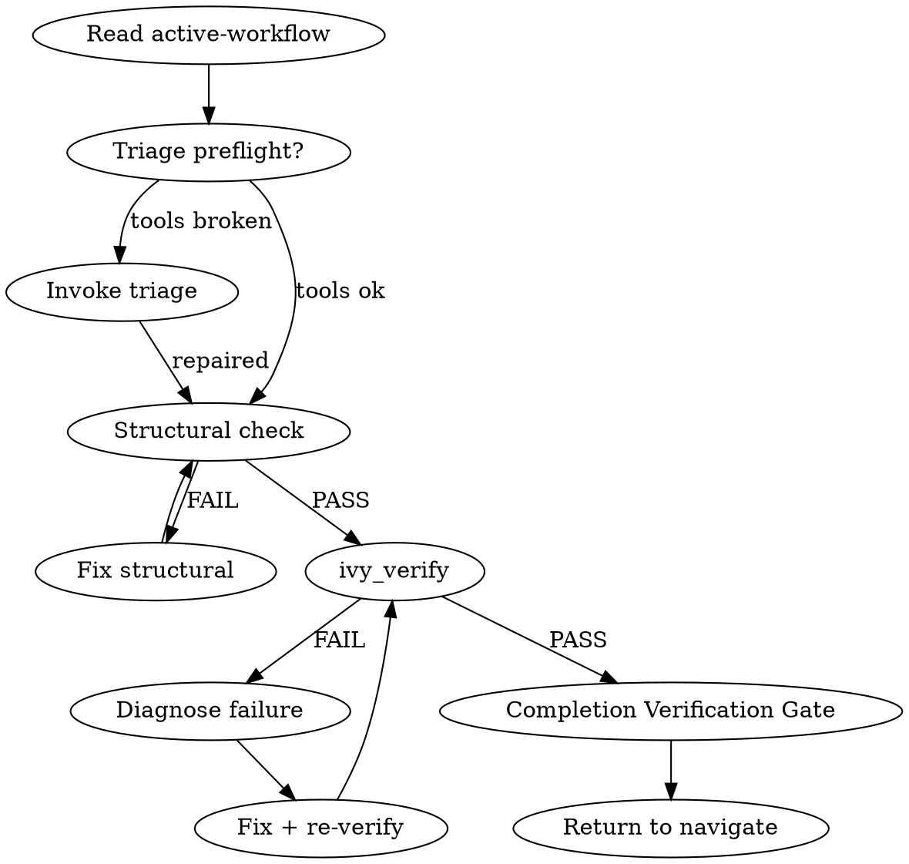

## Output Style

This workflow's output formatting is managed by the style system.
Follow the style directives injected via `additionalContext` -- they contain
your active workflow overlay and phase modifier. Do not invent your own
formatting for tool results that arrive pre-formatted in `hookSpecificOutput`.

## Iron Law

```
NO FIX PROPOSALS WITHOUT COMPLETING COMPILE + VERIFY PHASES FIRST.
If ivy_verify has not run in this turn, you cannot suggest code changes.
```

## Staleness Rule

Any `ivy_verify` or `ivy_compile` result older than the most recent `.ivy` file edit is STALE. Do not cite stale results as evidence of correctness. Re-run before claiming PASS or transitioning phases.

## Step Tracking

At the start of each phase, create tasks for each step using `TaskCreate`. Mark each `in_progress` before executing and `completed` after.

Phase 2 tasks:
```
TaskCreate(subject="Run ivy_diagnostics(mode='structural')", activeForm="Running structural check")
TaskCreate(subject="Fix structural errors if any", activeForm="Fixing structural errors")
TaskCreate(subject="Run ivy_verify on target", activeForm="Running formal verification")
TaskCreate(subject="Interpret results", activeForm="Interpreting verification results")
```

On failure (Phase 4+):
```
TaskCreate(subject="Diagnose verification failure", activeForm="Diagnosing failure")
TaskCreate(subject="Apply fix and re-verify", activeForm="Applying fix")
TaskCreate(subject="Run Completion Verification Gate", activeForm="Running completion gate")
```

Do not skip marking tasks as `completed` — incomplete tasks are visible to the user and signal unfinished work.

## Process Flow



# Verify Workflow

Read `.panther-ivy/active-workflow` on every turn to determine your current phase. Update the phase field as you transition.

---

## Phase 1 — Preflight

### Step 1: Stack health check

Invoke the `triage` skill as a sub-workflow. Before invoking, write the active-workflow flag:

- `workflow = "triage"`
- `phase = "preflight"`
- `invocation_depth` = current depth + 1
- `caller = "verify"`

Invoke: `Skill(skill="triage")`

Triage runs Phase 1 only (because `invocation_depth > 0`). If the stack is healthy it returns silently. If something is broken, triage handles diagnosis and repair interactively before returning here.

After triage returns, restore the active-workflow flag:

- `workflow = "verify"`
- `phase = "preflight"`

### Step 2: Detect target protocol

Resolve the protocol in this order:

1. Check `IVY_WORKSPACE_ROOT` environment variable
2. Check the active workspace state via `ivy_workspace(action="get")`
3. Scan the current working directory for `protocol-testing/` subdirectories

If the protocol is still ambiguous, ask the user: "Which protocol are you working with?"

### Step 3: Update state

Update the active-workflow phase to `"preflight-done"` via `ivy_workflow_state(action="set", workflow="verify", phase="preflight-done", protocol="<protocol>")`.

---

## Phase 2 — Test Selection

### Step 1: Scan existing tests

Look in `protocol-testing/{protocol}/{protocol}_tests/` for files matching `*_test*.ivy`. Group them by subdirectory:

- `server_tests/` — tests targeting server IUTs (Ivy acts as client)
- `client_tests/` — tests targeting client IUTs (Ivy acts as server)
- `mim_tests/` — man-in-the-middle attack tests

### Step 2: Present options

Offer the user three choices:

1. **Run ALL existing tests** for the target protocol
2. **Pick specific test(s)** from the list found in Step 1
3. **Design a new test inline** — this pulls supplementary knowledge for test authoring

If the user picks option 3, invoke the `ivy-writing-guide` skill and the `specification-patterns` skill to load authoring guidance. Guide the user through creating the test spec, then continue to Phase 3.

### Situation Briefing — Test Selection Confirmation

Load the `reflection-patterns` skill. Apply **Pattern C (Situation Briefing)** as the gate checkpoint (do not proceed without explicit confirmation):

- **What happened:** Summarize which test(s) were found/selected and what they test (protocol feature, role, RFC section).
- **Options:** "Compile and run all selected tests" / "Narrow selection" / "Design a new test instead"

### Step 3: Update state

Update phase to `"test-selected"` via `ivy_workflow_state(action="set", workflow="verify", phase="test-selected", protocol="<protocol>")`.

---

## Phase 3 — Compile

For each selected test file, call:

```
ivy_compile(relative_path=<test_file>, target="test")
```

### On SUCCESS

Move to Phase 4. Update phase to `"compiled"` via `ivy_workflow_state(action="set", workflow="verify", phase="compiled", protocol="<protocol>")`.

### On compile ERROR

1. Dispatch the `spec-analyst` agent with the full error output for diagnosis.
2. The spec-analyst returns a diagnosis and a fix suggestion.
3. Present the diagnosis and suggested fix to the user.
4. If the user agrees to apply the fix, apply it, then loop back to Phase 3 (recompile).
5. If the user declines, ask whether they want to fix it themselves or abandon.

---

## Phase 4 — Execute

Run the compiled test:

```
ivy_verify(relative_path=<test_file>)
```

### On PASS

1. Report: "Verification passed for `<test_file>`."
2. Offer follow-ups: "Run another test? Check coverage? Review model quality?"
3. If the user picks coverage or review, dispatch to the `review` workflow as a sub-workflow:
   - **Depth limit:** If `invocation_depth >= 3`, do not invoke sub-workflows. Instead, return to the caller (decrement depth, restore caller's workflow) or return to navigate with a summary of what was attempted and what remains.
   - Set `invocation_depth` += 1, `caller = "verify"` on the active-workflow flag
   - Invoke: `Skill(skill="review")`
4. Update phase to `"pass"`, then proceed to completion.

### Reflection Gate — Post-Execution Direction

After Phase 4 completes (pass or fail), load the `reflection-patterns` skill. Apply **Pattern A (Reflection Gate)**:

- **Current state:** "Verification [passed/failed] for [test_file]. [Brief result summary]."
- **On pass — alternative workflows:**
  - `review`: "Check coverage and quality of the verified model"
  - `build`: "Continue building additional layers or tests"
- **On fail — alternative workflows:**
  - `build`: "The failure may indicate structural issues — switch to build to fix the model"
  - Stay in `verify`: "Continue to diagnosis (Phase 6)"

### Knowledge Gate: Post-Execution

**KNOWLEDGE GATE (KG)**: Pause and invoke: `Skill(skill="panther-ivy-plugin:knowledge-capture")`
- Reflect on verification outcome — what patterns led to pass or fail?
- Save session log (observability events + digest)
- If candidates found, classify and present for user confirmation
- Resume workflow after gate completes

### On FAIL

Move to Phase 6. Update phase to `"executed"` via `ivy_workflow_state(action="set", workflow="verify", phase="executed", protocol="<protocol>")`.

---

## Phase 5 — IUT Testing (optional)

Only entered after Phase 4 succeeds (formal verification passes). Skipped when `invocation_depth > 0` (verify called as sub-workflow from build).

### Step 1: Offer IUT testing

Present the user with the option:

> "Formal verification passed. Want to run this test against a real implementation?"

If the user declines, proceed directly to completion (On Completion section).

### Step 2: Select IUT

Scan `panther/plugins/services/iut/{protocol}/` for available IUT plugin directories. Present as numbered options:

```
Available IUTs for {protocol}:
1. frr_bgp
2. (other IUT if multiple exist)
```

If only one IUT exists, suggest it directly and ask for confirmation.

### Step 3: Execute

Call the MCP tool:

```
ivy_iut_test(protocol=<detected>, test_name=<from Phase 2>, iut_name=<selected>)
```

### On PASS

1. Report: "IUT test passed. `<test_name>` succeeded against `<iut_name>` in {duration_seconds}s."
2. Show `output_dir` for reference.
3. Offer follow-ups: "Run another test? Check coverage? Review model quality?"
4. Update phase to `"iut-pass"`, then proceed to completion.

### On FAIL

1. Present the `iut_logs` content from the tool result.
2. Present key details from `experiment_summary` (test status, error message if any).
3. Show `output_dir`: "Full experiment output at `{output_dir}` — use Read to inspect further."
4. Offer: "Want me to investigate the failure? Or fix it yourself?"
5. If user wants investigation, move to Phase 6 (Diagnose) with the IUT failure context.
6. Update phase to `"iut-fail"`.

### On ERROR or TIMEOUT

1. Present the error details from `test_stderr`.
2. Suggest: "Check Docker status (`docker ps`), verify IUT plugin configuration, and ensure the test binary compiled successfully."
3. Update phase to `"iut-error"`.

### Step 4: Update state

Update active-workflow phase to match the outcome: `ivy_workflow_state(action="set", workflow="verify", phase="iut-pass"`, `phase="iut-fail"`, or `phase="iut-error"`, `protocol="<protocol>")`.

---

## Phase 6 — Diagnose & Phase 7 — Fix

For the full diagnosis and fix procedures, see `references/failure-diagnosis.md`. Summary:

1. Load `counterexample-guide` for trace interpretation
2. Multi-Perspective Diagnosis (dispatch spec-analyst + 2 Explore agents)
3. Classify failure: invariant violation, type error, or structural issue
4. Present diagnosis and ask user: fix or manual?
5. If fix accepted: apply, re-verify (loop back to Phase 3), knowledge gate on completion

---

## On Completion

Before completing, apply **Pattern D (Completion Verification Gate)** from the `reflection-patterns` skill.

- If `invocation_depth > 0`: Decrement depth. Restore `caller` as the active workflow in the active-workflow file. The caller resumes.
- If `invocation_depth == 0`: Clear the active-workflow flag via `ivy_workflow_state(action="clear", protocol="<protocol>")`. Navigate re-activates on the next user turn.

---

## Integration

- **Called by:** `navigate` (dispatch), `build` (post-build verification), user directly ("verify this", "run tests")
- **Calls:** `triage` (preflight), `spec-analyst` agent (diagnosis), `model-reviewer` agent (structural audit), `review` workflow (follow-up coverage)
- **Knowledge skills loaded:** `reflection-patterns` (SB Phase 2, RG Phase 4, MPE Phase 6, SB Phase 7), `counterexample-guide` (Phase 6), `ivy-writing-guide` (Phase 2 option 3, Phase 7), `specification-patterns` (Phase 2 option 3), `knowledge-capture` (KG Phase 4, KG Phase 7)
- **MCP tools used:** `ivy_compile`, `ivy_verify`, `ivy_workspace`, `ivy_iut_test`
- **State files:** `.panther-ivy/active-workflow`
